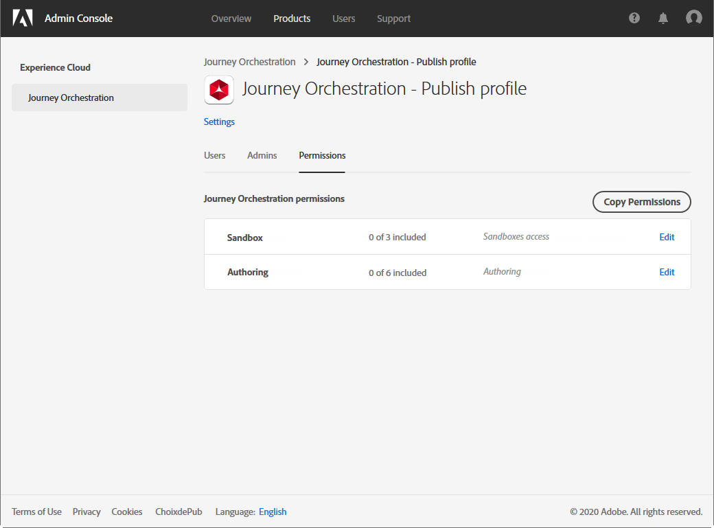

# 访问管理{#concept_rfj_wpt_52b}

## 关于访问管理 {#about-access-management}

[!DNL Journey Orchestration] 允许您为用户分配一组权限，以定义他们可以访问的界面部分。

他们可由有权访问 Admin Console 的管理员管理。有关 Admin Console 的详细信息，请参阅此 [文档](https://helpx.adobe.com/cn/enterprise/managing/user-guide.html)。

要能够访问 [!DNL Journey Orchestration]，用户必须是：

* 与权限 [!DNL Journey Orchestration]关联&#x200B;**[!UICONTROL product profile]**&#x200B;的一 [!DNL Journey Orchestration]部分。
* [!DNL Adobe Experience Platform]**[!UICONTROL product profile]** 的一部分。无需强制许可。用户应具有从 [!DNL Journey Orchestration] 界面创建和编辑 Platform 区段的 **[!UICONTROL profile management]** 权限。有关详细信息，请参见此 [ 页面](https://docs.adobe.com/content/help/zh-Hans/experience-platform/access-control/home.html#adobe-admin-console)。

在 Admin Console 中，您可以向用户分配以下现成的产品用户档案之一：

* **[!UICONTROL Limited Access User]**：对旅程和报告具有只读访问权限的用户。此产品用户档案包括以下权限：
   * 阅读旅程
   * 阅读报告

* **[!UICONTROL Administrators]**：用户可访问管理菜单，并可以管理旅程、事件和报告。此产品用户档案包括以下权限：
   * 管理旅程
   * 发布旅程
   * 管理事件、数据源和操作
   * 管理报告

   >[!NOTE]
   >
   >**[!UICONTROL Administrators]** 是唯一允许在 Adobe Campaign Standard 中创建、编辑和发布事务性消息（或消息模板）的产品用户档案。如果您使用 Adobe Campaign Standard 在旅程中发送消息，则需要此产品用户档案。

* **[!UICONTROL Standard User]**：具有基本访问权限的用户，如旅程管理。此产品用户档案包括以下权限：
   * 管理旅程
   * 发布旅程
   * 管理报告

如果现成的用户档案不足以管理用户，您还可以创建自己的产品用户档案。
用户必须始终链接到产品用户档案，以便您为他们分配特定的内置权限，例如：

* **[!UICONTROL Read journeys]**
* **[!UICONTROL Read reports]**
* **[!UICONTROL Manage events, data sources and actions]**
* **[!UICONTROL Read events, data sources and actions]**
* **[!UICONTROL Manage journeys]**
* **[!UICONTROL Publish journeys]**
* **[!UICONTROL Manage reports]**

您可以在下面找到不同权限和 [!DNL Journey Orchestration]不同功能之间的兼容性。

## 创建产品用户档案 {#create-product-profile}

[!DNL Journey Orchestration] 允许您创建自己的产品用户档案，并为用户分配一组权限和沙箱。通过产品用户档案，您可以授权或拒绝对界面中特定功能或对象的访问。

有关如何创建和管理沙箱的更多信息，请参阅 [Adobe Experience Platform 文档](https://docs.adobe.com/content/help/zh-Hans/experience-platform/sandbox/ui/user-guide.html)。

要创建产品用户档案并分配一组权限和沙箱，请执行以下操作：

1. 在 Admin Console 中，选择 **[!UICONTROL Journey Orchestration]**。在选项卡 **[!UICONTROL Product profile]** 中，单击 **[!UICONTROL New Profile]**。

   

1. 为新的产品用户档案添加 **[!UICONTROL Profile Name]** 和 **[!UICONTROL Description]**。如果希望用户档案的 **[!UICONTROL Display name]** 不同，请取消选中 **[!UICONTROL Same as Profile Name]** 并键入 **[!UICONTROL Display name]**。

1. 在类别 **[!UICONTROL User Notifications]** 中，选择在添加用户或从此产品用户档案中删除用户时，是否会通过电子邮件通知用户。

1. 完成后，单击 **[!UICONTROL Done]**。您的新产品用户档案现已创建。

   

1. 选择您的新产品用户档案以开始管理权限。在选项卡 **[!UICONTROL Users]** 中，将用户添加到您的产品用户档案。有关详细信息，请参见此 [ 页面](../about/access-management.md#assigning-product-profile)。

1. 执行与上述步骤相同的步骤，以将 **[!UICONTROL Admin]** 添加到您的产品用户档案。

1. 从 **[!UICONTROL Permissions]** 选项卡中，选择两个类别 **[!UICONTROL Sandbox]** 或 **[!UICONTROL Authoring]** 之一，打开 **[!UICONTROL Edit Permissions]** 页面并添加或删除您的产品用户档案的权限。

   

1. 在 **[!UICONTROL Sandboxes]** 权限类别中，选择要分配给产品用户档案的沙箱。在 **[!UICONTROL Available Permissions Items]** 下，单击加号 (+) 图标，将沙箱分配给用户档案。如需有关沙箱的详细信息，请参阅此[部分](../about/access-management.md#sandboxes)。

   

1. 如果需要，请在 **[!UICONTROL Included Permission Items]** 下，单击删除您的产品用户档案权限旁边的 X 图标。

   

1. 在 **[!UICONTROL Authoring]** 权限类别中，执行与上述步骤相同的步骤，向产品用户档案添加权限。
    有关权限和权限之间兼容性以及 [!DNL Journey Orchestration]不同功能的更多信息，请参阅此[部分](../about/access-management.md#about-access-management)。

   

1. 完成后，单击 **[!UICONTROL Save]**。

您的产品用户档案现已创建并配置。链接到此用户档案的用户现在可以连接到 [!DNL Journey Orchestration]。

## 分配产品用户档案 {#assigning-product-profile}

产品用户档案会分配给您组织内共享相同权限的一组用户。本部分提供每个现成产品用户档案及已分配权限的列表。

要为用户分配产品用户档案以访问 [!DNL Journey Orchestration]，请执行以下操作：

1. 在 Admin Console 中，选择 **[!UICONTROL Journey Orchestration]**。

   

1. 选择新用户将链接到的产品用户档案。

   

1. 单击 **[!UICONTROL Add user]**.

   您还可以将新用户添加到用户组以微调共享的权限集。有关详细信息，请参见此 [ 页面](https://helpx.adobe.com/cn/enterprise/using/user-groups.html)。

   

1. 键入新用户的电子邮件地址，然后单击 **[!UICONTROL Save]**。

   

随后，您的用户将收到一封重定向到您的 [!DNL Journey Orchestration] 实例的电子邮件。

## 使用沙箱 {#sandboxes}

[!DNL Journey Orchestration] 允许您将实例分区为称为沙箱的分隔虚拟环境。
沙箱通过 Admin Console 中的产品用户档案进行分配。有关如何分配沙箱的详细信息，请参阅此 [部分](../about/access-management.md#create-product-profile)。

[!DNL Journey Orchestration] 反映为给定组织创建的Adobe Experience Platform沙箱。
Adobe Experience Platform沙箱可以从Adobe Experience Platform实例创建或重置。 有关详细步骤，请参阅[沙箱用户指南](https://docs.adobe.com/content/help/zh-Hans/experience-platform/sandbox/ui/user-guide.html)。

您可以在屏幕左上角找到沙箱切换器控件。要从一个沙箱切换到另一个沙箱，请单击切换器中当前活动的沙箱，然后从下拉列表中选择另一个沙箱。
