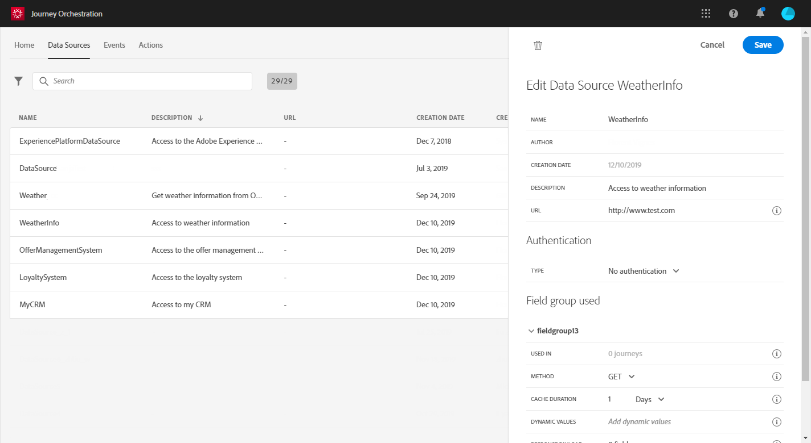

# 入门{#concept_y4b_4qt_52b}

在 [!DNL Journey Orchestration] 中，有两种用户，每种用户都执行特定任务：**技术用户**&#x200B;和&#x200B;**商业用户。**&#x200B;用户访问权限通过产品资料和权限进行管理。Refer to [this page](../about/access-management.md) to learn how to configure user access.

以下是配置和使用 [!DNL Journey Orchestration] 的主要步骤：

1. **配置事件**

   您需要定义预期信息以及如何处理信息。此配置是强制性的。此步骤由&#x200B;**技术用户**&#x200B;执行。

   有关详细信息，请参见[此页面](../event/about-events.md)。

   

1. **配置数据源**

   您需要定义与系统的连接，以检索将在您的旅程中使用的其他信息，例如在您的条件中。在预配时还会配置内置 Adobe Experience Platform 数据源。如果您仅利用旅程中事件的数据，则不需要执行此步骤。此步骤由&#x200B;**技术用户**&#x200B;执行。

   有关详细信息，请参见[此页面](../datasource/about-data-sources.md)。

   

1. **配置操作**

   如果您使用第三方系统来发送消息，则需要配置其与 [!DNL Journey Orchestration] 的连接。请参阅[此页](../action/about-custom-action-configuration.md)。

   如果您使用 Adobe Campaign Standard 来发送消息，则需要配置内置操作。请参阅[此页](../action/working-with-adobe-campaign.md)。

   这些步骤由&#x200B;**技术用户**&#x200B;执行。

   

1. **设计您的旅程**

   结合不同的事件、编排和操作活动，构建多步跨渠道方案。此步骤由&#x200B;**商业用户**&#x200B;执行。

   有关更多信息，请参阅[此页面](../building-journeys/journey.md)。

   

1. **测试并发布旅程**

   您需要验证并激活旅程。此步骤由&#x200B;**商业用户**&#x200B;执行。

   有关此方面的详细信息，请参 [阅测试旅程](../building-journeys/testing-the-journey.md)[和发布旅程](../building-journeys/publishing-the-journey.md)。

   

1. **监控您的旅程**

   使用专用的报告工具衡量旅程的有效性。此步骤由&#x200B;**商业用户**&#x200B;执行。

   有关更多信息，请参阅[此页面](../reporting/about-journey-reports.md)。

   

