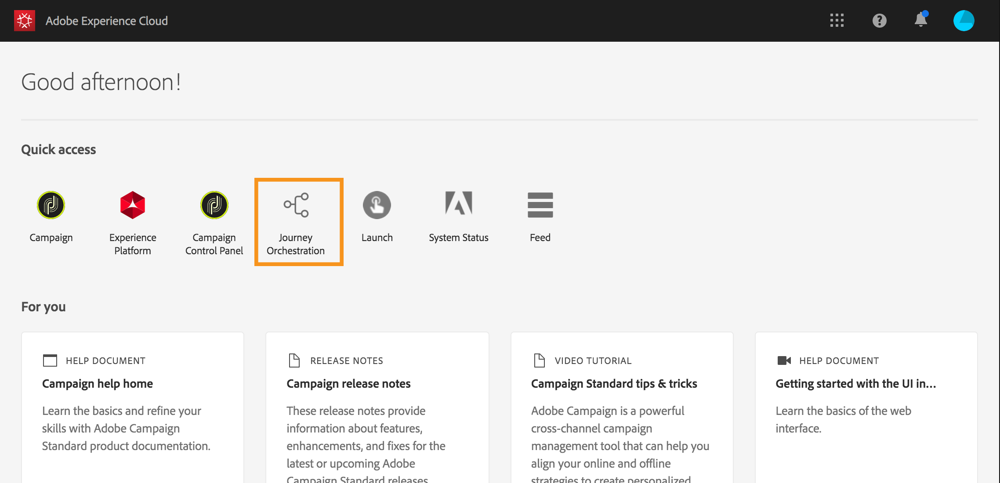

# 用户界面{#concept_rcq_lqt_52b}

>[!NOTE]
>
>为了充分利用 [!DNL Journey Orchestration]，我们建议将 Chrome 用作您的 Internet 浏览器。接口以 IMS 中定义的语言显示。如果 IMS 语言不受 [!DNL Journey Orchestration] 支持，则界面将以英语显示。
>
>此文档经常更新以反映产品中的最新更改。但是，某些屏幕截图可能与产品的界面略有不同。

## 访问 [!DNL Journey Orchestration]{#accessing_journey_orchestration}

要访问 [!DNL Journey Orchestration] 的界面，请单击右上角的 **[!UICONTROL App Selector]** 图标，然后单击 **[!UICONTROL Journey Orchestration]**。

您还可以从 Experience Cloud 主页的 **[!UICONTROL Quick access]** 部分访问 [!DNL Journey Orchestration]。

## 了解界面{#section_jsq_zr1_ffb}

>[!CONTEXTUALHELP]
>id="jo_home"
>title="关于历程列表"
>abstract="历程列表允许您同时查看所有历程、查看其状态并执行基本操作。"
>additional-url="https://images-tv.adobe.com/mpcv3/38af62cb-9390-4bc0-a576-d336849adb97_1574809570.1920x1080at3000_h264.mp4" text="观看演示视频"

通过顶部菜单，您可以浏览 [!DNL Journey Orchestration] 的不同功能：**[!UICONTROL Home]**（历程）、**[!UICONTROL Data Sources]**、**[!UICONTROL Events]**、**[!UICONTROL Actions]**。

单击屏幕右上角的图标以显示情景帮助。它可以在不同的 [!DNL Journey Orchestration] 列表屏幕（历程、事件、操作和数据源）中使用。通过此情景帮助，您可以查看当前功能的快速说明，并访问相关文章和视频。

## 搜索和筛选{#section_lgm_hpz_pgb}

在 **[!UICONTROL Home]**、**[!UICONTROL Data Sources]**、**[!UICONTROL Events]** 和 **[!UICONTROL Actions]** 列表中，搜索栏允许您搜索项目。

单击列表左上角的过滤器图标即可访问&#x200B;**[!UICONTROL Filters]**。通过过滤器菜单，您可以根据不同的条件筛选显示的元素。您可以选择仅显示特定类型或状态、您创建的元素或最近 30 天内修改的元素。

在 **[!UICONTROL Data Sources]**、**[!UICONTROL Events]** 和 **[!UICONTROL Actions]** 列表中，使用 **[!UICONTROL Creation filters]** 按创建日期和用户进行过滤。例如，您可以选择仅显示您在过去 30 天中创建的事件。

在历程列表（ **[!UICONTROL Home]**&#x200B;下）中，除了 **[!UICONTROL Creation filters]** 以外，您还可以根据显示的历程状态和版本 (**[!UICONTROL Status and version filters]**) 筛选。您还可以选择仅显示使用特定事件、字段组或操作（**[!UICONTROL Activity filters]**&#x200B;和 **[!UICONTROL Data filters]**）的历程。通过&#x200B;**[!UICONTROL Publication filters]**，您可以选择发布日期或用户。例如，您可以选择仅显示昨天发布的最新版实时历程。请参阅[此页](../building-journeys/using-the-journey-designer.md)。

>[!NOTE]
>
>请注意，显示的列可以使用列表右上角的配置按钮进行个性化设置。为每个用户保存个性化设置。

通过 **[!UICONTROL Last update]**&#x200B;和 **[!UICONTROL Last update by]** 列，可显示您的历程的上次更新时间以及运行该更新的用户。

在“事件”、“数据源”和“操作配置”窗格中，**[!UICONTROL Used in]**&#x200B;字段显示使用该特定事件、字段组或操作的历程数。您可以单击 **[!UICONTROL View journeys]**&#x200B;按钮以显示相应历程的列表。

在不同的列表中，您可以对每个元素执行基本操作。例如，您可以重复或删除项目。

## 浏览 Adobe Experience Platform 字段 {#friendly-names-display}

在定义[事件有效负载](../event/defining-the-payload-fields.md)、[字段组有效负载](../datasource/field-groups.md)以及在[表达式编辑器](../expression/expressionadvanced.md)中选择字段时，除字段名称外，还会显示其显示名称。此信息可从体验数据模型中的架构定义中检索。

如果在设置架构时提供了诸如“xdm:alternateDisplayInfo”之类的描述符，则用户友好型名称将替换显示名称。在使用“eVars”和通用字段时尤为有用。您可以通过 API 调用配置友好名称描述符。有关详细信息，请参阅[架构注册开发人员指南](https://docs.adobe.com/content/help/zh-Hans/experience-platform/xdm/api/getting-started.html)。

如果友好名称可用，则字段将显示为`<friendly-name>(<name>)`。如果没有可用的友好名称，将显示其显示名称，如`<display-name>(<name>)`。如果这两种名称均未定义，则仅显示字段的技术名称 `<name>`。

>[!NOTE]
>
>从架构组合中选择字段时，不会检索友好名称。

## 使用不同的快捷键{#section_ksq_zr1_ffb}

以下是 [!DNL Journey Orchestration] 界面中提供的不同快捷键。

_在历程、操作、数据源或事件列表中：_

* 按 **c** 创建新历程、操作、数据源或事件。

_在历程中配置活动时：_

画布会自动保存。您可以在画布的左上角看到其保存状态。

* 按 **Esc** 键关闭配置窗格并放弃所做的更改。这等同于 **[!UICONTROL Cancel]**&#x200B;按钮。
* 按 **Enter** 键或单击窗格外部以关闭配置窗格。更改已保存。这等同于 **[!UICONTROL Ok]**&#x200B;按钮。
* 如果按 **Delete** 或 **Backspace** 键，则之后可以按 **Enter** 键以确认删除。

_在弹出窗口中：_

* 按 **Esc** 键将其关闭（等同于 **[!UICONTROL Cancel]** 按钮）。
* 按 **Enter** 键保存或确认（等同于 **[!UICONTROL Ok]** 或 **[!UICONTROL Save]** 按钮）。

_在事件、数据源或操作配置窗格中：_

* 按 **Esc** 关闭配置窗格而不保存。
* 按 **Enter** 键保存修改并关闭配置窗格。
* 按 **Tab** 键在不同字段之间跳转以配置。

_在简单的表达式编辑器中_

* 双击左侧的字段以添加查询（等同于拖放）。

_浏览 XDM 字段时：_

* 选中“节点”将选择该节点的所有字段。

_在所有文本区域中：_

* 使用 **Ctrl/Command + A** 组合键选择文本。在有效负载预览中，将选择有效负载。

_在带有搜索栏的屏幕中：_

* 使用 **Ctrl/Command + F** 组合键选择搜索栏。

_在历程的画布中：_

* 使用 **Ctrl/Command + A** 组合键选择所有活动。
* 选择一个或多个活动后，按 **Delete** 或 **Backspace** 键以删除活动。然后，可以按 **Enter** 键以在确认弹出窗口中进行确认。
* 双击左侧面板上的活动，将其添加到第一个可用位置（从上到下）。

_在历程中：_

* 按 **T** 可启用/禁用测试模式。
* 在基于事件的历程中，在测试模式下，按 **E** 可触发事件。
* 在基于客户细分的历程中，当在测试模式下选择&#x200B;**一次单个用户档案**&#x200B;选项时，按 **P** 可触发事件。
* 在测试模式下，按 **L** 可显示日志。
