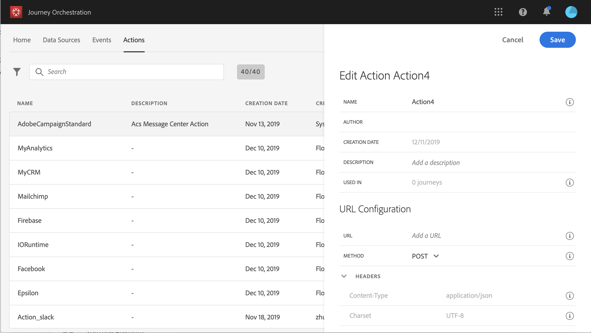

# 关于自定义操作配置 {#concept_sxy_bzs_dgb}

如果您使用第三方系统发送消息，或者 [!DNL Journey Orchestration] 要向第三方系统发送API调用，则可在此配置其连接 [!DNL Journey Orchestration]。 技术用户定义的自定义操作随后将在旅程的左侧调色板中显示在 **[!UICONTROL Action]** 类别中(请参 阅 以下是一些可以通过自定义操作连接到的系统示例：Epsilon、Facebook、Adobe、io、Firebase等。
限制列在此处： .

以下是配置自定义操作所需的主要步骤：

1. 在列表 **[!UICONTROL Actions]** 中，单 **[!UICONTROL Add]** 击以创建新操作。 操作配置窗格将在屏幕右侧打开。

   

1. 输入操作的名称。

   >[!NOTE]
   >
   >请勿使用空格或特殊字符。请勿使用超过 30 个字符。

1. 为操作添加描述。 此步骤是可选的。
1. The number of journeys that use this action is displayed in the **[!UICONTROL Used in]** field. You can click the **[!UICONTROL View journeys]** button to display the list of  journeys using this action.
1. Define the different **[!UICONTROL URL Configuration]** parameters. 请参见 。
1. 配置 **[!UICONTROL Authentication]** 部分。 此配置与数据源的配置相同。  请参见 。
1. 定义 **[!UICONTROL Message parameters]**。 请参见 。
1. 单击 **[!UICONTROL Save]**.

   自定义操作现已配置好，可在您的旅程中使用。 请参见 。

   >[!NOTE]
   >
   >在旅程中使用自定义操作时，大多数参数都是只读的。 您只能修改、 **[!UICONTROL Name]**、 **[!UICONTROL Description]**&#x200B;字段 **[!UICONTROL URL]** 和章 **[!UICONTROL Authentication]** 节。
