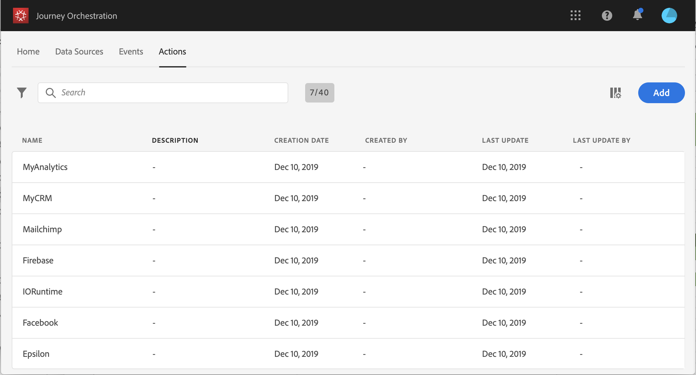

# 关于操作 {#about_actions}

>[!CONTEXTUALHELP]
>id="jo_actions"
>title="关于操作"
>abstract="您可以在此处定义与将发送消息的系统的连接。此处定义的操作随后将显示在历程左侧面板的“操作”类别中。 "

行动是指您通过这些连接向客户提供个性化的实时体验，如推送通知、电子邮件、短信，或您在业务中使用的任何其他数字互动方式。

通过自定义操作，您可以配置第三方系统的连接以发送消息或 API 调用。可以使用任何提供商的任何服务配置操作，这些服务可以通过具有 JSON 格式有效负载的 REST API 调用。

此类操作在历程的左侧面板的 **[!UICONTROL Action]** 类别中可用。请参阅[此页](../building-journeys/about-action-activities.md)。

>[!NOTE]
>
>自定义操作的配置始终由&#x200B;**技术用户**&#x200B;执行。

在&#x200B;**操作**&#x200B;列表中，您可以按“c”创建新历程、操作、数据源或事件。有关 [!DNL Journey Orchestration] 中快捷键的更多信息，请参阅[此部分](../about/user-interface.md#section_ksq_zr1_ffb)。

要查看操作列表或配置新操作，请单击顶部菜单中的&#x200B;**[!UICONTROL Actions]**。将显示操作列表。有关该界面的更多信息，请参阅[此页面](../about/user-interface.md)。

如果您拥有 Adobe Campaign Standard，您需要配置开箱即用的操作，以使用 Adobe Campaign Standard 的事务性消息传送功能发送电子邮件、推送通知和短信。请参见[此页面](../action/working-with-adobe-campaign.md)。

如果您使用第三方系统发送消息，如 Epsilon、Facebook、Adobe.io、Firebase 等，则需要添加和配置自定义操作。请参见[此页面](../action/about-custom-action-configuration.md)。

有关如何配置 [!DNL Journey Orchestration] 操作以及如何在历程中使用的更多信息，请观看此[视频教程](https://docs.adobe.com/content/help/zh-Hans/journey-orchestration-learn/tutorials/configure-actions.html)。
