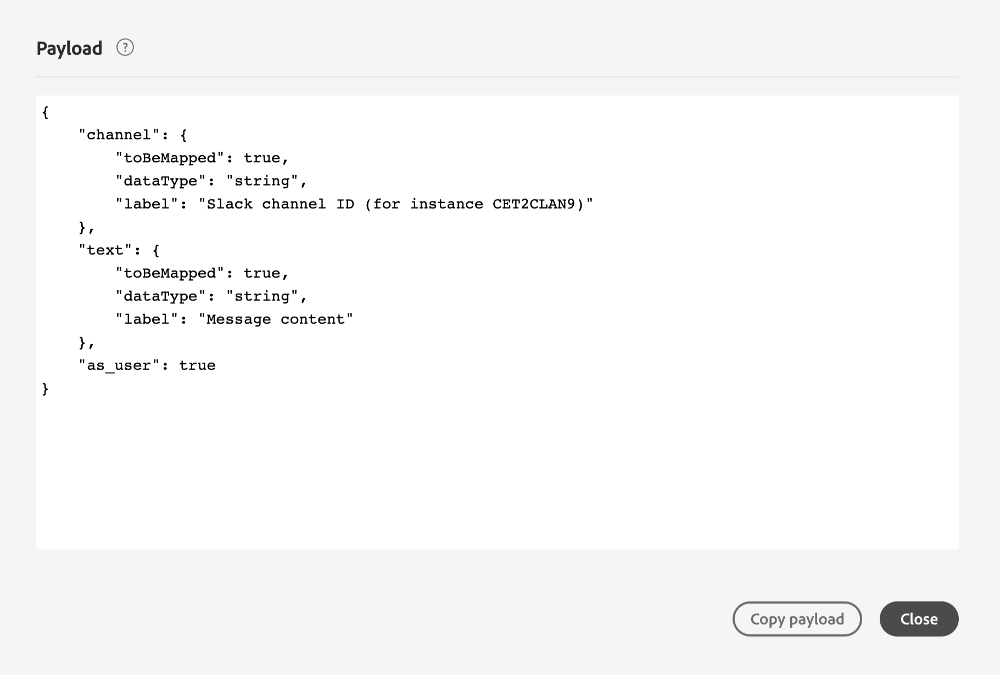

# 定义操作参数 {#concept_wy4_bf1_2gb}

在 **[!UICONTROL Action parameters]** 部分，粘贴要发送到外部服务的JSON有效负载示例。

>[!NOTE]
>
>有效负载中的字段名称不能包含“。” 字符. 不能以“$”字符开头。

您将能够定义参数类型（例如：字符串、整数等）。

您还可以在指定参数是常量还是变量之间进行选择：

* 常量表示参数的值由技术角色在操作配置窗格中定义。 该值将在各个历程中始终相同。 它不会发生变化，并且营销人员在历程中使用自定义操作时不会看到它。 例如，它可能是第三方系统期望的ID。 在这种情况下，切换常量/变量右侧的字段是传递的值。
* 变量表示参数的值将发生变化。 在历程中使用此自定义操作的营销人员可以自由传递他想要的值，或指定从何处检索此参数的值(例如，从事件、Adobe Experience Platform等)。 在这种情况下，切换常量/变量右侧的字段是营销人员将在历程中看到的用于命名此参数的标签。

