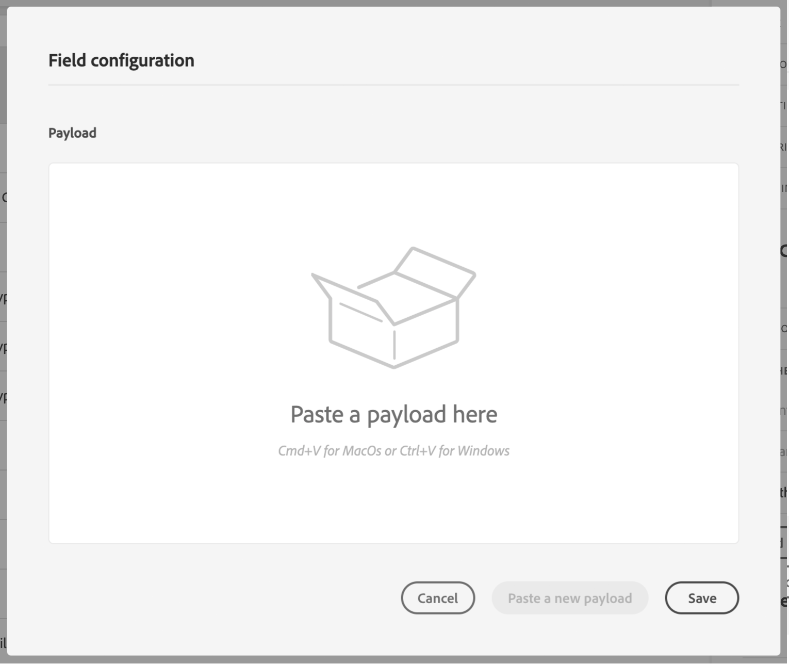

# 定义操作参数 {#concept_wy4_bf1_2gb}

>[!CAUTION]
>
>**希望了解 Adobe Journey Optimizer**？ 请单击[此处](https://experienceleague.adobe.com/zh-hans/docs/journey-optimizer/using/ajo-home){target="_blank"}获取 Journey Optimizer 文档。
>
>
>_本文档参考已被 Journey Optimizer 取代的旧版 Journey Orchestration 资料。 如果您对访问 Journey Orchestration 或 Journey Optimizer 有任何疑问，请联系帐户团队。_

在&#x200B;**[!UICONTROL Action parameters]**&#x200B;部分中，粘贴要发送到外部服务的JSON有效负载示例。

>[!NOTE]
>
>有效负载中的字段名称不能包含“。” 字符。 不能以“$”字符开头。

您将能够定义参数类型（例如：字符串、整数等）。

您还可以在指定参数是常量还是变量之间进行选择：

* 常量表示参数的值由技术角色在操作配置窗格中定义。 值将在各个历程中始终相同。 此操作不会有所不同，并且营销人员在历程中使用自定义操作时不会看到它。 例如，它可能是第三方系统期望的ID。 在这种情况下，切换常量/变量右侧的字段是传递的值。
* 变量表示参数的值将发生变化。 在历程中使用此自定义操作的营销人员可以自由传递所需的值，或指定在何处检索此参数的值（例如，从事件、Adobe Experience Platform等）。 在这种情况下，切换常量/变量右侧的字段是营销人员将在历程中看到的标签，营销人员可以将其命名为此参数。

