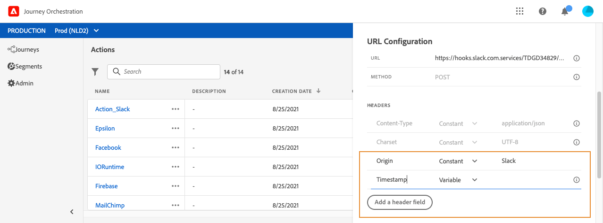

# URL 配置 {#concept_gbg_1f1_2gb}

配置自定义操作时，您需要定义以下&#x200B;**[!UICONTROL URL Configuration]**&#x200B;参数：

1. 在&#x200B;**[!UICONTROL URL]**&#x200B;字段中，指定外部服务的URL：

   * 如果URL是静态的，请在此字段中输入URL。

   * 如果URL包含动态路径，则仅输入URL的静态部分，即方案、主机、端口，以及（可选）路径的静态部分。

     示例：`https://xxx.yyy.com/somethingstatic/`

     将自定义操作添加到历程时，您将指定URL的动态路径。 [了解详情](../building-journeys/using-custom-actions.md)。

   >[!NOTE]
   >
   >出于安全原因，我们强烈建议您对URL使用HTTPS方案。 我们不允许使用非公共Adobe地址和IP地址。
   >
   >定义自定义操作时只允许使用默认端口：80用于http，443用于https。

1. 选择呼叫&#x200B;**[!UICONTROL Method]**：可以是&#x200B;**[!UICONTROL POST]**&#x200B;或&#x200B;**[!UICONTROL PUT]**。
1. 在&#x200B;**[!UICONTROL Headers]**&#x200B;部分中，定义要发送到外部服务的请求消息的HTTP标头：
   1. 要添加标题字段，请单击&#x200B;**[!UICONTROL Add a header field]**。
   1. 输入标题字段的键。
   1. 要为键值对设置动态值，请选择&#x200B;**[!UICONTROL Variable]**。 否则，请选择&#x200B;**[!UICONTROL Constant]**。

      例如，对于时间戳，您可以设置动态值。

   1. 如果已选择&#x200B;**[!UICONTROL Constant]**，请输入常量值。

      如果已选择&#x200B;**[!UICONTROL Variable]**，则在将自定义操作添加到历程时，将指定此变量。 [了解详情](../building-journeys/using-custom-actions.md)。

      

   1. 要删除标题字段，请指向标题字段并单击&#x200B;**[!UICONTROL Delete]**&#x200B;图标。

   默认情况下，**[!UICONTROL Content-Type]**&#x200B;和&#x200B;**[!UICONTROL Charset]**&#x200B;标头字段已设置。 您无法修改或删除这些字段。

   将自定义操作添加到历程后，如果历程处于草稿状态，您仍然可以向历程添加标题字段。 如果您不希望历程受配置更改的影响，请复制自定义操作并将标题字段添加到新的自定义操作。

   >[!NOTE]
   >
   >将根据字段解析规则验证标头。 [了解详情](https://tools.ietf.org/html/rfc7230#section-3.2.4)。
