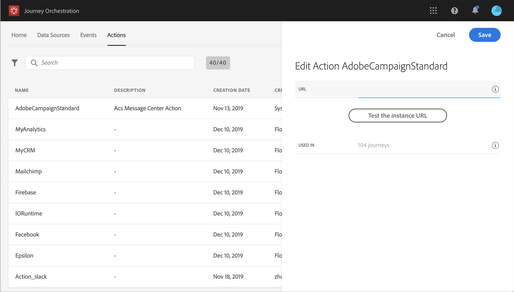

# 使用 Adobe Campaign Standard {#using_adobe_campaign_standard}

>[!CAUTION]
>
>**希望了解 Adobe Journey Optimizer**？ 请单击[此处](https://experienceleague.adobe.com/zh-hans/docs/journey-optimizer/using/ajo-home){target="_blank"}获取 Journey Optimizer 文档。
>
>
>_本文档参考已被 Journey Optimizer 取代的旧版 Journey Orchestration 资料。 如果您对访问 Journey Orchestration 或 Journey Optimizer 有任何疑问，请联系帐户团队。_

您可以使用Adobe Campaign Standard的事务性消息传送功能发送电子邮件、推送通知和短信。

[!DNL Journey Orchestration]附带一个现成的操作，该操作允许连接到Adobe Campaign Standard。

必须发布Campaign Standard事务型消息及其关联的事件，才能在Journey Orchestration中使用。 如果事件已发布但消息未发布，则不会在Journey Orchestration界面中看到该消息。 如果消息已发布，但其关联事件未发布，则它将在Journey Orchestration界面中可见，但不可用。

>[!NOTE]
>
>一旦设置了Adobe Campaign Standard集成，就会为Adobe Campaign Standard操作自动定义每5分钟4000次调用的上限规则。 这对应于Adobe Campaign Standard事务型消息传递的官方规模。
>
>在[Adobe Campaign Standard产品描述](https://helpx.adobe.com/cn/legal/product-descriptions/campaign-standard.html)中阅读有关事务性消息传递SLA的更多信息。

以下是配置此功能的步骤：

1. 从&#x200B;**[!UICONTROL Actions]**&#x200B;列表中，单击内置&#x200B;**[!UICONTROL AdobeCampaignStandard]**&#x200B;操作。 操作配置窗格将在屏幕右侧打开。

   

1. 复制您的Adobe Campaign Standard实例URL并将其粘贴到&#x200B;**[!UICONTROL URL]**&#x200B;字段中。

1. 单击&#x200B;**[!UICONTROL Test the instance URL]**&#x200B;以测试实例的有效性。

   >[!NOTE]
   >
   >此测试将验证：
   >
   >主机为“.campaign.adobe.com”、“.campaign-sandbox.adobe.com”、“.campaign-demo.adobe.com”、“.ats.adobe.com”或“.adls.adobe.com”。
   >
   >URL以https开头，
   >
   >与此Adobe Campaign Standard实例关联的组织与Journey Orchestration的组织相同。

设计历程时，**[!UICONTROL Action]**&#x200B;类别中将提供三个操作： **[!UICONTROL Email]**、**[!UICONTROL Push]**、**[!UICONTROL SMS]**（请参阅[使用Adobe Campaign操作](../building-journeys/using-adobe-campaign-actions.md)）。 **反应事件**&#x200B;还将允许您对消息点击次数、打开次数等做出反应（请参阅[反应事件](../building-journeys/reaction-events.md)）。

如果您使用第三方系统来发送消息，则需要添加和配置自定义操作。 请参阅[关于自定义操作配置](../action/about-custom-action-configuration.md)。
