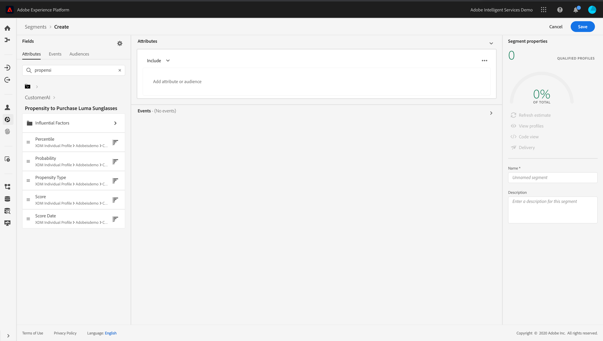

# 利用客户人工智能 {#customer-ai}

客户人工智能是智能服务的一部分。 它有助于预测客户可能做什么。 请参阅 [文档](https://docs.adobe.com/content/help/en/experience-platform/intelligent-services/customer-ai/overview.html)。

客户AI允许品牌创建基于客户流失或转化机器学习的分数，这些分数将作为用户档案用户档案(实时客户用户档案)中的Experience Platform属性提供。

因此，它们可以用作Journey Orchestration条件中的任何其他用户档案属性（以做出最佳决策）、操作或细分构建。

请注意，客户人工智能是Experience Platform的付费功能。

