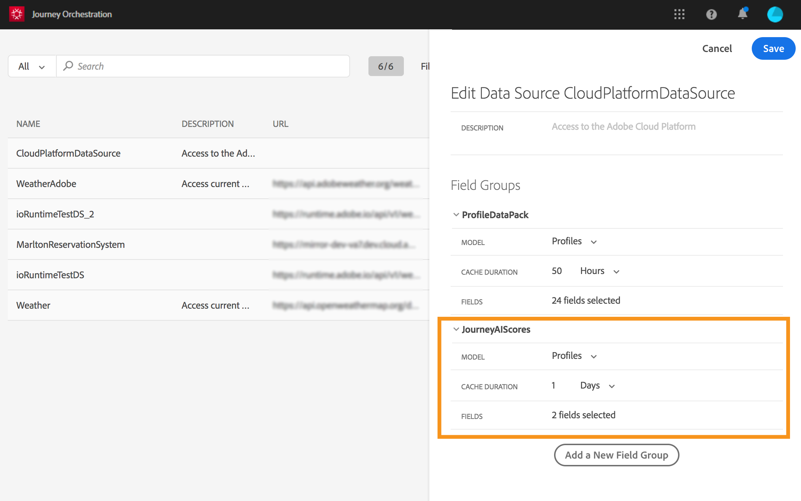

# 利用旅程AI {#concept_dsh_1ry_wfb}

此用例将向您展示如何利用疲劳分数来避免在旅程中过度吸引客户。

>[!CAUTION]
>
>预测疲劳得分功能仅适用于使用Adobe Campaign Standard数据服务功能的客户。

## 配置事件 {#section_ptb_ws1_ffb}

按照中所述的步骤操 [](../event/about-events.md)作。

## 配置数据源 {#section_o3n_4yy_wfb}

执行以下步骤以选择内置数据源中的疲劳分数字段：

1. 在顶部菜单中，单击 **[!UICONTROL Data Sources]** 选项卡，然后选择内建Adobe Experience Platform数据源。

   

1. 检查是否已选择用例所需的字段。
1. 单 **[!UICONTROL Add a New Field Group]**&#x200B;击，选择模 **[!UICONTROL Profiles]** 型并添加和字段(在 **[!UICONTROL fatigueLevel]** journeyAI > emailScore **[!UICONTROL fatigueScore]** >疲劳 __&#x200B;下)。

   

1. 单击 **[!UICONTROL Save]**。

## 构建旅程 {#section_uzm_pyy_wfb}

要创建、验证和发布旅程，请按照中所述的步骤操作 [](../building-journeys/journey.md)。

在我们的使用案例中，我们利用了这 **[!UICONTROL fatigueLevel]** 个领域。 您还可以使用该 **[!UICONTROL fatigueScore]** 字段。

执行以下步骤以充分利用旅程中的疲劳程度：

1. 在旅程中添加事件和条件。

   

1. 选择类 **[!UICONTROL Data Source Condition]** 型，然后在字段中 **[!UICONTROL Expression]** 单击。

   

1. 使用简单的表达式编辑器，找 **[!UICONTROL fatigueLevel]** 到字&#x200B;_段(ExperiencePlatformDataSource > JourneyAIScores >用户档案> journeyAI > emailScore >疲劳_)，将其放在右侧并创建以下条件： “fatugeLevel”等于“Low”。 单击 **[!UICONTROL Ok]**。

   

   高级表达式是：

   ```
   #{ExperiencePlatformDataSource.JourneyAIScores.Profile.journeyAI.emailScore.fatigue.fatigueLevel} == "low"
   ```

1. 在该条件下，为中高疲劳水平创建两个其他路径。

   

1. 您现在可以为每个疲劳级别添加不同的操作。

   
