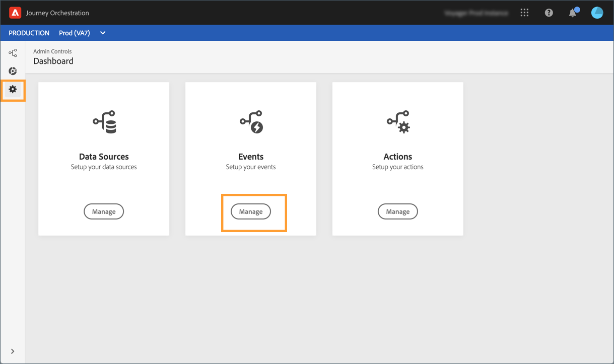
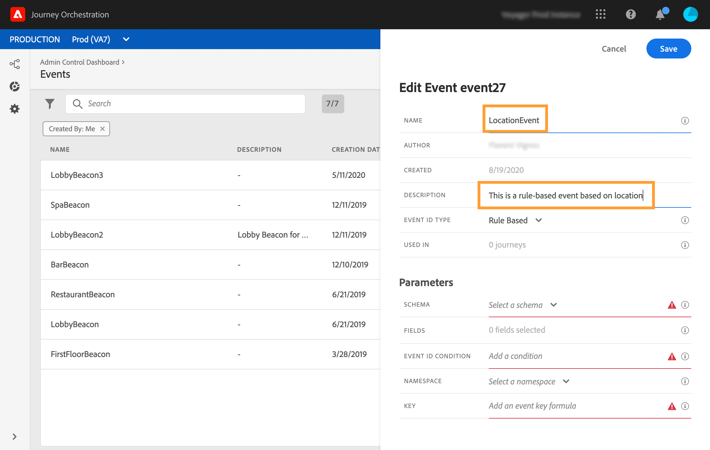

# 基于规则的事件{#simplified-events}

我们简化了您设置体验事件的方式。 我们引入了一种无需使用eventID的新方法。 在Journey Orchestration中设置事件时，您现在可以定义基于规则的事件。

此新类型的事件不生成eventID。 使用简单的表达式编辑器，您现在只需定义一个规则，系统将使用该规则来识别将触发您旅程的相关事件。 此规则可以基于事件有效负荷中可用的任何字段，例如用户档案的位置或添加到用户档案购物车的项目数。

这种新方法对用户来说大多是透明的。 唯一的更改是事件定义屏幕中的新字段。

1. 从左侧菜单，单击图 **[!UICONTROL Admin]** 标，然后单击 **[!UICONTROL Events]**。 将显示事件列表。

   

1. 单击&#x200B;**[!UICONTROL Add]**&#x200B;以创建新事件。事件配置窗格将在屏幕右侧打开。

   

1. 输入事件的名称。 您还可以添加描述。

   

1. In the new **[!UICONTROL Event ID type]** field, select **[!UICONTROL Rule Based]**.

   

   >[!NOTE]
   >
   >类 **[!UICONTROL System Generated]** 型是需要eventID的现有方法。 请参阅[此章节](../event/about-events.md)。

1. 定义有 **[!UICONTROL Schema]** 效负荷 **[!UICONTROL Fields]**。 请参阅[此章节](../event/defining-the-payload-fields.md)。

   

   >[!NOTE]
   >
   >当您选择时， **[!UICONTROL System Generated type]**&#x200B;只有具有eventID类型mixin的模式才可用。 选择类型时， **[!UICONTROL Rule Based]** 所有体验事件模式均可用。

1. 在字段内 **[!UICONTROL Event ID condition]** 单击。 使用简单的表达式编辑器，定义系统将使用的条件，以识别将触发您旅程的事件。

   

   在我们的例子中，我们根据用户档案的城市写了一个条件。 这意味着，只要系统收到与此条件（字段和值）匹&#x200B;**[!UICONTROL City]** 配的事件 **[!UICONTROL Paris]** ，它就会将其传递给Journey Orchestration。

1. 定义 **[!UICONTROL Namespace]** 和 **[!UICONTROL Key]**。 请参 [阅选择命名空间](../event/selecting-the-namespace.md)[和定义事件键](../event/defining-the-event-key.md)。

   

事件配置和旅程创建的其他步骤保持不变。

该事件现已配置好，可以像任何其他事件一样被丢弃到旅程中。 每次将与规则匹配的事件发送到系统时，都会将其传递给Journey Orchestration以触发您的旅程。

