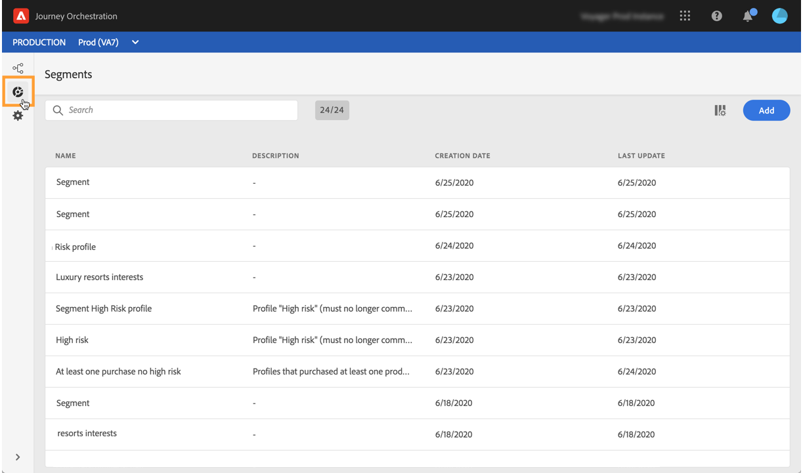

# 发现Alpha版本接口{#discovering-alpha-interface}

## 关于Alpha版本接口{#about-alpha-interface}

[!DNL Journey Orchestration]菜单内的导航已得到增强，以便与Adobe Experience Platform建立一致的界面。 更改包括：

* 菜单从界面的顶部移动到左侧，
* 将管理功能分组到单个仪表板中。

有关如何在界面中使用和导航的全局概念(搜索和筛选、浏览Adobe Experience Platform字段、快捷键)显示在[此部分](../about/user-interface.md)中。

## 访问[!DNL Journey Orchestration]功能{#accessing-journey-orchestration-functionalities}

位于左侧的菜单栏允许您访问不同的功能。 单击图标可访问相应的菜单。 单击左下方的箭头可展开或折叠菜单栏。

访问[!DNL Journey Orchestration]时，将显示&#x200B;**[!UICONTROL Journeys]**&#x200B;菜单，允许您访问现有旅程或创建新旅程。 请参阅[使用旅程设计器](../building-journeys/using-the-journey-designer.md)。

**[!UICONTROL Segments]**&#x200B;菜单允许您访问和创建Adobe Experience Platform区段。 请参阅[关于Adobe Experience Platform区段](../segment/about-segments.md)。

**[!UICONTROL Admin]**&#x200B;菜单对所有具有管理员权限的用户可用（请参阅[访问管理](../about/access-management.md)）。 它提供一个仪表板，允许您设置[数据源](../datasource/about-data-sources.md)、[事件](../event/about-events.md)和[操作](../action/action.md)。

