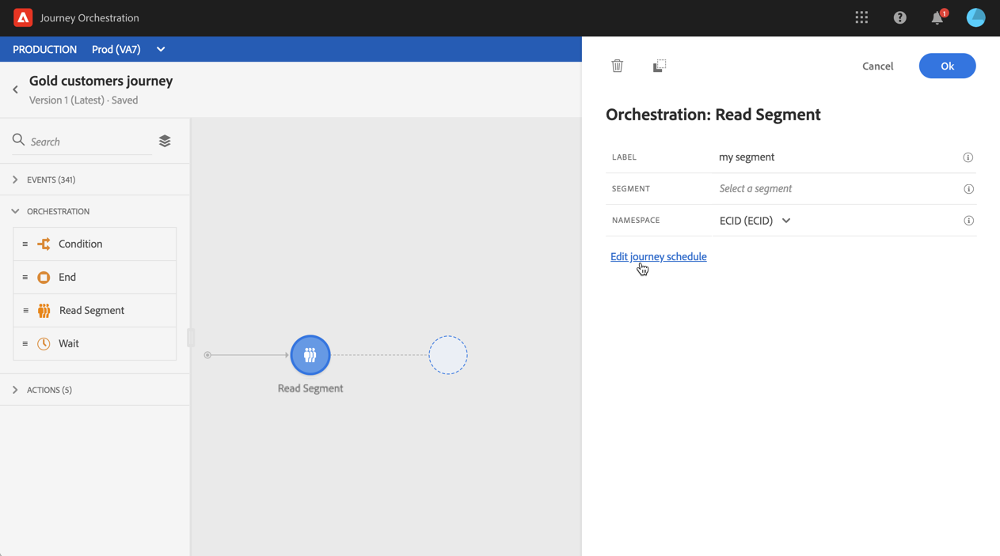

# 阅读细分活动 {#segment-trigger-activity}

## 关于读取区段活动 {#about-segment-trigger-actvitiy}

>[!NOTE]
>
>如果在发布时间或测试模式Adobe Campaign Standard时画布中存在激活现成的操作活动，则旅程将在每秒13个入口处被限制。 否则，旅程将以每秒1000事件的速度减速。

阅读区段活动允许您让属于Adobe Experience Platform区段的所有个人进入旅程。 进入旅程可以执行一次，也可以定期执行。

假设您在Adobe Experience Platform拥有黄金客户细分。 通过阅读细分活动，您可以让属于黄金客户细分的所有个人进入旅程，并让他们进入个性化旅程，利用所有旅程功能：条件、计时器、事件、动作。

## 配置活动 {#configuring-segment-trigger-activity}

>[!NOTE]
>
>由于细分导出延迟，无法在1小时以内的较短时间内触发基于细分的旅程。

1. 展开 **[!UICONTROL Orchestration]** 类别并将 **[!UICONTROL Read Segment]** 活动放入画布。

   活动必须定位为旅程的第一步。

1. 向活动 **[!UICONTROL Label]** 添加一个（可选）。

1. 在字段 **[!UICONTROL Segment]** 中，选择将进入旅程的Adobe Experience Platform区段，然后单击 **[!UICONTROL Save]**。

   >[!NOTE]
   >
   >请注意，您可以自定义列表中显示的列，并对其进行排序。

   

   添加区段后，该按 **[!UICONTROL Copy]** 钮允许您复制其名称和ID:

   `{"name":"Gold customers,”id":"8597c5dc-70e3-4b05-8fb9-7e938f5c07a3"}`

   

1. 在字 **[!UICONTROL Namespace]** 段中，选择要使用的命名空间以识别个人。 For more on namespaces, refer to [this section](../event/selecting-the-namespace.md).

   >[!NOTE]
   >
   >属于某个细分的个人，如果其不同身份之间没有选定的身份(命名空间)，则不能进入旅程。

1. 该 **[!UICONTROL Read Segment]** 活动允许您指定段将进入旅程的时间。 为此，请单击链 **[!UICONTROL Edit journey schedule]** 接以访问旅程的属性，然后配置字 **[!UICONTROL Scheduler type]** 段。

   

   默认情况下，区段会输入旅 **[!UICONTROL As soon as possible]**&#x200B;程，即在旅程发布后1小时输入。 如果要让区段在特定日期／时间或定期输入旅程，请从列表中选择所需值。

   >[!NOTE]
   >
   >请注意， **[!UICONTROL Schedule]** 只有在画布中放置 **[!UICONTROL Read Segment]** 活动后，该部分才可用。

   

## 测试和发布旅程 {#testing-publishing}

该 **[!UICONTROL Read Segment]** 活动允许您在单一用户档案或100个随机测试从符合段条件的用户档案中选择的用户档案上测试旅程。

为此，请激活测试模式，然后从左窗格中选择所需的选项。

然后，可以照常配置测试模式。 本节介绍如何测试旅程的详细 [步骤](../building-journeys/testing-the-journey.md)。

请注意，一次使用最多100个用户档案测试旅程不允许您使用视觉流跟踪旅程中个人的进度。

测试成功后，您可以发布旅程(请参 [阅发布旅程](../building-journeys/publishing-the-journey.md))。 属于该区段的个人将在旅程的属性部分中指定的日期／时间进入旅 **[!UICONTROL Scheduler]** 程。

>[!IMPORTANT]
>
>请记住，Adobe Experience Platform区段是每天计算一次(**批** 区段)或实时计算&#x200B;**(流** 区段)。
>
>如果对所选区段进行流处理，属于此区段的个人可能会实时进入该旅程。 如果区段为批，则新符合此区段资格的人员将潜在地在在Adobe Experience Platform执行区段计算时进入旅程。
