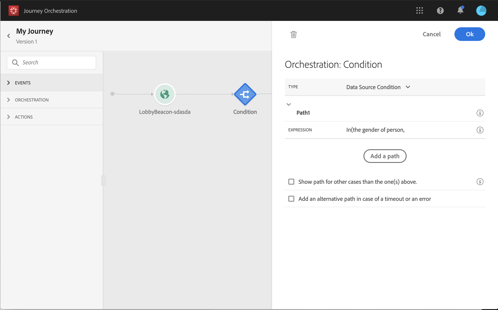

# 关于编排活动 {#concept_ksq_2rt_52b}

>[!CAUTION]
>
>**希望了解 Adobe Journey Optimizer**？ 请单击[此处](https://experienceleague.adobe.com/zh-hans/docs/journey-optimizer/using/ajo-home){target="_blank"}获取 Journey Optimizer 文档。
>
>
>_本文档参考已被 Journey Optimizer 取代的旧版 Journey Orchestration 资料。 如果您对访问 Journey Orchestration 或 Journey Optimizer 有任何疑问，请联系帐户团队。_

在屏幕左侧的面板中，提供了以下编排活动：

* [条件活动](../building-journeys/condition-activity.md)
* [结束活动](../building-journeys/end-activity.md)
* [等待活动](../building-journeys/wait-activity.md)

