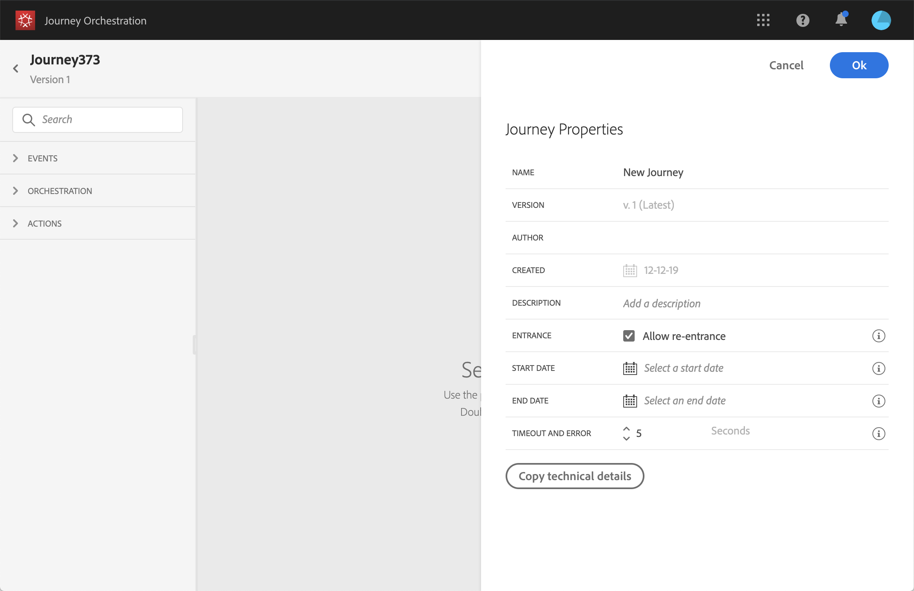

# 更改属性 {#concept_prq_wqt_52b}

单击右上角的铅笔图标可访问历程的属性。

您可以更改历程的名称、添加描述、允许重新进入、选择开始和结束日期并定义 **[!UICONTROL Timeout and error]** 持续时间（如果您是管理员）。

对于实时历程，此屏幕显示发布日期和发布历程的用户名称。

此 **复制技术详细信息** 允许您复制有关历程的技术信息，供支持团队用于进行故障排除。 复制了以下信息：JourneyVersion UID、OrgID、orgName、sandboxName、lastDeployedBy、lastDeployedAt。

## 入口{#entrance}

默认情况下，新历程允许重新进入。 您可以取消选中“一次性”旅程选项，例如，如果您想要在人员进入商店时提供一次性礼品。 在这种情况下，您不希望客户能够重新进入历程并再次收到选件。

当历程“结束”时，它具有状态 **[!UICONTROL Closed (no entrance)]**. 历程将停止让新个人进入历程。 已在历程中的人员将正常完成历程。

在默认全局超时30天后，历程将切换到 **已完成** 状态。 请参阅此[部分](#global_timeout)。

## 历程活动中的超时和错误 {#timeout_and_error}

编辑操作或条件活动时，您可以定义替代路径以防出现错误或超时。 如果处理询问第三方系统的活动超出了历程属性中定义的超时持续时间(**[!UICONTROL Timeout and  error]** 字段)，将选择第二条路径来执行潜在的回退操作。

授权值介于1和30秒之间。

我们建议您定义一个非常短的 **[!UICONTROL Timeout and error]** 值(如果您的旅程对时间敏感（例如：对人员的实时位置做出反应），因为您的操作不能延迟超过几秒钟。 如果您的旅程不太时效性，则可以使用较长的值，为调用的系统留出更多时间来发送有效响应。

[!DNL Journey Orchestration] 也会使用全局超时。 请参阅 [下一节](#global_timeout).

## 全局历程超时 {#global_timeout}

除了 [timeout](#timeout_and_error) 在历程活动中使用，还有一个全局历程超时，该超时未显示在界面中并且无法更改。 此超时将在个人进入历程30天后停止个人进度。 这意味着个人的历程不能超过30天。 在30天超时之后，将删除个人的数据。 超时期间结束时仍在历程中流动的个人将被停止，并且他们将被视为报告中的错误。

>[!NOTE]
>
>[!DNL Journey Orchestration] 不会直接对隐私选择退出、访问或删除请求做出反应。 但是，全局超时可确保个人在任何历程中的停留时间不超过30天。

由于30天历程超时，当历程不允许重新进入时，我们无法确保重新进入阻止将工作超过30天。 事实上，当我们删除有关进入旅程30天后进入旅程的人员的所有信息时，我们无法知道该人员是超过30天前进入的。

## 时区和配置文件时区 {#timezone}

时区在历程级别定义。

您可以输入固定时区，或使用Adobe Experience Platform配置文件定义历程时区。

有关时区管理的更多信息，请参阅 [此页面](../building-journeys/timezone-management.md).
