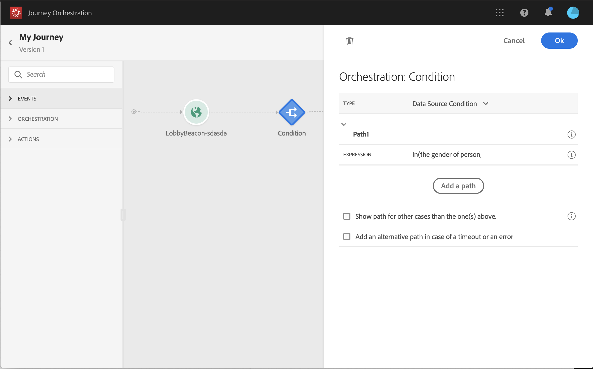
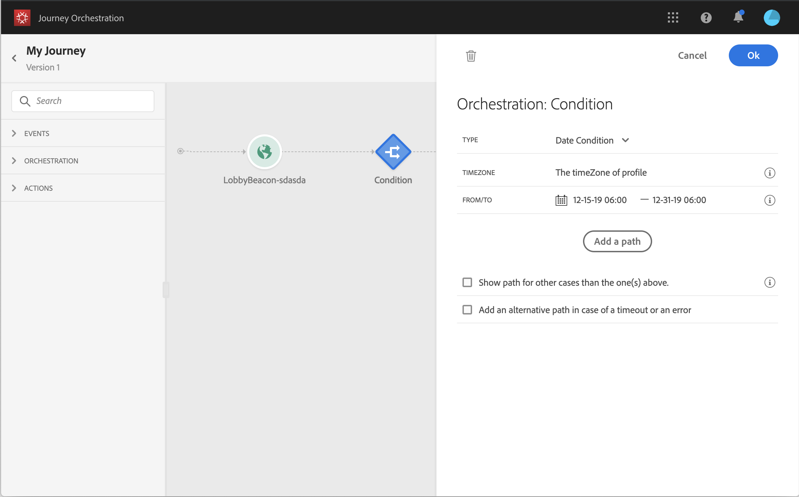

# 条件活动{#section_e2n_pft_dgb}

提供了四种类型的条件：

* [数据源条件](#data_source_condition)
* [时间条件](#time_condition)
* [百分比拆分](#percentage_split)
* [日期条件](#date_condition)

## 关于条件活动 {#about_condition}

在历程中使用多个条件时，您可以为其中每个条件定义标签，以便更轻松地识别它们。

如果要定义多个条件，请单击&#x200B;**[!UICONTROL Add a path]**。 对于每个条件，都会在活动后的画布中添加新路径。

请注意，历程的设计会对功能产生影响。 在条件后定义多个路径时，将只执行第一个符合条件的路径。 这意味着您可以通过将路径置于彼此之上或之下来改变路径的优先级。

例如，让我们以第一个路径的条件“人员是VIP”和第二个路径的条件“人员是男性”为例。 如果符合这两个条件的人员(即VIP的男性)通过此步骤，则将选择第一个路径，即使他也有资格使用第二个路径，因为第一个路径“高于”。 要更改此优先级，请按其他垂直顺序移动活动。

您可以通过选中&#x200B;**[!UICONTROL Show path for other cases than the one(s) above]**&#x200B;为不符合所定义条件的受众创建另一个路径。 请注意，此选项在拆分条件中不可用。 请参阅[百分比拆分](#percentage_split)。

利用简单模式，可根据字段组合执行简单查询。 所有可用字段都显示在屏幕的左侧。 将字段拖放到主区域中。 要组合不同的元素，请将它们互相联锁，以创建不同的组和/或组级别。 然后，您可以选择逻辑运算符来组合同一级别上的元素：

* 和：两个条件的交集。 只考虑与所有条件匹配的元素。
* 或：两个标准的并集。 考虑至少符合一个条件的元素。

如果您使用[Adobe Experience Platform Segmentation Service](https://docs.adobe.com/content/help/en/experience-platform/segmentation/home.html)创建区段，则可以在历程条件中利用这些区段。 请参阅[在条件中使用区段](../segment/using-a-segment.md)。

>[!NOTE]
>
>无法使用简单的编辑器对时间序列（例如购买列表、消息的过去点击）执行查询。 为此，您将需要使用高级编辑器。 请参阅[此页](../expression/expressionadvanced.md)。

当操作或条件中发生错误时，个人历程将停止。使其继续的唯一方法是选中 **[!UICONTROL Add an alternative path in case of a timeout or an error]** 框。请参阅[此章节](../building-journeys/using-the-journey-designer.md#paths)。

## 数据源条件 {#data_source_condition}

这允许您根据数据源中的字段或先前位于历程中的事件定义条件。 要了解如何使用表达式编辑器，请参阅[此页面](../expression/expressionadvanced.md)。 使用高级表达式编辑器，您可以设置更高级的条件来处理集合或使用需要传递参数的数据源。 请参阅[此页](../datasource/external-data-sources.md)。

## 时间条件{#time_condition}

这样，您就可以根据一天中的某个小时和/或一周中的某天执行不同的操作。 例如，您可以决定在白天发送短信消息，在工作日发送夜间电子邮件。

>[!NOTE]
>
>时区不再特定于条件，现在在历程属性的历程级别定义。 请参见[此页面](../building-journeys/timezone-management.md)。

## 百分比拆分 {#percentage_split}

利用此选项，可随机拆分受众以为每个群组定义不同的操作。 为每个路径定义拆分数和重新分区。 拆分计算是统计的，因为系统无法预测此历程活动中将会有多少人流。 因此，分割具有非常低的误差范围。 此函数基于Java随机机制（请参阅此[page](https://docs.oracle.com/javase/7/docs/api/java/util/Random.html)）。

>[!NOTE]
>
>请注意，没有按钮可在百分比拆分条件中添加路径。 路径的数量将取决于拆分的数量。 在拆分条件中，您无法为其他情况添加路径，因为该路径不可能发生。 人们将始终进入一条分割的路径。

## 日期条件 {#date_condition}

这允许您根据日期定义不同的流量。 例如，如果人员在“销售”期间进入该步骤，您将向他发送一条特定消息。 你今年剩下的时间，你会再发一条信息。

>[!NOTE]
>
>时区不再特定于条件，现在在历程属性的历程级别定义。 请参阅[此页](../building-journeys/timezone-management.md)。

