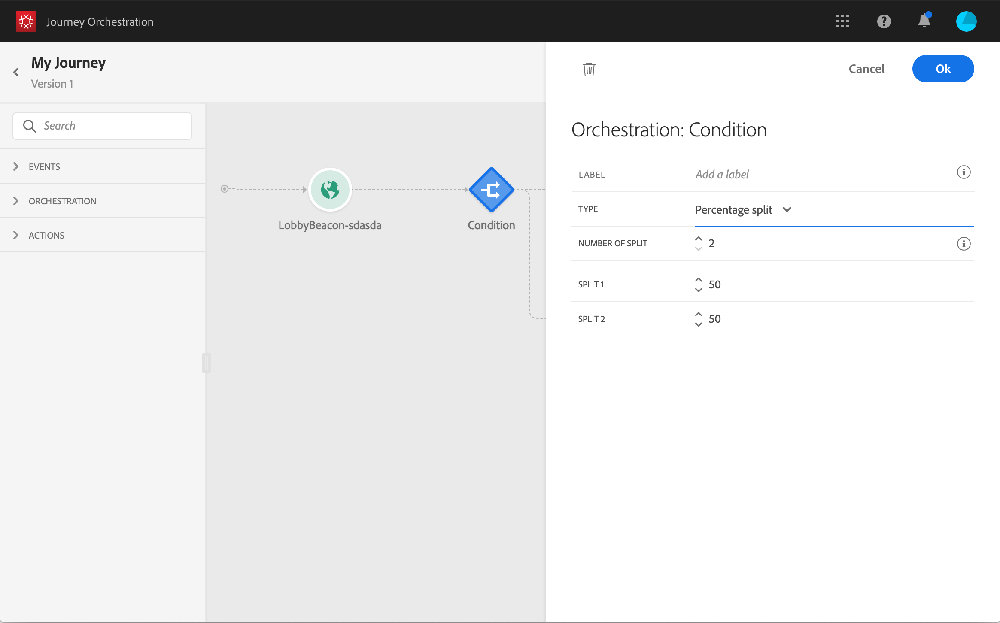

# 条件活动{#section_e2n_pft_dgb}

有四种条件可用：

* [数据源条件](#data_source_condition)
* [时间条件](#time_condition)
* [拆分百分比](#percentage_split)
* [日期条件](#date_condition)

## 关于条件活动{#about_condition}

在旅程中使用多个条件时，您可以为每个条件定义标签，以更轻松地识别它们。

如果要定义多个条件，请单击&#x200B;**[!UICONTROL Add a path]**。 对于每个条件，在活动后，画布中会添加新路径。

请注意，旅程的设计对功能有影响。 当在条件后定义多个路径时，将只执行第一个符合条件的路径。 这意味着您可以通过将路径置于彼此之上或之下来改变路径的优先级。

例如，让我们举一个第一条路径的条件“人是VIP”和第二条路径的条件“人是男性”的例子。 如果符合这两个条件的人(VIP的男性)通过此步骤，则即使他也有资格获得第二条路径，也将选择第一条路径，因为第一条路径“高于”。 要更改此优先级，请按另一个垂直顺序移动活动。

您可以通过选中&#x200B;**[!UICONTROL Show path for other cases than the one(s) above]**&#x200B;为不符合所定义条件的受众创建其他路径。 请注意，此选项在拆分条件中不可用。 请参阅[百分比拆分](#percentage_split)。

简单模式允许您根据字段组合执行简单查询。 所有可用字段都显示在屏幕的左侧。 将字段拖放到主区域。 要组合不同的元素，请将它们互相联锁，以创建不同的组和／或组级别。 然后，您可以选择逻辑运算符来组合同一级别上的元素：

* 和：两个标准的交集。 只考虑与所有条件匹配的元素。
* 或：一合并两个标准。 考虑至少符合一个条件的元素。

如果您使用[Adobe Experience Platform细分服务](https://docs.adobe.com/content/help/en/experience-platform/segmentation/home.html)创建细分，则可以在旅程条件中利用这些细分。 请参阅[在条件](../segment/using-a-segment.md)中使用段。

>[!NOTE]
>
>不能使用简单的编辑器对时间序列执行查询(例如，购买列表、过去单击消息)。 为此，您需要使用高级编辑器。 请参阅[此页](../expression/expressionadvanced.md)。

当操作或条件中发生错误时，个人旅程将停止。使其继续的唯一方法是选中 **[!UICONTROL Add an alternative path in case of a timeout or an error]** 框。请参阅[此章节](../building-journeys/using-the-journey-designer.md#paths)。

## 数据源条件{#data_source_condition}

这允许您根据数据源中的字段或之前位于旅程中的事件定义条件。 要了解如何使用表达式编辑器，请参阅[此页](../expression/expressionadvanced.md)。 使用高级表达式编辑器，您可以设置更高级的条件处理集合或使用要求传递参数的数据源。 请参阅[此页](../datasource/external-data-sources.md)。

## 时间条件{#time_condition}

这允许您根据一天中的某小时和／或一周中的某天执行不同的操作。 例如，您可以决定在白天发送SMS消息，在工作日晚上发送电子邮件。

>[!NOTE]
>
>时区不再特定于某个条件，现在在旅程属性的旅程级别定义。 请参见[此页面](../building-journeys/timezone-management.md)。

## 拆分百分比{#percentage_split}

此选项允许您随机拆分受众，为每个组定义不同的操作。 定义每个路径的拆分数和重新分区。 分割计算是统计的，因为系统无法预测在旅程的这个活动会有多少人流动。 因此，分割具有非常低的误差裕度。 此函数基于Java随机机制（请参阅此[页面](https://docs.oracle.com/javase/7/docs/api/java/util/Random.html)）。

>[!NOTE]
>
>请注意，在百分比拆分条件中没有添加路径的按钮。 路径数取决于拆分数。 在拆分条件中，无法为其他情况添加路径，因为不能添加路径。 人们将始终进入一条分割路径。

## 日期条件{#date_condition}

这允许您根据日期定义不同的流。 例如，如果人员在“销售”期间输入步骤，您将向其发送特定消息。 在这一年的剩余时间，您将再发送一条消息。

>[!NOTE]
>
>时区不再特定于某个条件，现在在旅程属性的旅程级别定义。 请参阅[此页](../building-journeys/timezone-management.md)。

