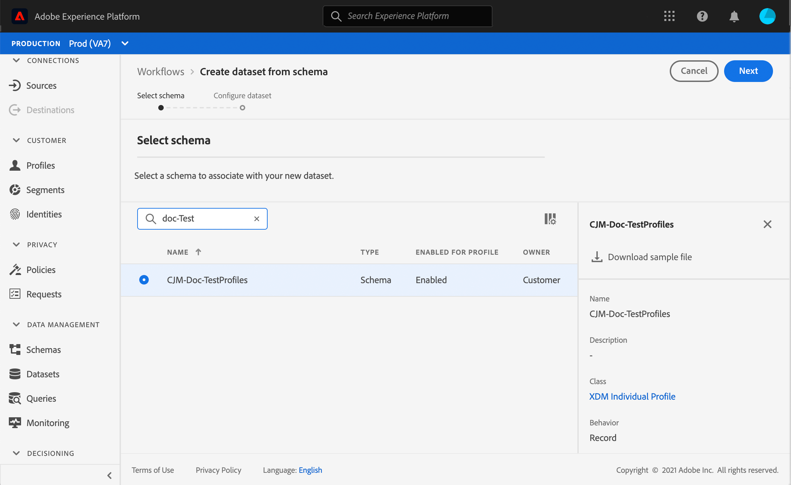
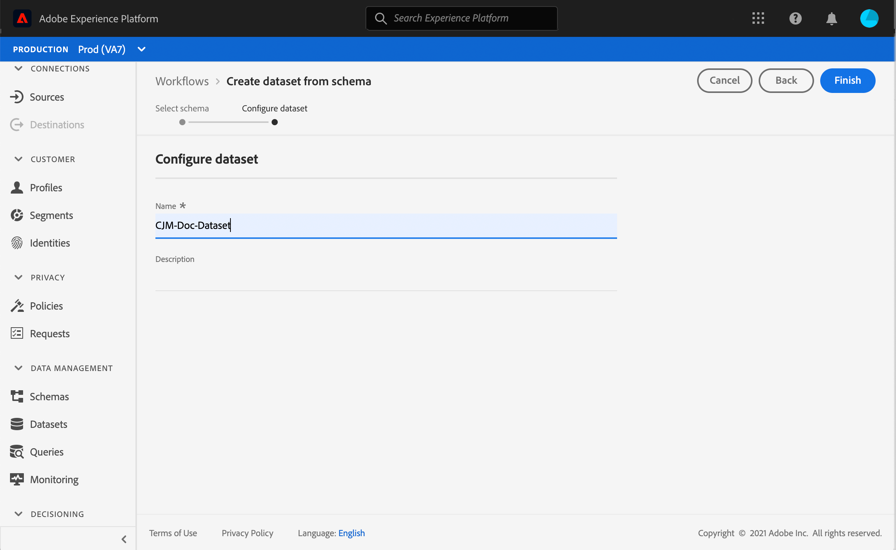

# 创建测试用户档案 {#create-test-profiles}

在历程中使用测试模式时需要测试配置文件。 要了解如何使用测试模式，请参阅 [本节](../building-journeys/testing-the-journey.md).

可通过多种方式在Adobe Experience Platform中创建测试用户档案。 在本文档中，我们重点介绍两种方法：上传 [csv文件](../building-journeys/creating-test-profiles.md#create-test-profiles-csv) 和使用 [API调用](../building-journeys/creating-test-profiles.md#create-test-profiles-api). 您还可以在数据集中上传json文件，请参阅 [数据引入文档](https://experienceleague.adobe.com/docs/experience-platform/ingestion/tutorials/ingest-batch-data.html#add-data-to-dataset).

这些导入方法还允许您更新用户档案属性。 这样，您可以将现有配置文件转换为测试配置文件。 只需使用相似的文件或API调用，并仅包含值为“true”的“testProfile”字段。

创建测试用户档案与在Adobe Experience Platform中创建常规用户档案类似。 欲了解更多信息，请参见 [Real-time Customer Profile文档](https://experienceleague.adobe.com/docs/experience-platform/profile/home.html?lang=zh-Hans).

## 先决条件{#test-profile-prerequisites}

为了能够创建用户档案，您首先需要在Adobe Experience Platform中创建架构和数据集。

首先，您需要 **创建架构**. 执行以下步骤：

1. 在Adobe Experience Platform中，单击 **[!UICONTROL Schemas]**，在左侧菜单中。
   
1. 单击 **[!UICONTROL Create schema]**，然后选择架构类型，例如 **[!UICONTROL XDM Individual Profile]**.
   
1. 为您的架构选择一个名称。
1. 在 **[!UICONTROL Mixins]** 部分中，单击 **[!UICONTROL Add]**。
   
1. 选择适当的mixin。 确保添加 **[!UICONTROL Profile test details]** mixin。 单击 **[!UICONTROL Add mixin]**。
   
mixin列表显示在架构概述屏幕上。
   
1. 在字段列表中，单击要定义为主标识的字段。
   
1. 在 **[!UICONTROL Field properties]** 右侧面板，检查 **[!UICONTROL Identity]** 和 **[!UICONTROL Primary Identity]** 选项并选择命名空间。 如果您希望主标识是电子邮件地址，请选择 **[!UICONTROL Email]** 命名空间。 单击 **[!UICONTROL Apply]**。
   
1. 选择架构并启用 **[!UICONTROL Profile]** 中的选项 **[!UICONTROL Schema properties]**.
   
1. 单击 **[!UICONTROL Save]**。

>[!NOTE]
>
>有关创建模式的详细信息，请参阅 [XDM文档](https://experienceleague.adobe.com/docs/experience-platform/xdm/ui/resources/schemas.html#prerequisites).

那你就需要 **创建数据集** 将在其中导入用户档案。 执行以下步骤：

1. 在Adobe Experience Platform中，单击 **[!UICONTROL Datasets]**，然后单击 **[!UICONTROL Create dataset]**.
   
1. 选择 **[!UICONTROL Create dataset from schema]**.
   
1. 选择之前创建的架构，然后单击 **[!UICONTROL Next]**.
   
1. 选择名称，然后单击 **[!UICONTROL Finish]**.
   
1. 启用 **[!UICONTROL Profile]** 选项。
   

>[!NOTE]
>
> 有关创建数据集的更多信息，请参阅 [目录服务文档](https://experienceleague.adobe.com/docs/experience-platform/catalog/datasets/user-guide.html#getting-started).

## 使用csv文件创建测试配置文件{#create-test-profiles-csv}

在Adobe Experience Platform中，您可以通过将包含其他配置文件字段的csv文件上传到数据集来创建配置文件。 这是最简单的方法。

1. 使用电子表格软件创建一个简单的csv文件。
1. 为每个所需的字段添加一列。 确保添加主标识字段（上面示例中为“personID”），并将“testProfile”字段设置为“true”。
   
1. 为每个用户档案添加一行并填写每个字段的值。
   
1. 将电子表格另存为csv文件。 确保使用逗号作为分隔符。
1. 在Adobe Experience Platform中，单击 **[!UICONTROL Workflows]**，在左侧菜单中。
   
1. 选择 **[!UICONTROL Map CSV to XDM schema]**，然后单击 **[!UICONTROL Launch]**.
   
1. 选择要将用户档案导入到的数据集。 单击 **[!UICONTROL Next]**。
   
1. 单击 **[!UICONTROL Choose files]** 并选择csv文件。 上传文件后，单击 **[!UICONTROL Next]**.
   
1. 将源csv字段映射到架构字段，然后单击 **[!UICONTROL Finish]**.
   
1. 数据导入开始。 状态将从 **[!UICONTROL Processing]** 到 **[!UICONTROL Success]**. 单击 **[!UICONTROL Preview data set]**，位于右上方。
   
1. 检查测试配置文件是否已正确添加。
   

您的测试用户档案已添加，现在可以在测试历程时使用。 请参阅[此小节](../building-journeys/testing-the-journey.md)。
>[!NOTE]
>
> 有关csv导入的更多信息，请参阅 [数据引入文档](https://experienceleague.adobe.com/docs/experience-platform/ingestion/tutorials/map-a-csv-file.html#tutorials).

## 使用API调用创建测试用户档案{#create-test-profiles-api}

您还可以通过API调用创建测试用户档案。 请参阅此[页面](https://experienceleague.adobe.com/docs/experience-platform/profile/home.html?lang=zh-Hans)。

您必须使用包含“配置文件测试详细信息”mixin的配置文件架构。 testProfile标志是此mixin的一部分。

创建配置文件时，请确保传递值： testProfile = true。

请注意，您还可以更新现有配置文件，将其testProfile标志更改为“true”。

以下是创建测试用户档案的API调用示例：

```
curl -X POST \
'https://dcs.adobedc.net/collection/xxxxxxxxxxxxxx' \
-H 'Cache-Control: no-cache' \
-H 'Content-Type: application/json' \
-H 'Postman-Token: xxxxx' \
-H 'cache-control: no-cache' \
-H 'x-api-key: xxxxx' \
-H 'x-gw-ims-org-id: xxxxx' \
-d '{
"header": {
"msgType": "xdmEntityCreate",
"msgId": "xxxxx",
"msgVersion": "xxxxx",
"xactionid":"xxxxx",
"datasetId": "xxxxx",
"imsOrgId": "xxxxx",
"source": {
"name": "Postman"
},
"schemaRef": {
"id": "https://example.adobe.com/mobile/schemas/xxxxx",
"contentType": "application/vnd.adobe.xed-full+json;version=1"
}
},
"body": {
"xdmMeta": {
"schemaRef": {
"contentType": "application/vnd.adobe.xed-full+json;version=1"
}
},
"xdmEntity": {
"_id": "xxxxx",
"_mobile":{
"ECID": "xxxxx"
},
"testProfile":true
}
}
}'
```
