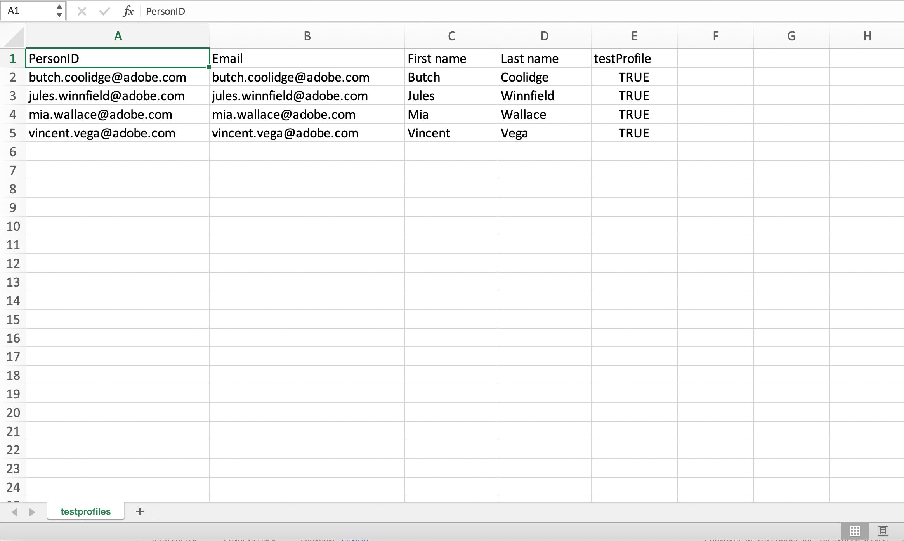
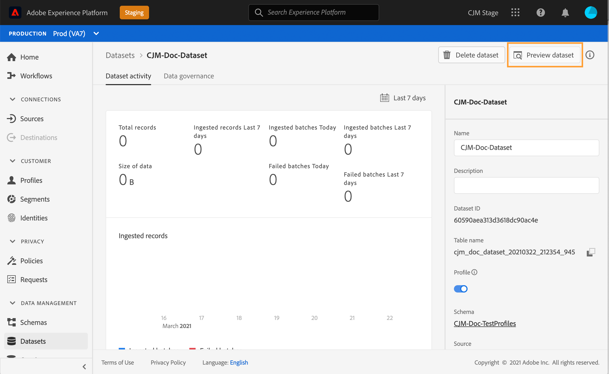

# 创建测试用户档案{#create-test-profiles}


在旅程中使用测试模式时，需要测试用户档案。 可以将[现有用户档案](../building-journeys/creating-test-profiles.md#turning-profile-into-test)转换为测试用户档案，或者[创建测试用户档案](../building-journeys/creating-test-profiles.md#create-test-profiles-csv)。 要了解如何使用测试模式，请参阅[本节](../building-journeys/testing-the-journey.md)。

在Adobe Experience Platform中创建测试用户档案有不同的方法。 在本文档中，我们侧重于两种方法：上传[csv文件](../building-journeys/creating-test-profiles.md#create-test-profiles-csv)并使用[API调用](../building-journeys/creating-test-profiles.md#create-test-profiles-api)。 您还可以在数据集中上传json文件，请参阅[数据摄取文档](https://experienceleague.adobe.com/docs/experience-platform/ingestion/tutorials/ingest-batch-data.html#add-data-to-dataset)

创建测试用户档案与在Adobe Experience Platform中创建常规用户档案类似。 有关详细信息，请参阅[实时客户用户档案文档](https://experienceleague.adobe.com/docs/experience-platform/profile/home.html)。

## 先决条件{#test-profile-prerequisites}

为了能够创建用户档案，您首先需要在Adobe Experience Platform中创建模式和数据集。

首先，您需要&#x200B;**创建模式**。 按照以下步骤操作：

1. 在Adobe Experience Platform中，单击左菜单中的&#x200B;**模式**。
   
1. 单击右上角的&#x200B;**创建模式**，然后选择模式类型，例如&#x200B;**XDM单个用户档案**。
   
1. 为模式选择名称。
1. 在&#x200B;**Mixins**&#x200B;部分，单击&#x200B;**添加**。
   
1. 选择适当的混音。 确保添加&#x200B;**用户档案测试详细信息**&#x200B;混音。 单击&#x200B;**添加mixin**。
   
混音的列表显示在模式概述屏幕上。

   
1. 在字段列表中，单击要定义为主标识的字段。
   
1. 在&#x200B;**字段属性**&#x200B;右面板中，检查&#x200B;**Identity**&#x200B;和&#x200B;**主标识**&#x200B;选项并选择命名空间。 如果希望主标识是电子邮件地址，请选择&#x200B;**电子邮件**&#x200B;命名空间。 单击&#x200B;**应用**。
   
1. 选择模式并在&#x200B;**用户档案属性**&#x200B;中启用&#x200B;**模式**选项。
   
1. 单击&#x200B;**保存**。

>[!NOTE]
>
>有关创建模式的详细信息，请参阅[ XDM文档](https://experienceleague.adobe.com/docs/experience-platform/xdm/ui/resources/schemas.html#prerequisites)。

然后，您需要&#x200B;**创建要导入用户档案的数据集**。 按照以下步骤操作：

1. 在Adobe Experience Platform中，单击左菜单中的&#x200B;**数据集**，然后单击&#x200B;**创建数据集**。
   
1. 选择&#x200B;**从模式**创建数据集。
   
1. 选择之前创建的模式，然后单击&#x200B;**下一步**。
   
1. 选择一个名称，然后单击&#x200B;**完成**。
   
1. 启用&#x200B;**用户档案**选项。
   

>[!NOTE]
>
> 有关创建数据集的详细信息，请参阅[目录服务文档](https://experienceleague.adobe.com/docs/experience-platform/catalog/datasets/user-guide.html#getting-started)。

## 将用户档案转换为测试用户档案{#turning-profile-into-test}

可以将现有用户档案转换为测试用户档案。 在Adobe Experience Platform中，可以像创建用户档案时一样更新用户档案属性。

要执行此操作，更简单的方法是在旅程中使用&#x200B;**更新用户档案**&#x200B;操作活动，并将testProfile布尔字段从false更改为true。

您的旅程将由&#x200B;**读取段**&#x200B;和&#x200B;**更新用户档案**&#x200B;活动组成。 您首先需要创建一个区段，定位要转换为测试用户档案的用户档案。

>[!NOTE]
>
> 由于您将更新&#x200B;**testProfile**&#x200B;字段，所选用户档案必须包含此字段。 相关模式必须具有&#x200B;**用户档案测试详细信息**&#x200B;混音。 请参阅[此章节](../building-journeys/creating-test-profiles.md#test-profiles-prerequisites)。

1. 在客户历程管理中，单击左侧菜单中的&#x200B;**区段**，然后单击右上方的&#x200B;**创建区段**。
   
1. 定义区段名称并构建区段：选择字段和值以目标所需的用户档案。
   
1. 单击&#x200B;**保存**并检查区段是否正确定位用户档案。
   

   >[!NOTE]
   >
   > 区段计算可能需要一些时间。 了解有关[此部分](../segment/about-segments.md)中的区段的更多信息。

1. 现在使用&#x200B;**读取区段**&#x200B;业务流程活动创建新的旅程和开始。
1. 选择之前创建的区段以及用户档案使用的命名空间。
   
1. 添加&#x200B;**更新用户档案**&#x200B;操作活动。
1. 选择模式、**testProfiles**字段、数据集并将值设置为“true”。
   
1. 添加&#x200B;**End**&#x200B;活动，然后单击&#x200B;**Publish**。
   
1. 在Adobe Experience Platform中，检查用户档案是否已正确更新。
   

   >[!NOTE]
   >
   > 有关&#x200B;**更新用户档案**&#x200B;活动的详细信息，请参阅[本节](../building-journeys/update-profiles.md)。

## 使用csv文件{#create-test-profiles-csv}创建测试用户档案

在Adobe Experience Platform中，可以通过将包含不同用户档案字段的csv文件上载到数据集中来创建用户档案。 这是最简单的方法。

1. 使用电子表格软件创建一个简单的csv文件。
1. 为每个需要的字段添加一列。 确保添加主标识字段（上例中为“personID”）和设置为“true”的“testProfile”字段。
   
1. 每个用户档案添加一行，并填写每个字段的值。
   
1. 将电子表格另存为csv文件。 确保逗号用作分隔符。
1. 在Adobe Experience Platform中，单击左菜单中的&#x200B;**工作流**。
   
1. 选择&#x200B;**将CSV映射到XDM模式**，然后单击&#x200B;**启动**。
   
1. 选择要将用户档案导入的数据集。 单击&#x200B;**下一步**。
   
1. 单击&#x200B;**选择文件**，然后选择您的csv文件。 上载文件时，单击&#x200B;**下一步**。
   
1. 将源csv字段映射到模式字段，然后单击&#x200B;**完成**。
   
1. 数据导入开始。 状态将从&#x200B;**Processing**&#x200B;移动到&#x200B;**Success**。 单击右上方的&#x200B;**预览数据集**。
   
1. 检查测试用户档案是否已正确添加。
   

将添加测试用户档案，现在可在测试旅程时使用。 请参阅[此章节](../building-journeys/testing-the-journey.md) 。
>[!NOTE]
>
> 有关csv导入的详细信息，请参阅[数据摄取文档](https://experienceleague.adobe.com/docs/experience-platform/ingestion/tutorials/map-a-csv-file.html#tutorials)。

## 使用API调用创建测试用户档案{#create-test-profiles-api}

您还可以通过API调用创建测试用户档案。 请参阅此[页面](https://docs.adobe.com/content/help/zh-Hans/experience-platform/profile/home.html)。

必须使用包含“用户档案测试详细信息”混音的用户档案模式。 testProfile标志是此混音的一部分。

创建用户档案时，请确保传递值：testProfile = true。

请注意，您还可以更新现有用户档案以将其testProfile标志更改为“true”。

以下是用于创建测试用户档案的API调用示例：

```
curl -X POST \
'https://dcs.adobedc.net/collection/xxxxxxxxxxxxxx' \
-H 'Cache-Control: no-cache' \
-H 'Content-Type: application/json' \
-H 'Postman-Token: xxxxx' \
-H 'cache-control: no-cache' \
-H 'x-api-key: xxxxx' \
-H 'x-gw-ims-org-id: xxxxx' \
-d '{
"header": {
"msgType": "xdmEntityCreate",
"msgId": "xxxxx",
"msgVersion": "xxxxx",
"xactionid":"xxxxx",
"datasetId": "xxxxx",
"imsOrgId": "xxxxx",
"source": {
"name": "Postman"
},
"schemaRef": {
"id": "https://example.adobe.com/mobile/schemas/xxxxx",
"contentType": "application/vnd.adobe.xed-full+json;version=1"
}
},
"body": {
"xdmMeta": {
"schemaRef": {
"contentType": "application/vnd.adobe.xed-full+json;version=1"
}
},
"xdmEntity": {
"_id": "xxxxx",
"_mobile":{
"ECID": "xxxxx"
},
"testProfile":true
}
}
}'
```

