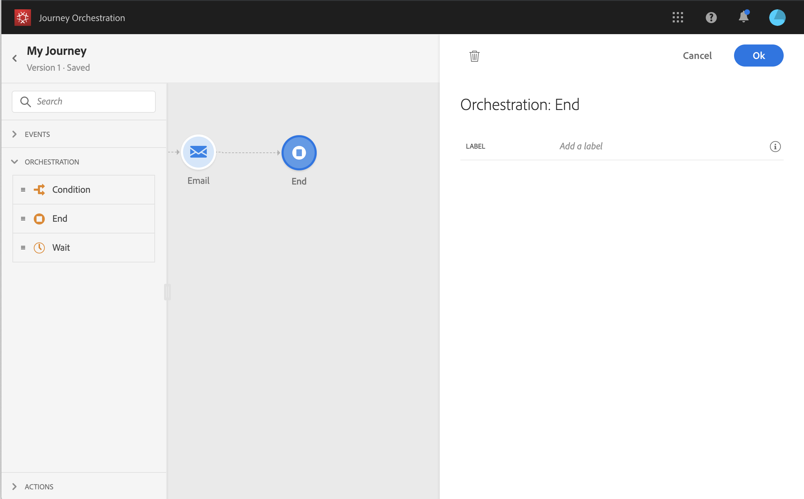

# 结束活动{#section_vqp_4ft_dgb}

>[!CAUTION]
>
>**希望了解 Adobe Journey Optimizer**？ 请单击[此处](https://experienceleague.adobe.com/zh-hans/docs/journey-optimizer/using/ajo-home){target="_blank"}获取 Journey Optimizer 文档。
>
>
>_本文档参考已被 Journey Optimizer 取代的旧版 Journey Orchestration 资料。 如果您对访问 Journey Orchestration 或 Journey Optimizer 有任何疑问，请联系帐户团队。_

**[!UICONTROL End]**&#x200B;活动允许您标记历程每个路径的结尾。 这并非强制性要求，但我们推荐使用以便能够清晰了解情况。 实际上，如果历程有多个结束活动，我们建议您为每个结束活动添加标签，以使报告更易于阅读。 请参阅[此页](../reporting/about-journey-reports.md)。

