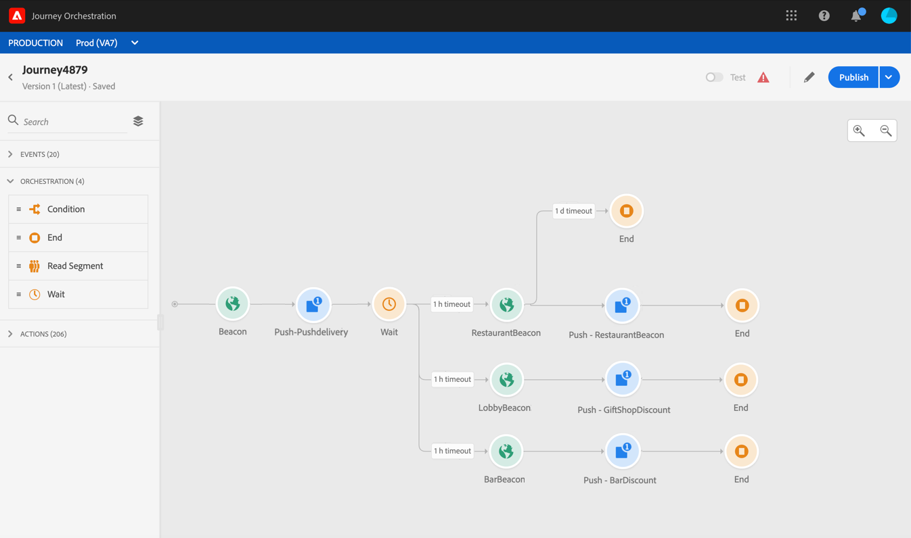

# 关于事件活动 {#concept_rws_1rt_52b}

技术用户配置的事件(请参阅 [此页面](../event/about-events.md))都会显示在屏幕左侧的面板的第一个类别中。

始终通过拖放事件活动开始您的历程。 您还可以双击该图标。

单击画布中的事件活动时，将显示活动配置窗格。 默认情况下，如果您多次使用同一事件，则会在画布的事件名称中添加一个递增的数字。 此外，您可以使用 **[!UICONTROL Label]** 字段来添加后缀，该后缀将显示在画布的活动下方。 这对于识别画布中的事件很有用，尤其是当您多次使用同一事件时。 这样还可以使错误时的调试更容易，并使报告更易于阅读。

## 在特定期间侦听事件 {#listening}

位于历程中的事件活动可无限期地侦听事件。 要仅在特定时间内侦听事件，必须为事件配置超时。

然后，该历程将在超时指定的时间内侦听事件。 如果在该时间段内收到事件，则该人员将流入事件路径。 如果没有，则客户将流入超时路径（如果已定义），或将继续该历程。 如果未定义超时路径，则超时设置将充当等待活动，从而使配置文件等待一段时间，如果事件发生在该等待结束之前，则该时间可能会停止。 如果要在超时后从历程中排除用户档案，则必须设置超时路径。

要为事件配置超时，请执行以下步骤：

1. 激活 **[!UICONTROL Enable the event timeout]** 事件属性中的选项。

1. 指定历程将等待事件的时间量。

1. 如果在指定的超时内未收到任何事件时要将个人发送到超时路径中，请启用 **[!UICONTROL Set the timeout path]** 选项。 如果未启用此选项，则到达超时后个人将继续历程。

   

在本例中，历程向客户发送第一个欢迎推送。 然后，仅当客户第二天进入餐厅时，它才会发送餐点折扣推送。 因此，我们将restaurant事件配置为1天超时：

* 如果在欢迎推送后不到1天收到餐厅事件，则发送餐饮折扣推送活动。
* 如果在第二天未收到餐馆事件，则该人员将流过超时路径。

请注意，如果要对位于之后的多个事件配置超时， **[!UICONTROL Wait]** 活动，您只需在这些事件之一上配置超时。

超时将应用于 **[!UICONTROL Wait]** 活动。 如果在指定的超时之前未收到任何事件，则个人将流入单个超时路径，或将通过分支继续该历程，退出已定义这些超时设置的活动。

