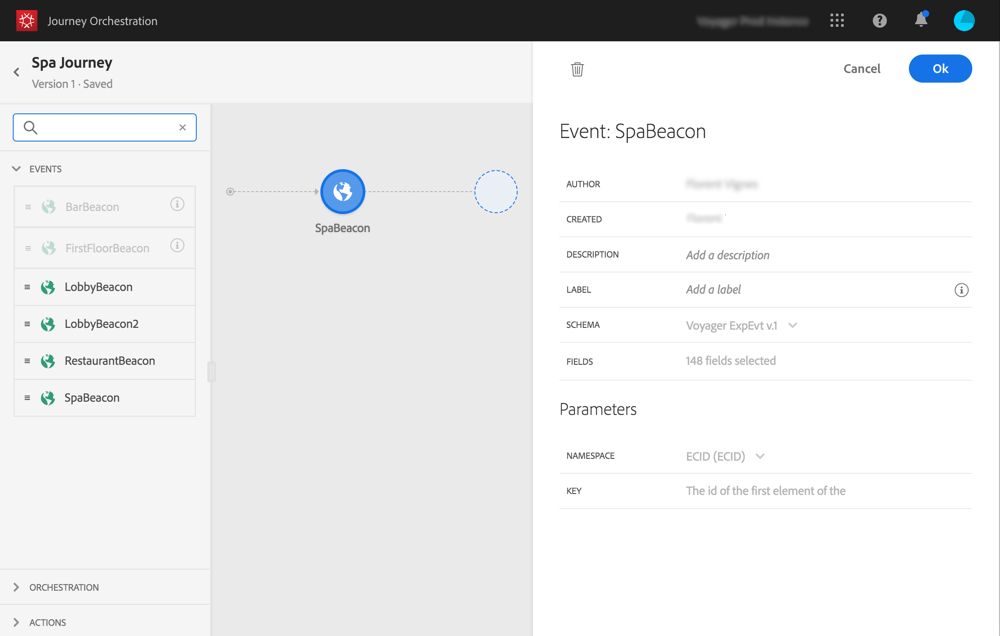

# 一般事件 {#section_ofg_jss_dgb}

>[!CAUTION]
>
>**希望了解 Adobe Journey Optimizer**？ 请单击[此处](https://experienceleague.adobe.com/zh-hans/docs/journey-optimizer/using/ajo-home){target="_blank"}获取 Journey Optimizer 文档。
>
>
>_本文档参考已被 Journey Optimizer 取代的旧版 Journey Orchestration 资料。 如果您对访问 Journey Orchestration 或 Journey Optimizer 有任何疑问，请联系帐户团队。_

对于此类事件，只能添加标签和描述。 配置的其他部分无法编辑。 该操作由技术用户执行。 请参阅[此页](../event/about-events.md)。

