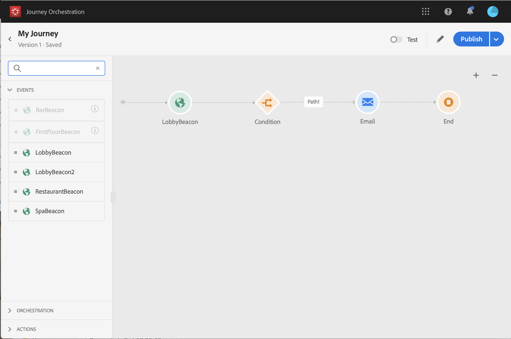

# 创建历程 {#concept_gq5_sqt_52b}

此步骤由 **商业用户**. 您可以在此处创建历程。 结合不同的事件、编排和操作活动，构建多步跨渠道方案。

历程界面让您可以轻松地将活动从调色板拖放到画布中。您还可以双击一个活动，以便在可以进行后续步骤时将其添加到画布中。每个活动在流程中具有特定的角色和位置。 活动将按顺序排列。 活动完成后，流会继续并处理下一个活动，依此类推。

每个历程只允许一个命名空间。 当您删除第一个事件时，具有不同命名空间的事件将显示为灰色。 如果第一个事件没有命名空间，则具有命名空间的所有事件都将灰显。 请参阅[此页](../event/selecting-the-namespace.md)。此外，如果历程具有没有命名空间的事件，则Adobe Experience Platform字段组将灰显。 最后，如果您在同一历程中使用多个事件，则需要使用相同的命名空间。

开始新历程时，无法在第一步操作中放入画布的元素会被隐藏。 这涉及所有操作、条件活动、等待和反应。

## 快速启动 {#creating_journey}

以下是创建和发布历程的主要步骤。

1. 在顶部菜单中，单击 **[!UICONTROL Home]**&#x200B;选项卡。

   将显示历程列表。 请参阅 [此页面](../building-journeys/using-the-journey-designer.md) 以了解有关该界面的详细信息。

   

1. 单击 **[!UICONTROL Create]** 以创建新旅程。

   

1. 编辑右侧显示的配置窗格中的历程属性。请参阅[此页](../building-journeys/changing-properties.md)。

   

1. 首先，将事件活动从面板拖放到画布中。 您还可以双击某个活动以将其添加到画布。

   

1. 拖放其他活动并进行配置。 请参阅页面 [事件活动](../building-journeys/event-activities.md)， [关于编排活动](../building-journeys/about-orchestration-activities.md) 和 [关于操作活动](../building-journeys/about-action-activities.md).

   

1. 您的历程会自动保存。 测试您的历程并发布它。 参见 [测试历程](../building-journeys/testing-the-journey.md) 和 [发布历程](../building-journeys/publishing-the-journey.md).

   

## 结束历程 {#ending_a_journey}

历程可能因个人原因而结束：

* 该人员到达路径的最后一个活动。 最后一个活动可以是结束活动或其他活动。 没有义务使用结束活动来结束路径。 请参阅[此页](../building-journeys/end-activity.md)。
* 人员到达条件活动（或具有条件的等待活动），但不匹配任何条件。

如果允许重新进入，人员可以重新进入历程。 请参阅[此页](../building-journeys/changing-properties.md)。

旅程可以关闭，原因如下：

* 历程已通过 **[!UICONTROL Close to new entrances]** 按钮。
* 已达到历程的结束日期。

当历程关闭时（由于上述任何原因），它将具有状态 **[!UICONTROL Closed]**. 历程将停止让新个人进入历程。 已在历程中的人员将正常完成历程。 默认全局超时30天后，历程将切换到 **已完成** 状态。 请参阅此[部分](../building-journeys/changing-properties.md#entrance)。

如果您需要停止历程中所有个人的进度，则可以停止它。 停止历程将超时历程中的所有个人。

要了解如何手动关闭或停止历程，请参阅此 [部分](../building-journeys/terminating-a-journey.md).
