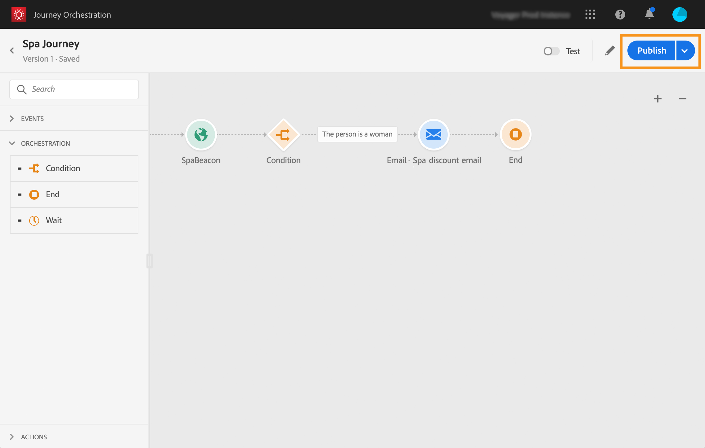

# 发布历程{#concept_mtc_lrt_52b}

>[!CAUTION]
>
>**希望了解 Adobe Journey Optimizer**？ 请单击[此处](https://experienceleague.adobe.com/zh-hans/docs/journey-optimizer/using/ajo-home){target="_blank"}获取 Journey Optimizer 文档。
>
>
>_本文档参考已被 Journey Optimizer 取代的旧版 Journey Orchestration 资料。 如果您对访问 Journey Orchestration 或 Journey Optimizer 有任何疑问，请联系帐户团队。_

您可以在测试历程的有效性后发布历程。

如果您需要对已发布的历程进行修改，则需要创建历程的新版本。 请参阅[此页](../building-journeys/journey-versions.md)。 当历程为只读时，您只能修改活动标签和描述、历程的名称和历程的描述。

如果停止历程，历程将永久停止。 将永久停止所有流入历程的人员，历程将停止允许新进入。 如果您需要再次使用历程，则需要复制并发布它。

1. 在发布历程之前，请验证其是否有效以及是否没有错误。 您将无法发布包含错误的历程。 请参阅[此小节](../about/troubleshooting.md#section_h3q_kqk_fhb)。 此外，建议在发布之前测试您的历程。 请参阅[此页](../building-journeys/testing-the-journey.md)。
1. 要发布历程，请单击右上角下拉菜单中的&#x200B;**[!UICONTROL Publish]**&#x200B;选项。

   

发布历程时，历程处于只读模式。
