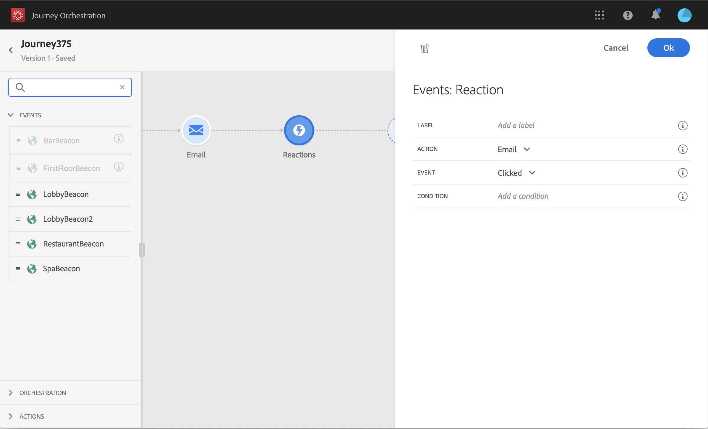

# 反应事件 {#section_dhx_gss_dgb}

在调色板中提供的不同事件活动中，您会找到内置的 **[!UICONTROL Reactions]** 事件。 此活动允许您对与通过电子邮件、短信发送的消息相关的跟踪数据做出响应，或在同一旅程中推送活动。 此信息来自Adobe Campaign Standard中的交易消息传递。 我们会在与Adobe Experience Platform共享信息时实时捕获这些信息。 对于推送通知，您可以对单击、发送或失败的消息做出响应。 对于SMS消息，您可以对已发送或失败的消息做出响应。 对于电子邮件，您可以对单击、发送、打开或失败的消息做出响应。

您还可以使用此机制在消息没有反应时执行操作。 为此，请创建与反应活动平行的第二条路径并添加等待活动。 如果在等待活动中定义的期间内没有反应，则将选择第二条路径。 例如，您可以选择发送后续消息。

请注意，只有在以前有电子邮件、推送或SMS活动时，您才能在画布中使用反应活动。

See [About action activities](../building-journeys/about-action-activities.md).

以下是配置反应事件的不同步骤：

1. 添加 **[!UICONTROL Label]** 反应。 此步骤是可选的。
1. 从下拉列表中，选择要对其做出响应的操作活动。 您可以选择位于路径前几步中的任何操作活动。
1. 根据您选择的操作（电子邮件、短信或推送通知），选择您要回应的内容。
1. 您可以将条件定义为可选步骤。 例如，在执行电子邮件操作后，您可以决定创建两个路径，一个具有仅跟踪VIP客户的点击的反应事件，另一个具有跟踪女性点击的反应事件。

>[!NOTE]
>
>反应事件可与Adobe Campaign Standard协作，无论其部署在AWS或Azure服务器上。
>
>反应事件无法跟踪不同旅程中发生的电子邮件、短信或推送操作。
>
>反应事件跟踪“跟踪”类型链接的点击情况(请参 [阅此页](https://docs.adobe.com/content/help/en/campaign-standard/using/designing-content/links.html#about-tracked-urls))。 退订和镜像页面链接未考虑在内。

>[!IMPORTANT]
>
>Gmail等电子邮件客户端允许阻止图像。 打开的电子邮件使用电子邮件中包含的0像素图像进行跟踪。 如果图像被阻止，则打开的电子邮件将不会被考虑在内。
