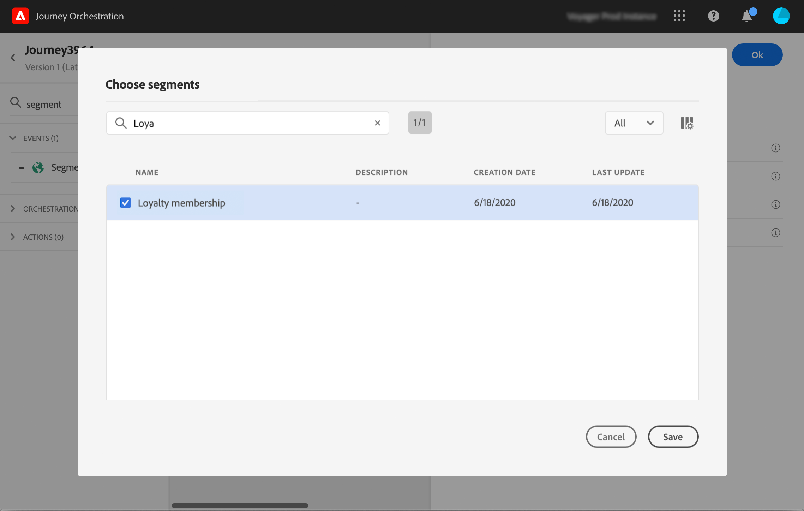

# 区段鉴别事件 {#segment-qualification}

## 关于细分资格事件{#about-segment-qualification}

此活动允许您的旅程倾听Adobe Experience Platform地区用户档案入口和出口，以便让个人进入旅程或前进。 For more information on segment creation, refer to this [section](../segment/about-segments.md).

假设您拥有“银色客户”细分。 通过此活动，您可以让所有新的银质客户进入旅程，并向他们发送一系列个性化信息。

此类事件可定位为旅程的第一步或稍后步骤。

>[!IMPORTANT]
>
>请记住，Adobe Experience Platform区段是每天计算一次&#x200B;**(批** 区段)或实时计算(**流化段** ，使用Adobe Experience Platform的高频受众选项)。
>
>如果对所选区段进行流处理，属于此区段的个人可能会实时进入该旅程。 如果区段为批，则新符合此区段资格的人员将潜在地在在Adobe Experience Platform执行区段计算时进入旅程。

1. 展开 **[!UICONTROL Events]** 类别并将 **[!UICONTROL Segment qualification]** 活动放入画布。

   

1. 添加 **[!UICONTROL Label]** 到活动。 此步骤是可选的。

1. 单击字段 **[!UICONTROL Segment]** 并选择要利用的区段。

   >[!NOTE]
   >
   >请注意，您可以自定义列表中显示的列，并对其进行排序。

   

   添加区段后，该按 **[!UICONTROL Copy]** 钮允许您复制其名称和ID:

   `{"name":"Loyalty membership“,”id":"8597c5dc-70e3-4b05-8fb9-7e938f5c07a3"}`

   

1. 在字 **[!UICONTROL Behavior]** 段中，选择您要监听段入口、出口或两者。

1. 选择命名空间。 仅当将事件定位为旅程的第一步时，才需要此设置。

   

有效负荷包含以下上下文信息，您可以在条件和操作中使用这些信息：

* 行为（入口、出口）
* 资格时间戳
* 区段id

在活动后面的条件或操作中使用表达式编辑 **[!UICONTROL Segment qualification]** 器时，您有权访问该 **[!UICONTROL SegmentQualification]** 节点。 您可以在和( **[!UICONTROL Last qualification time]** 进入或 **[!UICONTROL status]** 退出)之间进行选择。

请参 [阅条件活动](../building-journeys/condition-activity.md#about_condition)。

## 最佳做法 {#best-practices-segments}

该活动 **[!UICONTROL Segment Qualification]** 使得在Adobe Experience Platform地区获得资格或被取消资格的个人的旅程能够立即进入。

该信息的接收速度很快。 所做的测量显示每秒接收10,000事件的速度。 因此，你应该确保你明白入口高峰是如何发生的，如何避开它们，以及如何让你的旅程为它们做好准备。

### 批处理段{#batch-speed-segment-qualification}

在对批处理段使用段资格时，请注意，在每日计算时将出现入口高峰。 峰值的大小取决于每天进入（或退出）区段的个人数。

此外，如果新创建批段并立即在旅程中使用，则第一批计算可能会使大量个人进入旅程。

### 流化细分{#streamed-speed-segment-qualification}

当对流化分段使用分段资格时，由于持续评估分段，导致入口／出口出现较大高峰的风险较小。 但是，如果细分定义导致大量客户同时获得相应资格，则可能也会出现峰值。

### 如何避免过载{#overloads-speed-segment-qualification}

以下是有助于避免在旅程中利用超载系统(数据源、自定义操作、Adobe Campaign Standard操作)的一些最佳实践。

请勿在活动中 **[!UICONTROL Segment Qualification]** 创建批区段后立即使用它。 它将避免第一个计算峰。 请注意，如果您要使用从未计算过的区段，旅程画布中将显示黄色警告。

为数据源设置上限规则，并在旅程中使用操作，以避免超载(请参阅本 [节](../api/capping.md))。 请注意，限制规则没有重试。 如果需要重试，则必须通过选中条件或操作中的复选框，在旅程中使 **[!UICONTROL Add an alternative path in case of a timeout or an error]** 用替代路径。

在制作旅程中使用细分之前，请始终首先评估每天符合此细分条件的个人数量。 要这样做，您可以查 **[!UICONTROL Segments]** 看Adobe Experience Platform的部分并查看右侧的图形。

