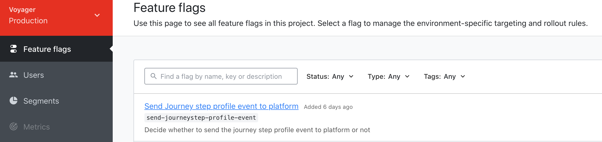

# 旅程步骤共享概述{#sharing-overview}

旅程安排会自动将旅程性能数据发送到Adobe Experience Platform，以便与其他数据结合使用，以便分析。

例如，您已设置发送多个电子邮件的旅程。 此功能允许您将旅程编排数据与下游事件数据相结合，如发生了多少转化、网站上发生了多少参与，或在商店中发生了多少交易。 旅程信息可以与平台上的数据相结合，无论是从其他数字资产还是离线资产，都可以提供更全面的性能视图。

旅程编排自动为个人在旅程中执行的每个步骤创建必要的模式和流到数据集中。 步骤事件对应于旅程中从一个节点移动到另一个节点的个人。 例如，在具有事件、条件和操作的旅程中，将向平台发送三步事件。

传递的XDM字段的列表是全面的。 有些代码包含系统生成的代码，而另一些代码则具有易读的易用名称。 示例包括旅程活动的标签或步骤状态： 操作超时或以错误结束的次数。

>[!CAUTION]
>
>默认情况下，数据集不会为实时用户档案服务打开。 如果要在用户档案服务中创建数据集，则需要打开它(**用户档案** 切换)。 请注意，大量事件将占用配额中的存储。 在激活用户档案数据集之前，请仔细执行
>
>

>[!]
>
>旅程还可以决定是否将旅程步骤用户档案事件发送到平台。  旅程可以通过技术切换来决定这一点。
>
>

旅程以流方式在数据发生时发送数据。 您可以使用查询服务查询此数据。 您可以连接到客户旅程分析或其他BI工具，以视图与这些步骤相关的数据。

将创建以下模式:

* 旅程步骤用户档案事件模式，用于旅程编排——体验旅程中所采取步骤的事件以及用于映射到单个旅程参与者的身份映射。
* 旅程编排的旅程步骤事件模式-与旅程元数据关联的旅程步骤事件。
* 旅程模式，包含用于旅程编排的旅程字段——用于描述旅程的旅程元数据。

传递以下数据集：

* 旅程步骤用户档案事件模式，用于旅程编排
* 旅程步骤事件
* 旅程

传递到平台的XDM字段的列表详细信息如下：

* [旅程步骤事件常用字段](../building-journeys/sharing-common-fields.md)
* [旅程步骤事件操作执行字段](../building-journeys/sharing-execution-fields.md)
* [journeyStep事件数据提取字段](../building-journeys/sharing-fetch-fields.md)
* [journeyStep事件身份字段](../building-journeys/sharing-identity-fields.md)
* [旅程场](../building-journeys/sharing-journey-fields.md)

