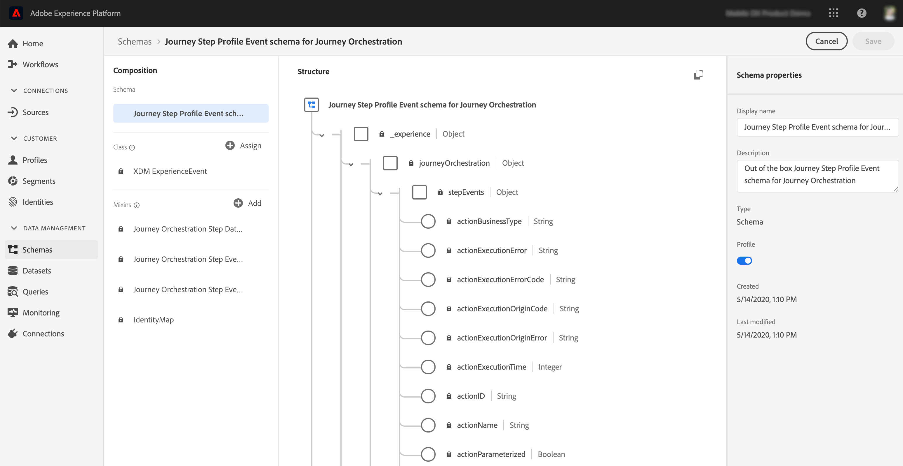

# 历程步骤共享概述{#sharing-overview}

[!DNL Journey Orchestration] 自动将旅程性能数据发送到Adobe Experience Platform，以便与其他数据结合进行分析。

>[!NOTE]
>
>默认情况下，在历程步骤事件的所有实例上都会激活此功能。 对于历程用户档案步骤事件，将应请求激活。 您无法修改或更新在配置步骤事件期间创建的架构和数据集。 默认情况下，这些架构和数据集处于只读模式。

例如，您已设置发送多个电子邮件的历程。 此功能允许您将 [!DNL Journey Orchestration] 包含下游事件数据的数据，例如发生了多少次转化、网站上发生了多少参与，或在存储中发生了多少次交易。 历程信息可以与Adobe Experience Platform上的数据（来自其他数字属性或来自离线属性）结合使用，以更全面地了解性能。

[!DNL Journey Orchestration] 会为个人在历程中执行的每个步骤自动将必要的架构和流创建到Adobe Experience Platform数据集。 步骤事件对应于在历程中从一个节点移动到另一个节点的个人。 例如，在包含事件、条件和操作的历程中，将三步事件发送到Adobe Experience Platform。

传递的XDM字段列表非常完整。 有些代码包含系统生成的代码，而另一些代码则具有人类可读的友好名称。 示例包括历程活动的标签或步骤状态：操作超时或以错误结束的次数。

>[!CAUTION]
>
>无法为实时配置文件服务打开数据集。 请确保 **[!UICONTROL Profile]** 关闭。

历程在发生数据时以流方式发送数据。 您可以使用查询服务查询此数据。 您可以连接到Customer Journey Analytics或其他BI工具以查看与这些步骤相关的数据。

创建了以下架构：

* 历程步骤配置文件事件架构 [!DNL Journey Orchestration]  — 体验事件，以了解在历程中采取的步骤以及要用于映射到单个历程参与者的身份映射。
* 历程步骤事件架构 [!DNL Journey Orchestration]  — 与历程元数据关联的历程步骤事件。
* 历程历程字段的架构 [!DNL Journey Orchestration]  — 用于描述历程的历程元数据。

传递了以下数据集：

* 历程步骤配置文件事件架构 [!DNL Journey Orchestration]
* 历程步骤事件
* 历程

下面详细介绍了传递到Adobe Experience Platform的XDM字段列表：

* [步骤事件字段列表](../building-journeys/sharing-field-list.md)
* [旧版步骤事件字段](../building-journeys/sharing-legacy-fields.md)

有关向Adobe Experience Platform报告步骤事件的更多信息，请观看此视频 [教程视频](https://experienceleague.adobe.com/docs/journey-orchestration-learn/tutorials/reporting-step-events-to-adobe-experience-platform.html).
