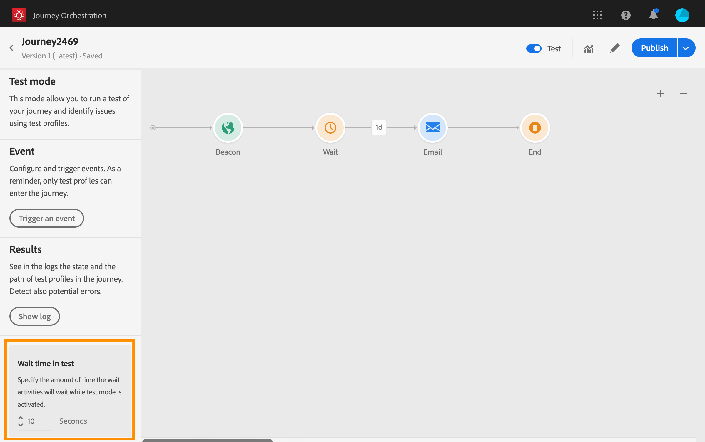

# 测试历程{#testing_the_journey}

在能够测试历程之前，必须解决所有错误（如果有）。 请参阅[此小节](../about/troubleshooting.md#section_h3q_kqk_fhb)。

您可以使用测试用户档案在历程发布之前对其进行测试。 这允许您分析个人在历程中的流动方式，并在发布之前进行故障诊断。

只有测试用户档案才能在测试模式下进入历程。 您可以创建新的测试用户档案，或将现有用户档案转换为测试用户档案。 请参阅此[部分](../building-journeys/creating-test-profiles.md)。

要使用测试模式，请执行以下步骤：

1. 在测试历程之前，请验证历程是否有效且没有错误。 您将无法启动包含错误的历程测试。 请参阅[此小节](../about/troubleshooting.md#section_h3q_kqk_fhb)。出现错误时，将显示警告符号。

1. 要激活测试模式，请单击位于右上角的&#x200B;**[!UICONTROL Test]**&#x200B;切换开关。

   

1. 使用左下角的&#x200B;**[!UICONTROL Wait time]**&#x200B;参数定义每个等待活动和事件超时在测试模式下的停留时间。 默认时间为10秒，用于等待和事件超时。 这样可以确保快速获得测试结果。 仅当您在历程中放置了一个或多个等待活动时，才会显示此参数。

   

   >[!NOTE]
   >
   >在历程中使用反应事件时，等待时间默认值和最小值为40秒。 请参阅[此小节](../building-journeys/reaction-events.md)。

1. 单击&#x200B;**[!UICONTROL Trigger an event]**&#x200B;以配置事件并将事件发送到历程。

   

1. 配置所需的不同字段。 在&#x200B;**配置文件标识符**&#x200B;字段中，输入用于标识测试用户档案的字段值。 例如，它可以是电子邮件地址。 确保发送与测试用户档案相关的事件。 请参阅[触发事件](#firing_events)。

   

1. 收到事件后，单击&#x200B;**[!UICONTROL Show log]**&#x200B;按钮以查看测试结果并进行验证。 请参阅[查看日志](#viewing_logs)。

   

1. 如果有任何错误，请取消激活测试模式，修改历程并再次进行测试。当测试结果确定时，您可以发布历程。 请参阅[此页](../building-journeys/publishing-the-journey.md)。

## 重要说明 {#important_notes}

* 提供了一个界面来触发事件到测试历程，但事件也可以由第三方系统（如Postman）发送。
* 只允许在实时客户用户档案服务中标记为“测试用户档案”的个人进入测试历程。 请参阅此[部分](../building-journeys/creating-test-profiles.md)。
* 测试模式仅在使用命名空间的草稿历程中可用。 测试模式需要检查进入历程的人员是否为测试用户档案，因此必须能够访问Adobe Experience Platform。
* 在测试会话期间，可以进入历程的测试用户档案最大数为100。
* 当您禁用测试模式时，它将从过去或当前使用该模式的所有人员处删除历程。 它还会清除报表。
* 您可以根据需要多次启用/禁用测试模式。
* 激活测试模式后，您无法修改历程。 在测试模式下，您可以直接发布历程，无需先停用测试模式。
* 达到拆分时，始终选择顶部分支。 如果希望测试选择其他路径，则可以重新组织拆分分支的位置。

## 将轮廓转换为测试轮廓{#turning-profile-into-test}

您可以将现有用户档案转换为测试用户档案。 在Adobe Experience Platform中，您可以通过API调用更新用户档案属性，但无法通过界面执行该操作。

要执行此操作，最简单的方法是使用&#x200B;**更新用户档案**&#x200B;操作活动，并将测试用户档案布尔字段从false更改为true。 请参阅[此小节](../building-journeys/update-profiles.md#using-the-test-mode)。

## 创建测试用户档案{#create-test-profile}

如果要创建新的测试用户档案，其过程与在Adobe Experience Platform中创建用户档案时的过程相同。 它通过API调用执行。 请参见此[page](https://experienceleague.adobe.com/docs/experience-platform/profile/home.html)

您必须使用包含“用户档案测试详细信息”混合的用户档案架构。 testProfile标记是此混合标记的一部分。

创建用户档案时，请确保传递值：testProfile = true。

请注意，您还可以更新现有的用户档案，以将其testProfile标记更改为“true”。

以下是用于创建测试用户档案的API调用示例：

```
curl -X POST \
'https://dcs.adobedc.net/collection/xxxxxxxxxxxxxx' \
-H 'Cache-Control: no-cache' \
-H 'Content-Type: application/json' \
-H 'Postman-Token: xxxxx' \
-H 'cache-control: no-cache' \
-H 'x-api-key: xxxxx' \
-H 'x-gw-ims-org-id: xxxxx' \
-d '{
"header": {
"msgType": "xdmEntityCreate",
"msgId": "xxxxx",
"msgVersion": "xxxxx",
"xactionid":"xxxxx",
"datasetId": "xxxxx",
"imsOrgId": "xxxxx",
"source": {
"name": "Postman"
},
"schemaRef": {
"id": "https://example.adobe.com/mobile/schemas/xxxxx",
"contentType": "application/vnd.adobe.xed-full+json;version=1"
}
},
"body": {
"xdmMeta": {
"schemaRef": {
"contentType": "application/vnd.adobe.xed-full+json;version=1"
}
},
"xdmEntity": {
"_id": "xxxxx",
"_mobile":{
"ECID": "xxxxx"
},
"testProfile":true
}
}
}'
```

## 触发事件 {#firing_events}

通过&#x200B;**[!UICONTROL Trigger an event]**&#x200B;按钮，可配置将让人员进入历程的事件。

>[!NOTE]
>
>在测试模式下触发事件时，将生成一个实际事件，这意味着它还会点击监听此事件的其他历程。

作为先决条件，您必须知道在Adobe Experience Platform中哪些用户档案被标记为测试用户档案。 事实上，测试模式仅允许在历程中使用这些用户档案，且事件必须包含ID。 预期的ID取决于事件配置。 例如，它可以是ECID或电子邮件地址。 此键的值需要添加到&#x200B;**配置文件标识符**&#x200B;字段中。

>[!NOTE]
>
>将为需要枚举的字段显示下拉列表。 只需选择一个可用值即可。

如果您的历程包含多个事件，请使用下拉列表选择一个事件。 然后，对于每个事件，配置传递的字段和执行事件发送。 界面可帮助您在事件有效负载中传递正确的信息，并确保信息类型正确。 测试模式会保存测试会话中使用的最后一个参数，以供日后使用。


界面允许您传递简单的事件参数。 如果要在事件中传递集合或其他高级对象，可单击&#x200B;**[!UICONTROL Code View]**&#x200B;以查看有效负载的整个代码并对其进行修改。 例如，您可以复制并粘贴由技术用户准备的事件信息。


技术用户还可以使用此界面来撰写事件负载和触发事件，而无需使用第三方工具。

单击&#x200B;**[!UICONTROL Send]**&#x200B;按钮时，测试开始。 历程中个人的进度由可视流表示。 当个人在历程中移动时，路径会逐渐变为绿色。 如果发生错误，则在相应步骤中显示警告符号。 您可以将光标放在上面以显示有关错误的详细信息并访问完整的详细信息（如果可用）。


当您在事件配置屏幕中选择其他测试用户档案并再次运行测试时，会清除可视化流程并显示新用户的路径。

在测试中打开历程时，显示的路径对应于上次执行的测试。

无论事件是通过界面触发还是通过外部触发（例如使用Postman），可视化流程都可正常工作。

## 基于规则的历程的测试模式 {#test-rule-based}

测试模式还适用于使用基于规则事件的历程。 有关基于规则的事件的更多信息，请参阅[此页面](../event/about-events.md)。

触发事件时，**事件配置**&#x200B;屏幕允许您定义要在测试中通过的事件参数。 您可以通过单击右上角的工具提示图标来查看事件ID条件。 规则评估中涉及的每个字段旁边也会提供工具提示。


有关如何使用测试模式的详细信息，请参阅[此页面](../building-journeys/testing-the-journey.md)。

## 查看日志 {#viewing_logs}

**[!UICONTROL Show log]**&#x200B;按钮允许您查看测试结果。 此页面以JSON格式显示历程的当前信息。 利用按钮可复制整个节点。 您需要手动刷新页面以更新历程的测试结果。


>[!NOTE]
>
>在测试日志中，如果调用第三方系统（数据源或操作）时出错，则显示错误代码和错误响应。

当前历程中显示的个人数（技术上称为实例）。 下面是为每个人显示的有用信息：

* _Id_:历程中个人的内部ID。这可用于调试。
* _currentstep_:个人在历程中所处的步骤。我们建议向您的活动添加标签，以便更轻松地识别它们。
* _currentstep_  > phase:个人历程的状态（正在运行、已完成、错误或超时）。有关详细信息，请参阅下文。
* _currentstep_  >  _extraInfo_:错误的描述和其他上下文信息。
* _currentstep_  >  _fetchErrors_:有关在此步骤期间发生的获取数据错误的信息。
* _externalKeys_:在事件中定义的键公式的值。
* _exchedData_:历程使用数据源时已检索的数据。
* _transitionHistory_:个人执行的步骤列表。对于事件，将显示有效负载。
* _actionExecutionErrors_ :有关所发生错误的信息。

以下是个人历程的不同状态：

* _正在运行_:个人当前正在历程中。
* _已完成_:个人即将结束历程。
* _错误_:由于错误，个人将在历程中停止。
* _超时_:由于步骤过于耗时，个人将在历程中停止。

使用测试模式触发事件时，将自动生成一个包含源名称的数据集。

使用测试模式触发事件时，将自动生成一个包含源名称的数据集。

测试模式会自动创建一个体验事件，并将其发送到Adobe Experience Platform。 此体验事件的源名称为“Journey Orchestration测试事件”。

如果是从多个历程触发的多个事件，

有一种情况是，从多个历程发送的多个事件将具有不同的架构。 是否可以将架构映射到1个数据集？ 如果没有，则需要多个数据集。

如果体验事件中未包含目标数据集，则会自动创建和命名这些数据集。 因此，我们今天会看到“Automatically created for voyager”（为旅行者自动创建的数据集）。

源的命名驱动着自动创建。 如果我们有多个事件，则应将其连接并设置为“Journey Orchestration测试事件 — 架构名称”。 这将自动转为“自动为Journey Orchestration测试事件生成的数据集 — 架构名称”。
