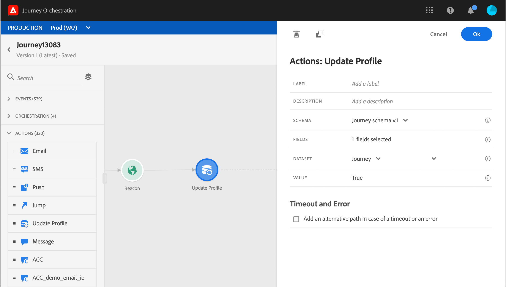

# 更新用户档案 {#update-profile}

**[!UICONTROL Update profile]**&#x200B;操作活动允许您使用来自事件、数据源或使用特定值的信息来更新现有Adobe Experience Platform配置文件。

## 重要说明

* **更新配置文件**&#x200B;操作只能在以具有命名空间的事件开始的历程中使用。
* 该操作仅更新现有字段，而不会创建新的用户档案字段。
* 您不能使用&#x200B;**更新配置文件**&#x200B;操作来生成体验事件，例如购买事件。
* 与任何其他操作一样，在出现错误或超时时，您可以定义替代路径，并且不能同时放置两个操作。
* 发送到Platform的更新请求将会很快，但不会立即/在一秒内发送。 通常需要几秒钟，但有时候需要更多时间，而且无法保证。 因此，例如，如果某个操作使用的是“字段1”，该字段1由位于前面的“更新用户档案”操作更新，则您不应期望该操作中会更新“字段1”。
* 数据源在字段组级别具有缓存持续时间的概念。 如果您希望在历程中利用最近更新的用户档案字段，请务必定义非常短的缓存时长。
* 在测试模式下，将不模拟用户档案更新。 将对测试用户档案执行更新。

## 使用用户档案更新

1. 通过以事件开始来设计您的历程。 请参阅此[部分](../building-journeys/journey.md)。

1. 在面板的&#x200B;**Action**&#x200B;部分中，将&#x200B;**Update profile**&#x200B;活动放入画布中。

   

1. 从列表中选择架构。

1. 单击&#x200B;**字段**&#x200B;以选择要更新的字段。 只能选择一个字段。

   

1. 从列表中选择数据集。 数据集选择将确定配置文件字段的新值将存储在哪里。

1. 单击&#x200B;**Value**&#x200B;字段以定义要使用的值：

   * 使用简单表达式编辑器，您可以从数据源或传入事件中选择字段。

      

   * 如果要定义特定值或利用高级函数，请单击&#x200B;**高级模式**。

      

**更新配置文件**&#x200B;现已配置完成。

