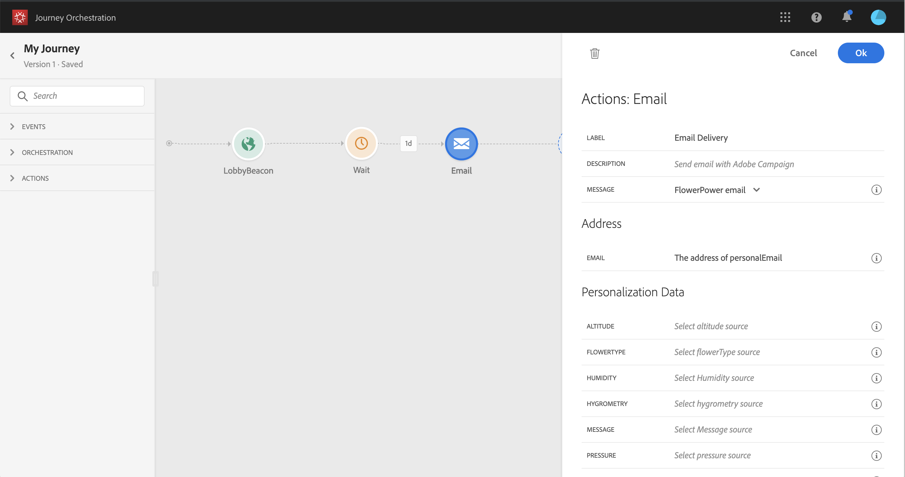

# 使用 Adobe Campaign Standard {#using_campaign_action}

如果您拥有Adobe Campaign Standard，则可以使用以下现成的操作活动： **[!UICONTROL Email]**， **[!UICONTROL Push]** 和 **[!UICONTROL SMS]**.

>[!NOTE]
>
>为此，您需要配置内置操作。 请参见[此页面](../action/working-with-adobe-campaign.md)。

对于每个渠道，您都选择一个Adobe Campaign Standard事务型消息传递 **模板**. 事实上， [!DNL Journey Orchestration] 不是消息发送解决方案。 对于内置的电子邮件、短信和推送渠道，我们依赖事务型消息传递来执行消息发送。 这意味着，如果您要在历程中使用特定消息模板，则必须在Adobe Campaign Standard中发布该模板。 请参阅 [此页面](https://experienceleague.adobe.com/docs/campaign-standard/using/communication-channels/transactional-messaging/getting-started-with-transactional-msg.html?lang=zh-Hans) 以了解如何使用此功能。

>[!NOTE]
>
>必须发布Campaign Standard事务型消息及其关联的事件，才能在Journey Orchestration中使用。 如果事件已发布但消息未发布，则不会在Journey Orchestration界面中看到该消息。 如果消息已发布，但其关联事件未发布，则它将在Journey Orchestration界面中可见，但不可用。


您可以使用事件（也称为实时）或用户档案事务型消息模板。

>[!NOTE]
>
>当我们发送实时事务型消息(rtEvent)或借助自定义操作通过第三方系统路由消息时，需要进行特定设置才能进行疲劳、阻止列表或退订管理。 例如，如果“unsubscribe”属性存储在Adobe Experience Platform或第三方系统中，则必须在消息发送之前添加条件以检查此条件。

选择模板后，消息有效负载中需要的所有字段都会显示在下的活动配置窗格中。 **[!UICONTROL Address]** 和 **[!UICONTROL Personalization Data]**. 您需要将每个字段映射到要使用的字段（从事件或从数据源）。 您还可以使用高级表达式编辑器手动传递值，对检索到的信息执行数据操作（例如，将字符串转换为大写），或使用函数，如“if， then， else”。 请参阅[此页](../expression/expressionadvanced.md)。



## 电子邮件和短信 {#section_asc_51g_nhb}

对象 **[!UICONTROL Email]** 和 **[!UICONTROL SMS]**，则参数相同。

>[!NOTE]
>
>对于电子邮件，如果您使用用户档案事务型模板，则会按Campaign Standard处理现成的退订机制。 您只需添加 **[!UICONTROL Unsubscription link]** 模板中的内容块([了解详情](https://experienceleague.adobe.com/docs/campaign-standard/using/communication-channels/transactional-messaging/getting-started-with-transactional-msg.html?lang=zh-Hans))。 如果您使用的是基于事件的模板(rtEvent)，则需要在消息中添加一个链接，在URL参数中传递用户的电子邮件并指向退订登陆页面。 您需要创建此登陆页面，并确保将人员取消订阅的决定传输到Adobe。

首先，您需要选择事务型消息传递模板。 请参见[此页面](../building-journeys/about-action-activities.md)。

有两种类别可用： **[!UICONTROL Address]** 和 **[!UICONTROL Personalization Data]**.

您可以轻松地定义在何处检索 **[!UICONTROL Address]** 或 **[!UICONTROL Personalization Data]** 使用界面。 您可以浏览事件和可用数据源的字段。 您还可以将高级表达式编辑器用于更高级的用例，例如使用需要传递参数或执行操作的数据源。 请参阅[此页](../expression/expressionadvanced.md)。

**[!UICONTROL Address]**

>[!NOTE]
>
>仅当您选择“事件”事务型消息时，此类别才可见。 对于“profile”消息， **[!UICONTROL Address]** 字段由系统自动从Adobe Campaign Standard中检索。

这些是系统需要知道将消息发送到何处的字段。 对于电子邮件模板，这是电子邮件地址。 如果是短信，就是手机号码。


**[!UICONTROL Personalization Data]**

>[!NOTE]
>
>您无法在个性化数据中传递集合。 如果事务型电子邮件或短信需要收藏集，则无法正常使用。 另请注意，个性化数据具有预期格式（例如：字符串、小数等）。 必须注意遵守这些预期格式。

这些是Adobe Campaign Standard消息预期的字段。 这些字段可用于个性化消息、应用条件格式或选择特定的消息变体。


## 推送 {#section_im3_hvf_nhb}

在使用推送活动之前，需要在Campaign Standard的同时配置您的移动应用程序，以发送推送通知。 使用此 [文章](https://helpx.adobe.com/cn/campaign/kb/integrate-mobile-sdk.html) 为移动设备执行必要的实施步骤。

首先，您需要从下拉列表中选择移动设备应用程序和事务型消息。 请参阅[此页](../building-journeys/about-action-activities.md)。


有两种类别可用： **[!UICONTROL Target]** 和 **[!UICONTROL Personalization Data]**.

**[!UICONTROL Target]**

>[!NOTE]
>
>仅当您选择事件消息时，此类别才可见。 对于用户档案消息， **[!UICONTROL Target]** 系统使用Adobe Campaign Standard执行的协调自动检索字段。

在此部分中，您需要定义 **[!UICONTROL Push platform]**. 下拉列表允许您选择 **[!UICONTROL Apple Push Notification Server]** (iOS)或 **[!UICONTROL Firebase Cloud Messaging]** (Android)。 或者，您可以从事件或数据源中选择特定字段，或定义高级表达式。

您还需要定义 **[!UICONTROL Registration Token]**. 表达式取决于令牌在事件有效负载中或其他 [!DNL Journey Orchestration] 信息。 如果在集合中定义了令牌，则它可以是简单字段，也可以是更复杂的表达式：

```
@{Event_push._experience.campaign.message.profileSnapshot.pushNotificationTokens.first().token}
```

**[!UICONTROL Personalization Data]**

>[!NOTE]
>
>您无法在个性化数据中传递集合。 如果事务推送需要收藏集，则无法运行。 另请注意，个性化数据具有预期格式（例如：字符串、小数等）。 必须注意遵守这些预期格式。

这些是Adobe Campaign Standard消息中使用的事务型模板所需的字段。 这些字段可用于个性化您的消息、应用条件格式或选择特定的消息变体。
