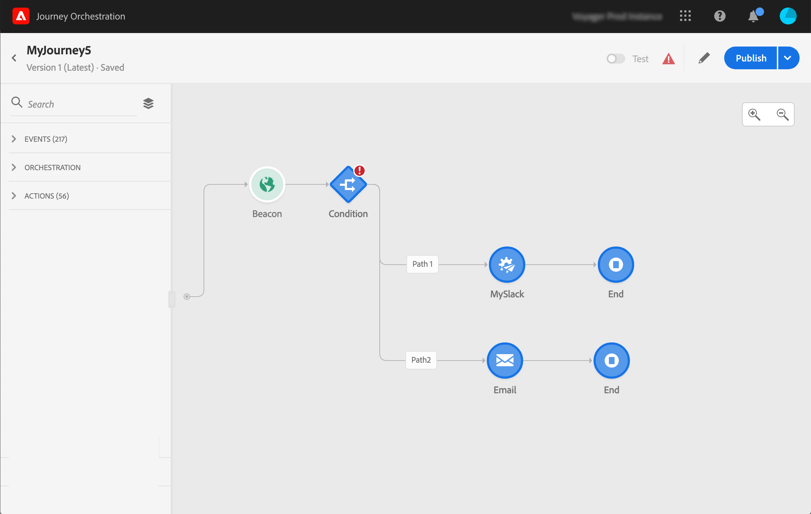

# 使用历程设计器 {#concept_m1g_5qt_52b}

旅程“主页”菜单允许您视图旅程&#x200B;**的**&#x200B;列表。 创建新旅程或单击现有旅程，打开&#x200B;**旅程设计器的接口**。 设计器由以下区域组成：调色板、画布和活动配置窗格。

## 旅程列表{#journey_list}

使用&#x200B;**旅程列表**，您可以同时视图所有旅程、查看其状态并执行基本操作。 您可以重复、停止或删除您的历程。某些操作可能不可用，具体取决于历程。例如，您无法删除或重新启动已关闭的历程。您可以从中创建新版本、重复或停止它。 您还可以使用搜索栏搜索历程。

单击列表左上角的过滤器图标即可访问&#x200B;**[!UICONTROL Filters]**。“过滤器”菜单允许您根据不同条件（状态、您创建的、在过去30天内修改的、仅限最新版本等）筛选显示的旅程。 您还可以选择仅显示使用特定事件、字段组或操作的旅程。 可以配置列表上显示的列。 所有过滤器和列均按用户保存。

您的所有版本旅程都显示在列表中，并带有版本号。 请参阅[此页](../building-journeys/journey-versions.md)。

>[!NOTE]
>
>要在其他浏览器选项卡中打开旅程画布，请按住&#x200B;**Control**&#x200B;或&#x200B;**Command**&#x200B;键并单击旅程。

## 调色板{#palette}

**调板**&#x200B;位于屏幕的左侧。 所有可用活动都分为几个类别:**[!UICONTROL Events]**、**[!UICONTROL Orchestration]**&#x200B;和&#x200B;**[!UICONTROL Actions]**。 您可以通过单击不同类别的名称来展开/折叠它们。 要在旅程中使用活动，请将其从调色板中拖放到画布中。 您还可以在下一个可用步骤中，多次单击调色板中的活动以将其添加到画布。 在发布旅程之前，必须配置从调色板添加的每个活动。 如果将某个活动放在画布中，但未完成其配置，该活动将保留在画布中，但会出现红色警告，指示该配置尚未完成。

>[!NOTE]
>
>请注意，设置旅程时有规则。 将丢弃不允许的配置。 例如，您不能将操作并行放置、将活动链接到上一步以创建循环、将旅程开始为事件以外的其他内容，等等。

左上角的&#x200B;**[!UICONTROL Filter items]**&#x200B;图标允许您显示以下过滤器:

* **仅显示可用项目**:隐藏或显示调色板中不可用的元素，例如使用与旅程中所用命名空间不同的事件。默认情况下，不可用项目处于隐藏状态。如果选择显示它们，它们将灰显。

* **仅显示最近的项目**:除了开箱即用的事件和操作外，此过滤器还允许您仅显示最后五个使用的操作。这特定于每个用户。 默认情况下，将显示所有项目。

您还可以使用&#x200B;**[!UICONTROL Search]**&#x200B;字段。

## 画布{#canvas}

**画布**&#x200B;是旅程设计器中的中心区域。 您可以在此区域放置活动并配置它们。 单击画布中的活动进行配置。 这会打开右侧的活动配置窗格。 可以使用右上方的“+”和“ — ”按钮进行放大和缩小。 在画布中，除&#x200B;**[!UICONTROL End]**&#x200B;活动（请参阅[此页面](../building-journeys/end-activity.md)）外，所有活动都允许您在后面添加下一步。

## 活动配置窗格{#configuration_pane}

单击调色板中的活动时，将显示&#x200B;**活动配置窗格**。 填写必填字段。 单击&#x200B;**[!UICONTROL Delete]**&#x200B;图标以删除活动。 单击&#x200B;**[!UICONTROL Cancel]**&#x200B;取消修改，或单击&#x200B;**[!UICONTROL Ok]**&#x200B;确认。 要删除活动，您还可以选择一个活动（或多个）并按后空格键。 按转义键将关闭活动配置窗格。

在画布中，您的操作和事件活动由图标表示，图标的名称显示在下方。 在活动配置窗格中，可以使用&#x200B;**[!UICONTROL Label]**&#x200B;字段向活动名称添加后缀。 这些标签将帮助您将事件和动作的使用情境化，尤其是当您在旅程中多次使用相同的事件或动作时。 您还可以看到您在[!DNL Journey Orchestration]报告中添加的标签。 您还可以为条件活动定义标签。

默认情况下，只读字段处于隐藏状态。 要显示这些字段，请单击活动配置窗格左上角的&#x200B;**显示只读字段**&#x200B;图标。

## 顶栏操作{#top_actions}

根据旅程的状态，您可以使用右上角的按钮对旅程执行不同的操作：**[!UICONTROL Publish]**、**[!UICONTROL Duplicate]**、**[!UICONTROL Delete]**、**[!UICONTROL Journey properties]**、**[!UICONTROL Test]**。 未选择活动时，将显示这些按钮。 某些按钮将根据上下文显示。 激活测试模式时，将显示测试模式日志按钮（请参阅[此页](../building-journeys/testing-the-journey.md)）。 当旅程实时、停止或关闭时，将显示报告按钮。

## 在画布{#paths}中使用路径

几个活动(**[!UICONTROL Condition]**、**[!UICONTROL Action]**&#x200B;活动)允许您在出现错误或超时时定义回退操作。 在“活动配置”窗格中，选中该框：**[!UICONTROL Add an alternative path in case of a timeout or an error]**。 在活动后添加了另一个路径。 超时持续时间在旅程的属性中定义（请参阅管理员用户[此页](../building-journeys/changing-properties.md)）。 例如，如果发送电子邮件的时间过长或出错，您可以决定发送短信。

各种活动(事件、操作、等待)允许您在路径后添加多个路径。 要执行此操作，请将光标放在活动上并单击“+”符号。 只能并行设置事件和等待活动。 如果并行设置多个事件，则所选路径将是第一个事件。

当您收听事件时，我们建议您不要无限期地等待事件。 它不是强制性的，只是一种最佳做法。 如果只想在某个特定时间内收听一个或多个事件，您将并行放置一个或多个事件和等待活动。 请参阅[此章节](../building-journeys/event-activities.md#section_vxv_h25_pgb)。

要删除路径，请将光标置于路径上并单击&#x200B;**[!UICONTROL Delete arrow]**&#x200B;图标。

在画布中，当两个活动断开连接时，将显示警告。 将光标置于警告图标上以显示错误消息。 要解决此问题，只需移动已断开连接的活动并将其连接到上一个活动。

## 复制和粘贴活动{#copy-paste}

您可以复制一个或多个旅程活动，并将它们粘贴到同一旅程或不同旅程中。 如果您希望重复使用在上一个旅程中已配置的大量活动，这样您可以节省时间。

**重要说明**

* 您可以跨不同的选项卡和浏览器进行复制/粘贴。 您只能复制/粘贴同一实例中的活动。
* 如果目标旅程具有使用其他事件的事件，则无法复制/粘贴命名空间。
* 粘贴的活动可能引用目标旅程中不存在的数据，例如，如果您在不同沙箱之间复制/粘贴。 始终检查错误并进行所需的调整。
* 请注意，您无法撤消操作。 要删除粘贴的活动，您需要选择并删除它们。 因此，请确保在复制活动之前只选择所需的字体。
* 您可以从任何旅程（甚至只读旅程）复制活动。
* 您可以选择任何活动，甚至是未链接的。 链接的活动在粘贴后将保持链接状态。

以下是复制/粘贴活动的步骤：

1. 开启旅程。
1. 通过在单击时移动鼠标来选择要复制的活动。 按&#x200B;**Ctrl/Command**&#x200B;键时，也可以单击每个活动。 如果要选择所有活动，请使用&#x200B;**Ctrl/Command + A**。
   
1. 按&#x200B;**Ctrl/Command + C**。
如果只想复制一个活动，可以单击它，然后使用活动配置窗格左上角的**复制**图标。
   
1. 在任何旅程中，按&#x200B;**Ctrl/Command + V**&#x200B;粘贴活动，而不将它们链接到现有节点。 粘贴的活动将按相同的顺序放置。 粘贴后，活动将保持选中状态，以便您可以轻松移动它们。 也可以将光标放在空占位符上，然后按&#x200B;**Ctrl/Command + V**。 粘贴的活动将链接到节点。
   

