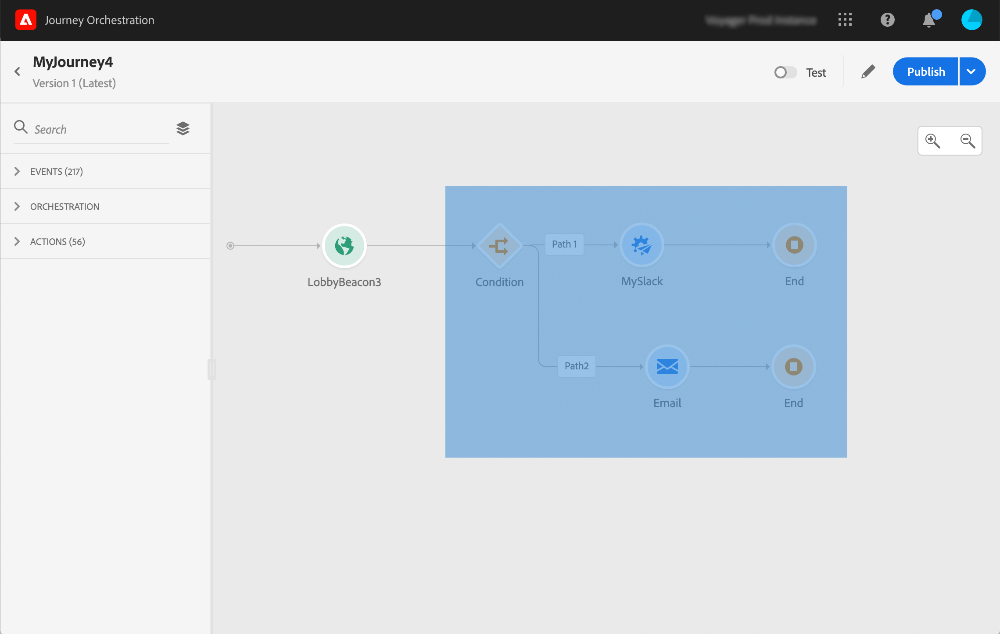

# 使用历程设计器 {#concept_m1g_5qt_52b}

历程主页菜单允许您查看历程&#x200B;**列表**。 创建新历程或单击现有历程以打开&#x200B;**历程设计器的界面**。 设计器由以下区域组成：面板、画布和活动配置窗格。

## 历程列表 {#journey_list}

**历程列表**&#x200B;允许您同时查看所有历程、查看其状态并执行基本操作。 您可以重复、停止或删除您的历程。某些操作可能不可用，具体取决于历程。例如，您无法删除或重新启动已关闭的历程。您可以从中创建新版本、复制或停止该版本。 您还可以使用搜索栏搜索历程。

单击列表左上角的过滤器图标即可访问 **[!UICONTROL Filters]**。利用过滤器菜单，可根据不同的条件（状态、您创建的历程、在过去30天内修改的历程、仅最新版本等）筛选显示的历程。 您还可以选择仅显示使用特定事件、字段组或操作的历程。 可以配置列表中显示的列。 所有过滤器和列均按用户进行保存。

您的历程的所有版本都会显示在列表中，且包含版本号。 请参阅[此页](../building-journeys/journey-versions.md)。

>[!NOTE]
>
>要在其他浏览器选项卡中打开历程的画布，请按住&#x200B;**Control**&#x200B;或&#x200B;**Command**&#x200B;键并单击历程。

## 面板 {#palette}

**面板**&#x200B;位于屏幕的左侧。 所有可用活动都按以下几类进行分类：**[!UICONTROL Events]**、**[!UICONTROL Orchestration]**&#x200B;和&#x200B;**[!UICONTROL Actions]**。 您可以通过单击不同类别的名称来展开/折叠其名称。 要在历程中使用活动，请将其从面板拖放到画布中。 您还可以在下一步中双击面板中的活动，将其添加到画布中。 您必须先配置从面板添加的每个活动，然后才能发布历程。 如果将活动拖放到画布中，但未完成其配置，则该活动将保留在画布中，但会出现红色警告，指示此活动的配置未完成。

>[!NOTE]
>
>请注意，设置历程时有一些规则。 将丢弃不允许的配置。 例如，您无法并行放置操作、将活动链接到上一步以创建循环、以事件以外的内容开始旅程等。

使用左上角的&#x200B;**[!UICONTROL Filter items]**&#x200B;图标可显示以下过滤器：

* **仅显示可用项目**:隐藏或显示面板中不可用的元素，例如使用不同于历程中使用的命名空间的事件。默认情况下，不可用项目处于隐藏状态。如果选择显示它们，它们将显示为灰显。

* **仅显示最近的项目**:此过滤器除了现成事件和操作之外，还允许您仅显示最近使用的五个事件和操作。这特定于每个用户。 默认情况下，将显示所有项目。

您还可以使用&#x200B;**[!UICONTROL Search]**&#x200B;字段。

## 画布 {#canvas}

**画布**&#x200B;是历程设计器中的中心区域。 您可以在此区域中拖放并配置活动。 单击画布中的活动以对其进行配置。 此操作将打开右侧的活动配置窗格。 您可以使用右上方的“+”和“ — ”按钮进行放大和缩小。 在画布中，除&#x200B;**[!UICONTROL End]**&#x200B;活动外，所有活动都允许您在其后面添加下一步（请参阅[此页面](../building-journeys/end-activity.md)）。

## 活动配置窗格 {#configuration_pane}

单击面板中的活动时，会显示&#x200B;**活动配置窗格**。 填写必填字段。 单击&#x200B;**[!UICONTROL Delete]**&#x200B;图标以删除活动。 单击&#x200B;**[!UICONTROL Cancel]**&#x200B;取消修改，或单击&#x200B;**[!UICONTROL Ok]**&#x200B;确认。 要删除活动，您还可以选择一个活动（或多个活动）并按Backspace键。 按Esc键将关闭活动配置窗格。

在画布中，您的操作和事件活动由图标表示，图标下方显示事件或操作的名称。 在活动配置窗格中，可以使用&#x200B;**[!UICONTROL Label]**&#x200B;字段为活动名称添加后缀。 这些标签将帮助您将事件和操作的使用置于情境中，尤其是当您在历程中多次使用同一事件或操作时。 您还将能够看到您在[!DNL Journey Orchestration]报表中添加的标签。 您还可以为条件活动定义标签。

默认情况下，只读字段处于隐藏状态。 要显示只读字段，请单击活动配置窗格左上角的&#x200B;**显示只读字段**&#x200B;图标。 此设置适用于所有历程中的所有活动。

## 顶部栏操作 {#top_actions}

根据历程的状态，您可以使用右上角提供的按钮对历程执行不同的操作：**[!UICONTROL Publish]**、**[!UICONTROL Duplicate]**、**[!UICONTROL Delete]**、**[!UICONTROL Journey properties]**、**[!UICONTROL Test]**。 未选择活动时，将显示这些按钮。 某些按钮将根据上下文显示。 测试模式日志按钮在测试模式激活时显示（请参阅[此页](../building-journeys/testing-the-journey.md)）。 历程处于实时、停止或关闭状态时，会显示报告按钮。

## 在画布中使用路径 {#paths}

利用多个活动（**[!UICONTROL Condition]**、**[!UICONTROL Action]**&#x200B;活动），可定义发生错误或超时时的回退操作。 在活动配置窗格中，选中框：**[!UICONTROL Add an alternative path in case of a timeout or an error]**。 活动后会添加另一个路径。 超时持续时间由管理员用户在历程的属性中定义（请参阅[此页面](../building-journeys/changing-properties.md)）。 例如，如果电子邮件发送时间过长或出错，您可以决定发送短信。

各种活动（事件、操作、等待）允许您在其后添加多个路径。 要实现此目的，请将光标放在活动上并单击“+”符号。 只能并行设置事件和等待活动。 如果同时设置多个事件，则所选路径将是第一个发生事件的路径之一。

在监听事件时，我们建议您不要无限期地等待该事件。 它不是强制性的，只是一种最佳做法。 如果只想在特定时间内侦听一个或多个事件，则将并行放置一个或多个事件和等待活动。 请参阅[此小节](../building-journeys/event-activities.md#section_vxv_h25_pgb)。

要删除路径，请将光标放在该路径上，然后单击&#x200B;**[!UICONTROL Delete arrow]**&#x200B;图标。

在画布中，当两个活动断开连接时，会显示一条警告消息。 将光标放在警告图标上以显示错误消息。 要修复此问题，只需移动已断开连接的活动并将其连接到上一个活动即可。

## 复制和粘贴活动 {#copy-paste}

您可以复制一个历程的一个或多个活动，并将它们粘贴到同一历程中或其他历程中。 如果要重复使用在上一个历程中已配置的大量活动，这样可节省时间。

**重要说明**

* 您可以在不同的选项卡和浏览器之间复制/粘贴。 您只能复制/粘贴同一实例中的活动。
* 如果目标历程的事件使用其他命名空间，则无法复制/粘贴事件。
* 粘贴的活动可能会引用目标历程中不存在的数据，例如，如果您在不同的沙箱中复制/粘贴。 始终检查错误并进行所需的调整。
* 请注意，您无法撤消某个操作。 要删除粘贴的活动，您需要选择并删除它们。 因此，在复制活动之前，请确保只选择所需的活动。
* 您可以从任何历程中复制活动，甚至可以复制只读的活动。
* 您可以选择任何活动，甚至可以选择未链接的活动。 链接的活动在粘贴后将保持链接状态。

以下是复制/粘贴活动的步骤：

1. 打开旅程。
1. 单击时移动鼠标以选择要复制的活动。 在按&#x200B;**Ctrl/Command**&#x200B;键时，也可以单击每个活动。 如果要选择所有活动，请使用&#x200B;**Ctrl/Command + A**。
   
1. 按&#x200B;**Ctrl/Command + C**。
如果只想复制一个活动，可以单击该活动，然后使用活动配置窗格左上角的**复制**图标。
   
1. 在任何历程中，按&#x200B;**Ctrl/Command + V**&#x200B;粘贴活动，而不将活动链接到现有节点。 粘贴的活动会按相同的顺序放置。 粘贴活动后，将保持选中状态，以便轻松移动活动。 也可以将光标放在空的位置保持器上，然后按&#x200B;**Ctrl/Command + V**。 粘贴的活动将链接到节点。
   
