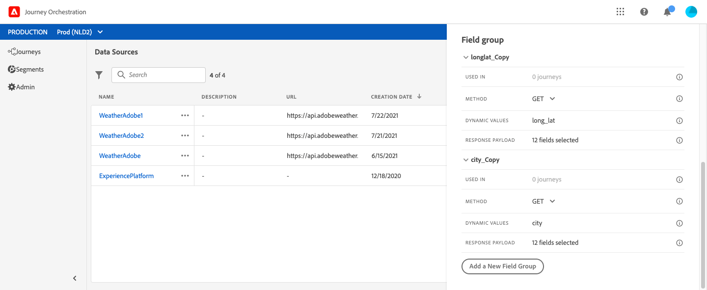
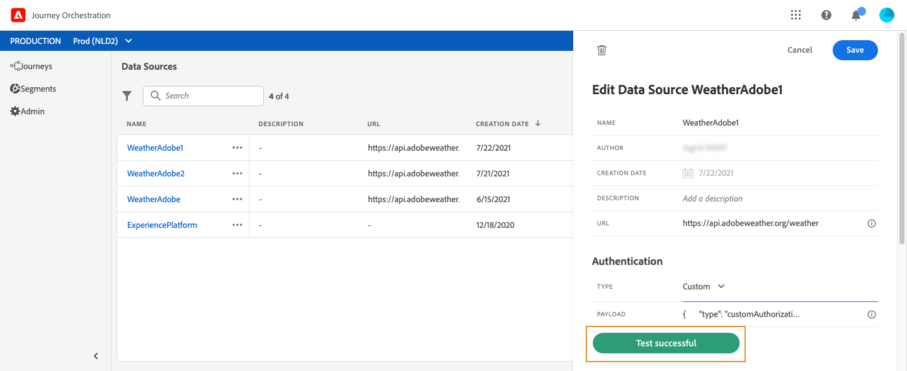

# 外部数据源 {#concept_t2s_kqt_52b}

外部数据源允许您定义与第三方系统的连接，例如，如果您使用酒店预订系统来检查人员是否已注册了房间。与内置 Adobe Experience Platform 数据源相反，您可以根据需要创建尽可能多的外部数据源。

支持使用 POST 或 GET 的 REST API 和返回 JSON。支持 API 密钥、基本和自定义身份验证模式。

让我们举一个天气 API 服务的例子，我想借助该服务根据实时天气数据定制我的旅程的行为。

以下是两个 API 调用示例：

* _https://api.adobeweather.org/weather?city=London,uk&amp;appid=1234_
* _https://api.adobeweather.org/weather?lat=35&amp;lon=139&amp;appid=1234_

该调用由一个主 URL (_https://api.adobeweather.org/weather_)、两个参数集（“city”表示城市，“lat/long”表示纬度和经度）和 API 密钥 (appid) 组成。

以下是创建和配置新外部数据源的主要步骤：

1. 在数据源列表中，单击 **[!UICONTROL Add]**&#x200B;以创建新的外部数据源。

   

   这将打开屏幕右侧的数据源配置窗格。

   

1. 输入数据源的名称。

   >[!NOTE]
   >
   >请勿使用空格或特殊字符。请勿使用超过 30 个字符。

1. 向数据源添加描述。此步骤是可选的。
1. 添加外部服务的 URL。在我们的示例中：_https://api.adobeweather.org/weather_。

   >[!CAUTION]
   >
   >出于安全原因，我们强烈建议使用 HTTPS。另请注意，我们不允许使用非公开的 Adobe 地址和 IP 地址。

   

1. 根据外部服务配置以配置身份验证：**[!UICONTROL No authentication]**、**[!UICONTROL Basic]**、**[!UICONTROL Custom]** 或&#x200B;**[!UICONTROL API key]**。For more information on the custom authentication mode, see [this section](../datasource/external-data-sources.md#section_wjp_nl5_nhb). 在我们的示例中，我们选择：


   * **[!UICONTROL Type]**：“API 密钥”
   * **[!UICONTROL Value]**：“1234”（这是 API 密钥值）
   * **[!UICONTROL Name]**：“appid”（这是 API 密钥参数名称）
   * **[!UICONTROL Location]**：“查询参数”（API 密钥位于 URL 中）

   

1. 通过单击&#x200B;**[!UICONTROL Add a New Field Group]**&#x200B;为每个 API 参数集添加新字段组。请勿在字段组名称中使用空格或特殊字符。在我们的示例中，我们需要创建两个字段组，每个参数集（“city”和“long/lat”）各一个。

对于“long/lat”参数集，我们创建一个包含以下信息的字段组：

* **[!UICONTROL Used in]**：显示使用字段组的旅程数。您可以单击 **[!UICONTROL View journeys]**&#x200B;图标以显示使用此字段组的旅程列表。
* **[!UICONTROL Method]**：选择 POST 或 GET 方法。在我们的示例中，我们选择 GET 方法。
* **[!UICONTROL Cache duration]**：在我们的示例中，我们希望天气能缓存 10 分钟。
* **[!UICONTROL Response Payload]**：单击&#x200B;**[!UICONTROL Payload]** 字段并粘贴由调用返回的有效负载示例。例如，我们使用了在天气 API 网站上找到的有效负载。验证字段类型是否正确。每次调用 API 时，系统将检索有效负载示例中包含的所有字段。请注意，如果要更改当前传递的有效负载，可以单击 **[!UICONTROL Paste a new payload]**。
* **[!UICONTROL Dynamic Values]**：在我们的示例中，输入以逗号分隔的不同参数“long,lat”。由于参数值取决于执行上下文，因此将在旅程中进行定义。请参阅[此页](../expression/expressionadvanced.md)。
* **[!UICONTROL Sent Payload]**：在我们的示例中不显示此字段。仅当选择 POST 方法时才可用。粘贴将发送到第三方系统的有效负载。

如果 GET 调用需要参数，则在&#x200B;**[!UICONTROL Parameters]**&#x200B;字段中输入参数，这些参数将在调用结束时自动添加。如果是 POST 调用，您需要：

* 在 **[!UICONTROL Parameter]**&#x200B;字段中列出调用时要传递的参数（在下面的示例中为“identifier”）。
* 在发送的有效负载主体中使用完全相同的语法指定它们。为此，您需要添加“param”：“您的参数名称”（在以下示例中为“identifier”）。请遵循以下语法：

   ```
   {"id":{"param":"identifier"}}
   ```



单击 **[!UICONTROL Save]**.

数据源现已配置完毕，可随时用于您的旅程，例如在您的条件下或个性化电子邮件时。如果温度高于 30°C，您可以决定发送特定通信。

## 自定义身份验证模式{#section_wjp_nl5_nhb}

>[!CONTEXTUALHELP]
>id="jo_authentication_payload"
>title="关于自定义身份验证"
>abstract="自定义身份验证模式用于复杂身份验证，以调用 OAuth2 等 API 封装协议。操作执行分为两步。首先，执行对端点的调用以生成访问令牌。然后，访问令牌将插入操作的 HTTP 请求中。"

此身份验证模式用于复杂的身份验证，通常用于调用 OAuth2 等 API 封装协议，以检索要插入到操作的实际 HTTP 请求中的访问令牌。

配置自定义身份验证时，可以单击以下按钮检查自定义身份验证有效负载是否正确配置。


如果测试成功，按钮将变为绿色。



通过此身份验证，操作执行分为两步：

1. 调用端点以生成访问令牌。
1. 通过以正确的方式插入访问令牌以调用 REST API。

此身份验证分为两部分。

要调用以生成访问令牌端点的定义：

* 端点：用于生成端点的 URL
* 端点上 HTTP 请求的方法（GET 或 POST）
* 标头：键/值对将作为标头插入此调用（如果需要）
* 主体：描述在方法为 POST 时调用的主体。我们支持一个有限的主体结构，在 bodyParams（键/值对）中定义。bodyType 描述调用中主体的格式和编码：
   * “form”：表示内容类型将为 application/x-www-form-urlencoded (charset UTF-8)，键/值对将按如下方式序列化：key1=value1&amp;key2=value2&amp;...
   * “json”：表示内容类型将为 application/json (charset UTF-8)，并且键值对将序列化为 json 对象，如下所示：_{ &quot;key1&quot;: &quot;value1&quot;, &quot;key2&quot;: &quot;value2&quot;, ...}_

在操作的 HTTP 请求中必须插入访问令牌方式的定义：

* authorizationType：定义如何在操作的 HTTP 调用中插入生成的访问令牌。可能的值包括：

   * 载体：指示必须在授权标头中插入的访问令牌，如：_授权：载体&lt;access token>_
   * 标头：指示必须将访问令牌作为标头插入，即由 tokenTarget 属性定义的标头名。例如，如果 tokenTarget 是 myHeader，则访问令牌将作为标头插入：_myHeader：&lt;access token>_
   * queryParam：指示访问令牌必须作为 queryParam 插入，即由属性 tokenTarget 定义的查询参数名称。例如，如果 tokenTarget 是 myQueryParam，则操作调用的 URL 将为：_&lt;url>?myQueryParam=&lt;access token>_

* tokenInResponse：指示如何从身份验证调用中提取访问令牌。此属性可以是：
   * “response”：指示 HTTP 响应是访问令牌
   * json 中的选择器（假定响应是 json，我们不支持 XML 等其他格式）。此选择器的格式为 _json://&lt;path to the access token property>_。例如，如果调用的响应为 _{ &quot;access_token&quot;: &quot;theToken&quot;、&quot;timestamp&quot;: 12323445656 }_，则 tokenInResponse 将为 _json: //access_token_

此身份验证的格式为：

```
{
    "type": "customAuthorization",
    "authorizationType": "<value in 'bearer', 'header' or 'queryParam'>",
    (optional, mandatory if authorizationType is 'header' or 'queryParam') "tokenTarget": "<name of the header or queryParam if the authorizationType is 'header' or 'queryParam'>",
    "endpoint": "<URL of the authentication endpoint>",
    "method": "<HTTP method to call the authentication endpoint, in 'GET' or 'POST'>",
    (optional) "headers": {
        "<header name>": "<header value>",
        ...
    },
    (optional, mandatory if method is 'POST') "body": {
        "bodyType": "<'form'or 'json'>,
        "bodyParams": {
            "param1": value1,
            ...

        }
    },
    "tokenInResponse": "<'response' or json selector in format 'json://<field path to access token>'"
}
```

您可以更改自定义身份验证数据源的令牌的缓存时间。以下是自定义身份验证有效负载的示例。缓存时间在“cacheDuration”参数中定义。它指定缓存中生成的令牌的保留持续时间。单位可以是毫秒、秒、分钟、小时、天、月、年。

```
"authentication": {
    "type":"customAuthorization",
    "authorizationType":"Bearer",
    "endpoint":"http://localhost:${port}/epsilon/oauth2/access_token",
    "method":"POST",
    "headers": {
        "Authorization":"Basic EncodeBase64(${epsilonClientId}:${epsilonClientSecret})"
        },
    "body": {
        "bodyType":"form",
        "bodyParams": {
             "scope":"cn mail givenname uid employeeNumber",
             "grant_type":"password",
             "username":"${epsilonUserName}",
             "password":"${epsilonUserPassword}"
             }
        },
    "tokenInResponse":"json://access_token",
    "cacheDuration":
             { "duration":5, "timeUnit":"seconds" }
    }
```
