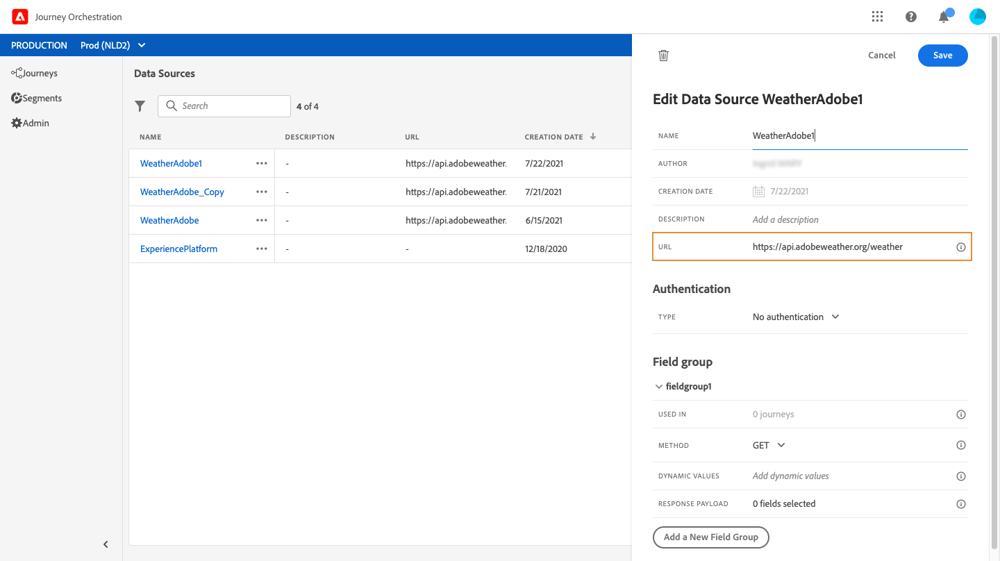

# 外部数据源 {#concept_t2s_kqt_52b}

外部数据源允许您定义与第三方系统的连接，例如，如果您使用酒店预订系统来检查该人是否已注册房间。 与内置的Experience platform数据源相比，您可以创建所需数量的外部数据源。

支持使用POST或GET和返回JSON的REST API。 支持API密钥、基本和自定义身份验证模式。

让我们举一个气象API服务的示例，我想用它根据实时天气数据定制我旅程的行为。

以下是API调用的两个示例：

* _https://api.adobeweather.org/weather?city=London,uk&amp;appid=1234_
* _https://api.adobeweather.org/weather?lat=35&amp;lon=139&amp;appid=1234_

该调用由一个主URL(_https://api.adobeweather.org/weather_)、两个参数集（城市为“城市”，经纬度为“纬度／长”）和API密钥(appid)组成。

以下是创建和配置新外部数据源的主要步骤：

1. 从数据源列表中，单击以 **[!UICONTROL Add]**创建新的外部数据源。

   

   这将打开屏幕右侧的数据源配置窗格。

   

1. 输入数据源的名称。

   >[!NOTE]
   >
   >请勿使用空格或特殊字符。 请勿使用30个以上的字符。

1. 向数据源添加说明。 此步骤是可选的。
1. 添加外部服务的URL。 在我们的示例中： _https://api.adobeweather.org/weather_。

   >[!CAUTION]
   >
   >出于安全原因，我们强烈建议使用HTTPS。 另请注意，我们不允许使用不公开的Adobe地址和IP地址。

   

1. 根据外部服务配置配置身份验证： **[!UICONTROL No authentication]**、**[!UICONTROL Basic]****[!UICONTROL Custom]**或**[!UICONTROL API key]**。 有关自定义身份验证模式的详细信息，请参阅 [](../datasource/external-data-sources.md#section_wjp_nl5_nhb)。 在我们的示例中，我们选择：


   * **[!UICONTROL Type]**:&quot;API密钥&quot;
   * **[!UICONTROL Value]**:“1234”（这是我们的API密钥的值）
   * **[!UICONTROL Name]**:“appid”（这是API密钥参数名称）
   * **[!UICONTROL Location]**:“查询参数”（API密钥位于URL中）
   

1. 通过单击为每个API参数集添加新字段组 **[!UICONTROL Add a New Field Group]**。 请勿在字段组名称中使用空格或特殊字符。 在我们的示例中，我们需要创建两个字段组，每个参数集各一个（城市和长／纬度）。

对于“long/lat”参数集，我们将创建一个包含以下信息的字段组：

* **[!UICONTROL Used in]**:显示使用字段组的旅程数。 您可以单击该**[!UICONTROL View journeys]** 图标以显示使用此字段组的旅程列表。
* **[!UICONTROL Method]**:选择POST或GET方法。 在我们的例子中，我们选择GET方法。
* **[!UICONTROL Cache duration]**:在我们的例子中，我们希望天气能缓存10分钟。
* **[!UICONTROL Response Payload]**:在字段内单**[!UICONTROL Payload]** 击，然后粘贴由调用返回的有效负荷示例。 在我们的示例中，我们使用了在天气API网站上找到的有效负荷。 验证字段类型是否正确。 每次调用API时，系统都将检索有效负荷示例中包含的所有字段。 请注意，如果要更改当 **[!UICONTROL Paste a new payload]**前传递的有效负荷，可以单击。
* **[!UICONTROL Dynamic Values]**:在我们的示例中输入以“long,lat”分隔的不同参数。 由于参数值取决于执行上下文，因此它们将在旅程中定义。 请参见[](../expression/expressionadvanced.md)。
* **[!UICONTROL Sent Payload]**:此字段不显示在示例中。 仅当您选择POST方法时，此选项才可用。 粘贴将发送到第三方系统的有效负荷。

如果GET调用需要参数，则在字段中输入这些参 **[!UICONTROL Parameters]**数，这些参数将在调用结束时自动添加。 如果发生开机自检呼叫，您需要：

* 在字段中列出调用时要传递的 **[!UICONTROL Parameter]**参数(在以下示例中：“标识符”)。
* 在已发送的有效负荷的正文中，也使用完全相同的语法指定它们。 为此，您需要添加：“param”:“您的参数名称”(在以下示例中：“标识符”)。 请按照以下语法操作：

   ```
   {“id”:{“param”:“identifier”}}
   ```


单击 **[!UICONTROL Save]**.

数据源现已配置好并准备好用于您的旅程，例如在您的条件下或个性化电子邮件。 如果温度高于30°C，您可以决定发送特定通信。

## 自定义身份验证模式{#section_wjp_nl5_nhb}

此身份验证模式用于复杂的身份验证，通常用于调用OAuth2等API封装协议，以检索要插入实际HTTP请求中的访问令牌以执行操作。

配置自定义身份验证时，您可以单击下面的按钮检查自定义身份验证有效负荷是否正确配置。


如果测试成功，则按钮将变为绿色。


通过此身份验证，操作执行分为两个步骤：

1. 调用端点以生成访问令牌。
1. 通过以正确的方式注入访问令牌来调用REST API。

此身份验证分为两部分。

要调用以生成访问令牌的端点的定义：

* endpoint:用于生成端点的URL
* 端点（GET或POST）上的HTTP请求的方法
* 标题：键／值对（如果需要）将作为头插入此调用
* body:如果方法为POST，则描述调用的主体。 我们支持在bodyParams（键／值对）中定义的有限体结构。 bodyType描述调用中正文的格式和编码：
   * “form”:这意味着内容类型将为application/x-www-form-urlencoded(charset UTF-8)，并且键／值对将按如下方式进行序列化：key1=value1&amp;key2=value2&amp;...
   * “json”:这意味着内容类型将是application/json(charset UTF-8)，并且键值对将按原样序列化为json对象： _{ &quot;key1&quot;:&quot;value1&quot;, &quot;key2&quot;:&quot;value2&quot;, ...}_

在操作的HTTP请求中必须注入访问令牌的方式的定义：

* authorizationType:定义在动作的HTTP调用中必须注入生成的访问令牌的方式。 可能的值有：

   * 载体：指示必须在授权标头中插入访问令牌，例如：授 _权：Bearer &lt;access token>_
   * header:指示必须将访问令牌作为头插入，即由属性tokenTarget定义的头名。 例如，如果tokenTarget是myHeader，则访问令牌将作为标头插入： _myHeader:&lt;访问令牌>_
   * queryParam:指示必须将访问令牌作为queryParam插入，该查询参数名称由属性tokenTarget定义。 例如，如果tokenTarget是myQueryParam，则操作调用的URL将为： _&lt;url>?myQueryParam=&lt;access token>_

* tokenInResponse:指示如何从身份验证调用中提取访问令牌。 此属性可以是：
   * &#39;response&#39;:指示HTTP响应是访问令牌
   * json中的选择器（假定响应是json，我们不支持XML等其他格式）。 此选择器的格式为 _json://&lt;访问令牌属性的路径>_。 例如，如果调用的响应是： _{ &quot;access_token&quot;:&quot;theToken&quot;, &quot;timestamp&quot;:12323445656 }_,tokenInResponse将为： _json://access_token_

此身份验证的格式为：

```
{
    "type": "customAuthorization",
    "authorizationType": "<value in 'bearer', 'header' or 'queryParam'>",
    (optional, mandatory if authorizationType is 'header' or 'queryParam') "tokenTarget": "<name of the header or queryParam if the authorizationType is 'header' or 'queryParam'>",
    "endpoint": "<URL of the authentication endpoint>",
    "method": "<HTTP method to call the authentication endpoint, in 'GET' or 'POST'>",
    (optional) "headers: {
        "<header name>": "<header value>",
        ...
    },
    (optional, mandatory if method is 'POST') "body": {
        "bodyType": "<'form'or 'json'>,
        "bodyParams": {
            "param1": value1,
            ...

        }
    },
    "tokenInResponse": "<'response' or json selector in format 'json://<field path to access token>'"
}
```
