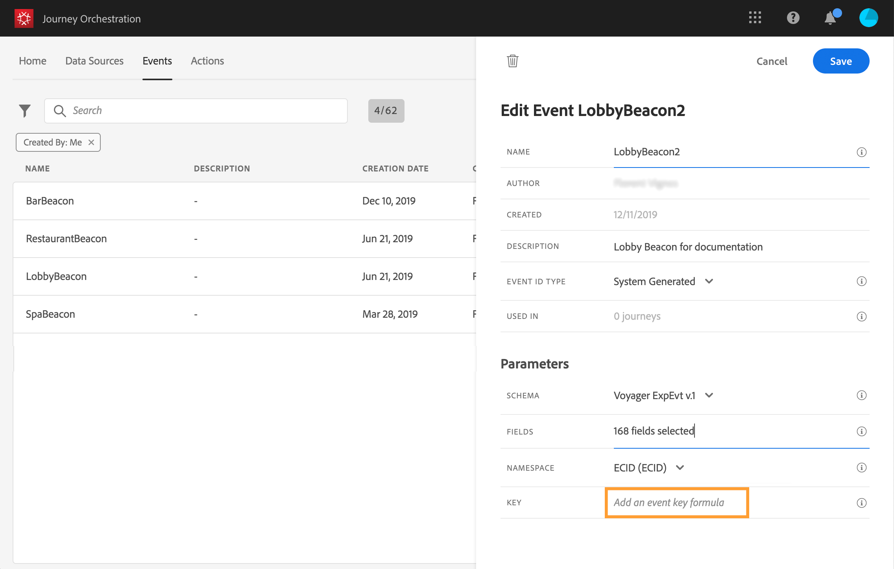

# 定义事件键 {#concept_ond_hqt_52b}

关键是字段或字段组合是事件有效负荷数据的一部分，这将允许系统识别与事件关联的人。 密钥可以是Experience CloudID、CRM ID或电子邮件地址。

如果您计划利用存储在Real-time Customer 用户档案事件库中的数据，则必须选择在[Real-time Customer  Service](https://docs.adobe.com/content/help/zh-Hans/experience-platform/profile/home.html)中定义为用户档案身份的信息作为用户档案密钥。

它将允许系统执行事件与个人用户档案之间的协调。 如果选择具有主标识的模式，则预填&#x200B;**[!UICONTROL Key]**&#x200B;和&#x200B;**[!UICONTROL Namespace]**&#x200B;字段。 如果未定义标识，则选择&#x200B;_identityMap > id_&#x200B;作为主键。 然后，您必须选择一个命名空间，然后使用&#x200B;_identityMap > id_&#x200B;预填（在&#x200B;**[!UICONTROL Namespace]**&#x200B;字段下）键。

选择字段时，主标识字段将被标记。

如果您需要使用其他键（如CRM ID或电子邮件地址），则需要手动添加它：

1. 单击&#x200B;**[!UICONTROL Key]**&#x200B;字段或铅笔图标。

   

1. 在有效负荷字段的列表中选择选作键的字段。 您还可以切换到高级表达式编辑器以创建更复杂的键(例如，事件的两个字段的串联)。 请参阅下面的部分。

   

当收到事件时，键值将允许系统识别与事件关联的人。 与命名空间关联（请参阅[此页](../event/selecting-the-namespace.md)），该键可用于在Adobe Experience Platform上执行查询。 请参阅[此页](../building-journeys/about-orchestration-activities.md)。钥匙还用于检查某人是否在旅程中。 事实上，一个人不可能在同一旅程中处于两个不同的位置。 因此，系统不允许同一密钥（例如密钥CRMID=3224）在同一旅程的不同位置。

如果要执行其他操作，您还可以访问高级表达式函数(**[!UICONTROL Advanced mode]**)。 通过这些函数，您可以操作用于执行特定查询的值，例如更改格式、执行字段连接，只考虑字段的一部分（例如10个前字符）。 请参阅[此页](../expression/expressionadvanced.md)。
