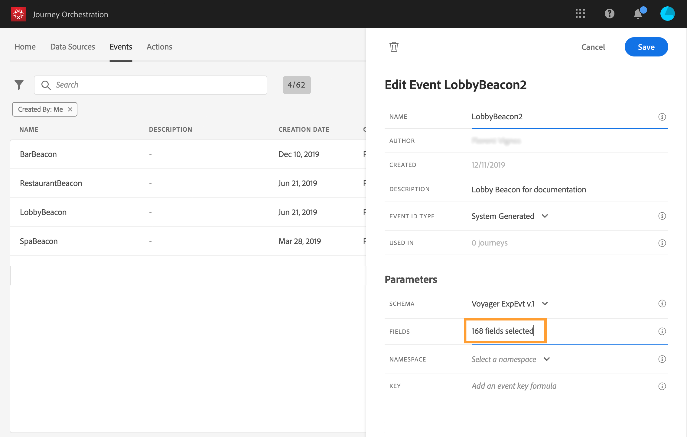

# 定义有效负载字段 {#concept_yrw_3qt_52b}

有效负载定义允许您选择系统希望从历程中的事件接收的信息，以及用于标识与事件关联的人员的键。 负载基于Experience CloudXDM字段定义。 有关XDM的更多信息，请参阅 [本页](https://experienceleague.adobe.com/docs/experience-platform/xdm/home.html?lang=zh-Hans).

1. 从列表中选择XDM架构，然后单击 **[!UICONTROL Payload]** 字段或 **[!UICONTROL Edit]** 图标。

   

   将显示架构中定义的所有字段。 字段列表因架构而异。 您可以搜索特定字段，或使用过滤器显示所有节点和字段，或仅显示选定的字段。 根据架构定义，某些字段可能是必填的，并且是预选的。 您无法取消选择它们。 默认情况下，对于Journey Orchestration要正确接收的事件，必须填写的所有字段都会被选中。

   >[!NOTE]
   >
   >确保已将“编排”混合添加到XDM架构。 这将确保您的架构包含所有使用所需的信息 [!DNL Journey Orchestration].

   

1. 选择要从事件接收的字段。 业务用户将在历程中利用这些字段。 它们还必须包含用于标识与事件关联的人员的键(请参阅 [本页](../event/defining-the-event-key.md))。

   

   >[!NOTE]
   >
   >对于系统生成的事件， **[!UICONTROL eventID]** 字段会自动添加到选定的字段列表中，以便 [!DNL Journey Orchestration] 可以识别事件。 推送事件的系统不应生成ID，它应使用有效负荷预览中提供的ID。 请参阅[此页](../event/previewing-the-payload.md)。

1. 选择完所需字段后，单击 **[!UICONTROL Save]** 或按 **[!UICONTROL Enter]**.

   

   选定字段的数量显示在 **[!UICONTROL Payload]** 字段。

   
