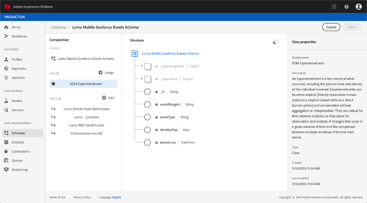

# 关于适用于事件的ExperienceEvent模式 [!DNL Journey Orchestration]

[!DNL Journey Orchestration] 事件是通过流摄取发送到Adobe Experience Platform的XDM体验事件。

因此，设置事件的一个重要先决条件是 [!DNL Journey Orchestration] 您熟悉Adobe Experience Platform的体验数据模型(XDM)，以及如何构建XDM体验事件模式，以及如何将XDM格式的数据传输到Adobe Experience Platform。

## 模式要求 [!DNL Journey Orchestration] 事件

设置事件的第一步是确 [!DNL Journey Orchestration] 保您定义了XDM模式来表示事件，并创建了数据集来记录Adobe Experience Platform事件的实例。 为事件建立数据集并非绝对必要，但将事件发送到特定数据集将允许您保留用户的事件历史记录，以供将来参考和分析，因此这始终是个好主意。 如果您还没有适合您的模式的事件和数据集，可以在Adobe Experience PlatformWeb界面中执行这两个任务。

将用于模式的任何XDM事件 [!DNL Journey Orchestration] 均应满足以下要求：

* 模式必须是XDM ExperienceEvent类。

* 模式必须包括Orchestration eventID mixin。 [!DNL Journey Orchestration] 使用此字段识别旅程中使用的事件。

* 声明标识字段以标识事件的主体。 如果未指定身份，则可以使用身份映射。 不建议这样做。

* 如果您希望此数据稍后在旅程中可供查阅，请标记模式和数据集以进行用户档案。

* 您可以随意包含数据字段以捕获要包含在事件中的任何其他上下文数据，如有关用户、从中生成事件的设备、位置或与事件相关的任何其他有意义的情况。

