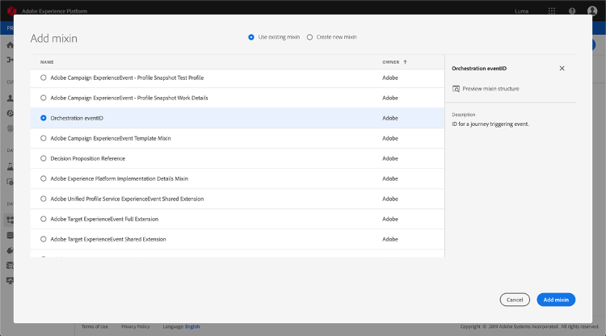
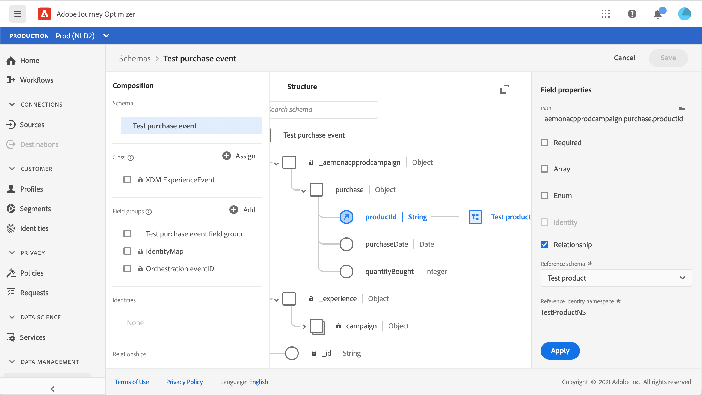

# 关于[!DNL Journey Orchestration]事件的ExperienceEvent架构

>[!CAUTION]
>
>**正在查找Adobe Journey Optimizer**？ 单击[此处](https://experienceleague.adobe.com/zh-hans/docs/journey-optimizer/using/ajo-home){target="_blank"}获取Journey Optimizer文档。
>
>
>_本文档参考已被Journey Optimizer替换的旧版Journey Orchestration资料。 如果您对访问Journey Orchestration或Journey Optimizer有任何疑问，请联系您的帐户团队。_

[!DNL Journey Orchestration]事件是通过流式摄取发送到Adobe Experience Platform的XDM Experience事件。

因此，为[!DNL Journey Orchestration]设置事件的一项重要先决条件是，您熟悉Adobe Experience Platform的Experience Data Model（或XDM）、如何构建XDM Experience Event架构以及如何将XDM格式的数据流式传输到Adobe Experience Platform。

## [!DNL Journey Orchestration]事件的架构要求

为[!DNL Journey Orchestration]设置事件的第一步是确保您定义了用于表示该事件的XDM架构，并创建了数据集以在Adobe Experience Platform上记录该事件的实例。 严格来说，为事件创建数据集并不是必需的，但将事件发送到特定数据集将允许您维护用户的事件历史记录，以供将来参考和分析，因此始终是一个不错的主意。 如果您还没有适合事件的架构和数据集，则可以在Adobe Experience Platform Web界面中完成这两项任务。

将用于[!DNL Journey Orchestration]事件的任何XDM架构都应满足以下要求：

* 架构必须为XDM ExperienceEvent类。

  

* 对于系统生成的事件，架构必须包括Orchestration eventID mixin。 [!DNL Journey Orchestration]使用此字段识别历程中使用的事件。

  

* 声明用于标识事件主体的标识字段。 如果未指定标识，则可以使用标识映射。 不建议采取此做法。

  

* 如果您希望此数据稍后可在历程中查找，请标记架构和数据集的配置文件。

  

  

* 您可以随意包含数据字段，以捕获要与事件一起包含的任何其他上下文数据，例如有关用户的信息、生成事件的设备、位置或与事件相关的任何其他有意义的情况。

  

  

## 利用架构关系{#leverage_schema_relationships}

Adobe Experience Platform允许您定义架构之间的关系，以便将一个数据集用作另一个数据集的查询表。

假设您的品牌数据模型具有一个用于捕获购买的架构。 此外，您还有一个产品目录架构。 您可以捕获购买架构中的产品ID，并使用关系从产品目录中查找更完整的产品详细信息。 例如，这样，您就可以为购买笔记本电脑的所有客户创建一个区段，而无需明确列出所有笔记本电脑ID或在事务系统中捕获每个产品详细信息。

要定义关系，源架构中需要有一个专用字段，在此例中是购买架构中的产品ID字段。 此字段需要引用目标架构中的产品ID字段。 必须为配置文件启用源表和目标表，并且目标架构必须将公共字段定义为其主要标识。

以下是为将产品ID定义为主标识的配置文件启用的产品目录架构。

以下是“产品ID”字段中定义关系的购买架构。

>[!NOTE]
>
>在[Experience Platform文档](https://experienceleague.adobe.com/docs/platform-learn/tutorials/schemas/configure-relationships-between-schemas.html?lang=zh-Hans)中了解有关架构关系的更多信息。

在Journey Orchestration中，您可以利用链接表中的所有字段：

* 配置单一事件时，[了解更多](../event/experience-event-schema.md#unitary_event_configuration)
* 在历程中使用条件时，[了解更多](../event/experience-event-schema.md#journey_conditions_using_event_context)
* 在自定义操作个性化中，[了解更多](../event/experience-event-schema.md#custom_action_personalization_with_journey_event_context)

### 单一事件配置{#unitary_event_configuration}

链接的架构字段在统一事件配置中可用：

* 浏览事件配置屏幕中的事件架构字段时。
* 在为系统生成的事件定义条件时。

链接的字段不可用：

* 在事件键公式中
* 在事件id条件中（基于规则的事件）

要了解如何配置单一事件，请参阅此[页面](../event/about-creating.md)。

### 使用事件上下文的历程条件{#journey_conditions_using_event_context}

您可以使用查询表中的数据，该表链接到条件构建（表达式编辑器）的历程中使用的事件。

在历程中添加条件、编辑表达式并在表达式编辑器中展开事件节点。

要了解如何定义历程条件，请参阅此[页面](../building-journeys/condition-activity.md)。

### 使用历程事件上下文进行操作个性化{#custom_action_personalization_with_journey_event_context}

配置历程操作活动的操作参数时，可以使用链接的字段。

要了解如何使用自定义操作，请参阅此[页面](../building-journeys/using-custom-actions.md)。

