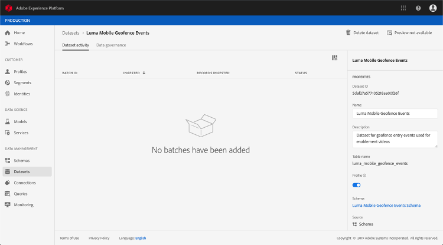

# 关于旅程编排的ExperienceEvent模式事件

旅程编排事件是通过流摄取发送到Adobe Experience Platform的XDM体验事件。

因此，设置旅程编排事件的一个重要先决条件是您熟悉平台的体验数据模型(XDM)、如何构建XDM体验事件模式，以及如何将XDM格式化的数据流式传输到平台。

## 模式旅程编排事件要求

设置旅程编排事件的第一步是确保您定义了用于表示事件的XDM模式，并创建了用于在平台上记录事件实例的数据集。 为事件建立数据集并非绝对必要，但将事件发送到特定数据集将允许您保留用户的事件历史记录，以供将来参考和分析，因此这始终是个好主意。 如果您还没有适合您的模式的事件和数据集，则可以在平台Web界面中执行这两个任务。

将用于旅程安排事件的任何XDM模式都应满足以下要求：

* 模式必须是XDM ExperienceEvent类。

* 模式必须包括Orchestration eventID mixin。 旅程编排使用此字段来识别旅程中使用的事件。

* 声明标识字段以标识事件的主体。 如果未指定身份，则可以使用身份映射。 不建议这样做。

* 如果您希望此数据稍后在旅程中可供查阅，请标记模式和数据集以进行用户档案。

* 您可以随意包含数据字段以捕获要包含在事件中的任何其他上下文数据，如有关用户、从中生成事件的设备、位置或与事件相关的任何其他有意义的情况。

