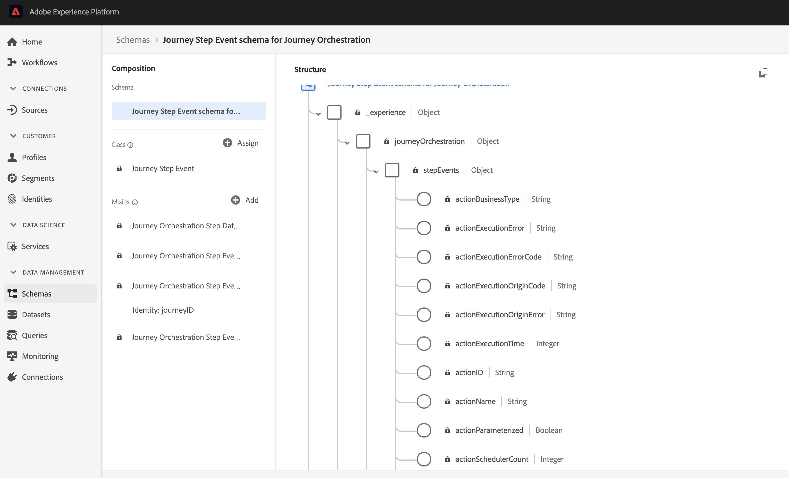

# 发行说明 {#release-notes}

此页面列出了 Journey Orchestration 的所有新功能和改进。
您还可以参阅[文档更新](../release-notes/documentation-updates.md)。

## 2020年8月版 {#august-release}

### GA更新{#august-ga-update}

“区段资格”事件的有效负荷现在包含以下上下文信息，您可以在条件和操作中使用这些信息：行为（入口、退出）、资格时间戳和区段ID。 [阅读更多](../building-journeys/segment-qualification-events.md)

### Alpha更新{#august-alpha-update}

要发现Alpha的范围，请参阅此 [部分](../alpha/alpha-overview.md)。

<table>
<thead>
<tr>
<th><strong>区段触发活动</strong> </th>
</tr>
</thead>
<tbody>
<tr>
<td>

对段触发器活动进行了以下改进：

<ul>
<li>
活动的名称已更改为“读取段”。 

</li>
<li>
旅程调度程序的配置已从活动的属性中删除。 现在可从旅程的属性中直接访问该资源，该资源位于一个专用部分中，如果已将读取区段活动放入画布中，则会显示该资源。 

</li>
<li>
您现在可以在单一用户档案上测试旅程，并使用视觉流跟踪旅程的进度。

</li>
</ul>

有关详细信息，请参阅<a href="../alpha/alpha-segment-trigger.md">详细文档</a>。

</td>
</tr>
</tbody>
</table>

<table>
<thead>
<tr>
<th><strong>基于规则的事件</strong> </th>
</tr>
</thead>
<tbody>
<tr>
<td>

对基于规则的事件进行了以下改进：

<ul>
<li>
您现在可以利用您已捕获的所有Adobe Analytics行为事件数据并将其流化到平台中，以触发旅程并为客户自动化体验。 <a href="../alpha/alpha-events.md#analytics-data">阅读更多</a>

</li>
<li>
在测试模式下触发基于规则的事件时，您现在可以直接视图事件ID条件。 此外，在规则评估的每个字段旁边都添加了工具提示。 <a href="../alpha/alpha-events.md#configuring-rule-based">阅读更多</a>

</li>
<li>
基于规则的事件定义屏幕已重新组织，以改善体验。 <a href="../alpha/alpha-events.md#test-rule-based">阅读更多</a>

</li>
</ul>
</td>
</tr>
</tbody>
</table>

## Alpha版本- 2020年7月 {#alpha-release---july-2020}

Alpha项目优惠功能目前在有限的一组客户中进行测试。 这样，我们就可以根据收到的反馈来改进我们的产品。 并非所有Journey Orchestration客户都可使用这些功能。

这些功能在专用部分中 [有介绍](../alpha/alpha-overview.md)。

<table>
<thead>
<tr>
<th><strong>增强的用户界面</strong> </th>
</tr>
</thead>
<tbody>
<tr>
<td>

Journey Orchestration菜单内的导航已得到增强，以便与Adobe Experience Platform提供一致的界面：

<ul>
<li>
菜单从界面的顶部移动到左侧。 

</li>
<li>
将管理功能分组到单个仪表板。

</li>
</ul>

有关详细信息，请参阅<a href="../alpha/alpha-interface.md">详细文档</a>。

</td>
</tr>
</tbody>
</table>

<table>
<thead>
<tr>
<th><strong>区段触发活动</strong> </th>
</tr>
</thead>
<tbody>
<tr>
<td>

区段触发活动允许您让属于Adobe Experience Platform区段的所有个人进入旅程。 进入旅程可以执行一次，也可以定期执行。 <a href="../alpha/alpha-segment-trigger.md">阅读更多</a>

</td>
</tr>
</tbody>
</table>

<table>
<thead>
<tr>
<th><strong>基于规则的事件</strong> </th>
</tr>
</thead>
<tbody>
<tr>
<td>

我们简化了您设置体验事件的方式。 我们引入了一种无需使用eventID的新方法。 在Journey Orchestration中设置事件时，您现在可以定义基于规则的事件。 <a href="../alpha/alpha-events.md">阅读更多</a>

</td>
</tr>
</tbody>
</table>

## 第 2 季度发行 - 2020 年 6 月 {#q2-release---june-2020}

<table>
<thead>
<tr>
<th><strong>Adobe Experience Platform 集成增强</strong> </th>
</tr>
</thead>
<tbody>
<tr>
<td>

已增强以下Adobe Experience Platform集成：

<ul>
<li>
新活动允许您聆听Adobe Experience Platform区段入口／出口，让客户在旅程中进入或前进。 <a href="../building-journeys/segment-qualification-events.md">阅读更多</a>

</li>
<li>
Adobe Experience Platform segments can now be created and edited without leaving the Journey Orchestration interface, thanks to a new <strong>Segments</strong> tab.<a href="../segment/about-segments.md">阅读更多</a>

</li>
<li>
在简单的表达式编辑器中，Adobe Experience Platform区段现在直接列在导航树中，以便轻松设置条件，如“此人是否属于区段A?”。<a href="../segment/using-a-segment.md">阅读更多</a>

</li>
<li>
Journey Orchestration现在自动传递到Adobe Experience Platform，在旅程中执行的步骤。 这包括遇到的潜在错误。此信息可用于通过对特定旅程或所有旅程的旅程步骤事件执行查询，从而实现报告和故障排除。<a href="../building-journeys/sharing-overview.md">阅读更多</a>

</li>
<li>
Journey Orchestration现在可以连接到生产和非生产的Adobe Experience Platform沙箱。 请注意，沙箱是测试版功能。<a href="../about/access-management.md#sandboxes">阅读更多</a>

</li>
</ul>
</td>
</tr>
</tbody>
</table>

<table>
<thead>
<tr>
<th><strong>旅程设计人员和测试模式增强功能</strong> </th>
</tr>
</thead>
<tbody>
<tr>
<td>

对旅程设计人员和测试模式进行了以下增强：

<ul>
<li>
您现在可以选中 1 个或 N 个旅程活动，将活动从一个旅程复制粘贴到另一个旅程。<a href="../building-journeys/using-the-journey-designer.md#copy-paste">阅读更多</a>

</li>
<li>
在启动一个事件以使测试用户档案进入旅程后，您现在可以看到其在旅程中的进度，这用彩色的视觉流显示。如果旅程中出错，系统还会显示错误的详细信息。<a href="../building-journeys/testing-the-journey.md#firing_events">阅读更多</a>

</li>
<li><strong>已完成</strong>的旅程状态已更名为<strong>已关闭（禁止进入）</strong>，以更好地反映此状态的含义。</li>
</ul>
</td>
</tr>
</tbody>
</table>

**其他改进**

为避免向第三方系统发送过多 API 调用，我们引入了新的公共 API 来设置“上限”规则。上限规则允许定义每毫秒对 API 端点的最大调用数。[阅读更多](../api/capping.md)

访问控制现在允许在用户访问管理中实现更大粒度。可用起始日期：2020 年 6 月 30 日。[阅读更多](../about/access-management.md#create-product-profile)

Journey Orchestration 现已在 APAC（澳大利亚数据中心）提供。可用起始日期：2020 年 6 月 30 日

Journey Orchestration 界面提供日语版。

## 第 1 季度发行 - 2020 年 3 月{#q1-release---march-2020}

**新增内容?**

<table>
<thead>
<tr>
<th><strong>测试模式增强功能</strong> </th>
</tr>
</thead>
<tbody>
<tr>
<td>

测试模式已进行了以下增强功能：

<ul>
<li>当旅程使用多个事件时，您现在可以从测试模式的<strong>事件配置</strong>屏幕中的下拉列表单独触发每个事件。<a href="../building-journeys/testing-the-journey.md#firing_events">阅读更多</a>
</li>
<li>
当在旅程中使用一个或多个<strong>等待</strong>活动时，您现在可以定义每个活动在测试模式下的停留时间。默认时间为 10 秒。可以使用左下角的<strong>测试中的等待时间</strong>参数更改此设置。<a href="../building-journeys/testing-the-journey.md">阅读更多</a>

</li>
<li>在<strong>测试日志</strong>中，如果调用第三方系统（数据源或操作）时出错，则现在将显示错误代码和错误响应。<a href="../building-journeys/testing-the-journey.md#viewing_logs">阅读更多</a>
</li>
</ul>
</td>
</tr>
</tbody>
</table>

<table>
<thead>
<tr>
<th><strong>集中化时区管理</strong> </th>
</tr>
</thead>
<tbody>
<tr> 
<td>

时区管理现在集中在旅程属性面板中。旅程属性中添加了两个参数：

<ul>
<li><strong>时区</strong>下拉列表允许您选择特定时区。默认情况下，使用浏览器的时区。 </li>
<li>The <strong>Profile Timezone</strong> checkbox allows you to use the Adobe Experience Platform Profile timezone of the person entering the journey, if available. 如果不可用，则使用下拉列表中定义的时区。此功能与使用没有命名空间的事件的旅程不兼容。</li>
</ul>

有关更多信息，请参阅<a href="../building-journeys/changing-properties.md#timezone">更改属性</a>和<a href="../building-journeys/timezone-management.md">时区管理</a>部分。

</td>
</tr>
</tbody>
</table>

<table>
<thead>
<tr>
<th><strong>旅程设计器增强功能</strong> </th>
</tr>
</thead>
<tbody>
<tr> 
<td>

旅程设计器左侧的旅程<strong>面板</strong>已得到增强：

<ul>
<li>通过<strong>搜索</strong>栏旁的新图标，您可以隐藏或显示面板中不可用的元素，例如使用不同于您的旅程中使用的命名空间的事件。默认情况下，不可用项目处于隐藏状态。</li>
<li>使用<strong>搜索</strong>字段，会显示每个画布活动类别的结果数。</li>
<li>不同活动类别之间的导航已得到改进。</li>
</ul>

在旅程设计器中，您可以检查您是否正在访问旅程的最新版本。此信息显示在版本号旁边。

在旅程<strong>画布</strong>中，当两个活动断开连接时，会显示一条警告消息。

有关详细信息，请参阅<a href="../building-journeys/using-the-journey-designer.md">详细文档</a>。

</td>
</tr>
</tbody>
</table>

<table>
<thead>
<tr>
<th><strong>情景帮助</strong> </th>
</tr>
</thead>
<tbody>
<tr>
<td>

现在，可以跨不同的 Journey Orchestration 列表屏幕（旅程、事件、操作和数据源）提供情景帮助。通过此情景帮助，您可以查看当前功能的快速说明，并访问相关文章和视频。

要显示情景帮助，请单击屏幕右上角的 图标。 

</td>
</tr>
</tbody>
</table>

**其他改进**

* In addition to US, Journey Orchestration is now available in **EMEA**. 应用程序和文档提供法语和德语两个版本。

* Experience League 现已集成到产品中。这简化了对相关内容的访问，并有助于您充分利用 Experience Cloud。直接访问“帮助”选项卡底部的 Journey Orchestration 文档。此外，单击“帮助”>“反馈”以报告问题或与 Adobe 分享您的想法。

* 现在，所有列表屏幕中都提供 **C** 键盘快捷键，它允许您创建新项目：旅程、数据源、操作和事件。[阅读更多](../about/user-interface.md#section_ksq_zr1_ffb)

* 您现在可以&#x200B;**删除**&#x200B;已停止的旅程。与这些已删除的旅程关联的报告将不可用。

* When browsing through **Adobe Experience Platform fields** (XDM format), you will now see the display name in addition to the field name. 此信息可从体验数据模型中的架构定义中检索。当可用时，将显示替代显示名称。此用户友好型描述（在 eVar 字段中尤为有用）使您能够更轻松地识别字段。[阅读更多](../about/user-interface.md#friendly-names-display)

## 正式全面发行 - 2019 年 12 月 {#ga-release---december-2019}

Journey Orchestration 现已正式全面发行。

利用存储在事件或数据源中的情境数据构建实时编排用例。

Journey Orchestration 允许由事件的情境数据、Adobe Experience Platform 信息或第三方 API 服务数据提供支持的实时编排。应用程序根据消费者的资料和行为确定在称为旅程的多步流中特定于消费者的下一个最佳操作。这包括最佳时间和操作类型，如通过 Adobe Campaign Standard 事务性消息传送功能（需要 Adobe Campaign Standard）向消费者发送推送通知或第三方系统通知。这些决策是根据规则和 Sensei 得分做出的。

详细了解 Journey Orchestration。

其他资源：

* [教程](https://docs.adobe.com/content/help/zh-Hans/journey-orchestration-learn/tutorials/understanding-journey-orchestration.html)
* [社区](https://www.adobe.com/go/journeyorchestrationcommunity)
