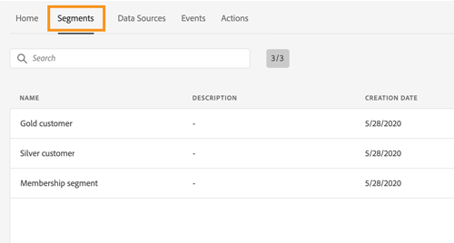
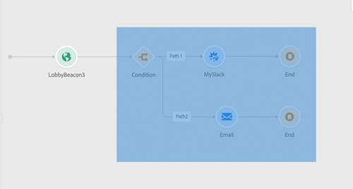

# 发行说明 {#release-notes}

此页面列出了 Journey Orchestration 的所有新功能和改进。
您还可以查阅最新的[文档更新](../release-notes/documentation-updates.md)。

## 2022 年 5 月版 {#may-2022-release}

### 改进

* **表达式编辑器** - 添加了 [limit](../functions/functionlimit.md) 函数，以限制列表的项目数。 现在，使用 [sort](../functions/functionsort.md) 函数可对列表对象进行排序。 此外，还向 [disctinct](../functions/functiondistinct.md) 和 [distinctWithNull](../functions/functiondistinctwithnull.md) 函数添加了 listObject 支持。

## 2022 年 3 月版 {#feb-2022-release}

### 改进

* 为了避免统一用户档案架构中出现不必要的字段，默认情况下将不再为用户档案启用历程步骤事件架构。如有需要，您可以启用它。[了解详情](../building-journeys/sharing-overview.md)
* 与导出作业相关的新步骤事件现在由 Journey Optimizer 发送至 Adobe Experience Platform。文档中添加了查询示例。[了解详情](../building-journeys/query-examples.md)

## 2022 年 2 月版 {#february-2022-release}

### 改进

* 为优化性能并防止使用过时资源，现在，所有处于测试模式且一周内未触发的历程都将切换回草稿状态。[了解更多信息](../building-journeys/testing-the-journey.md#important_notes)

## 2022 年 1 月版 {#january-2022-release}

### 改进

* Journey Orchestration 步骤事件现在可以链接到 [Adobe Customer Journey Analytics](https://experienceleague.adobe.com/docs/analytics-platform/using/cja-overview/cja-overview.html?lang=zh-Hans) 中的其他数据集。**profileID** 字段，在内置的历程步骤事件架构中，现在定义为标识字段。[了解详情](../building-journeys/sharing-overview.md#integration-cja)
* Adobe Campaign Standard 操作的上限规则已更改为 4000 次调用/5 分钟。[了解更多信息](../action/working-with-adobe-campaign.md)

## 2021 年 10 月版 {#october-2021-release}

### 改进

* **表达式编辑器** - 作为高级用户，您现在可以使用函数处理映射。[了解详情](../expression/field-references.md)
* **辅助功能** - 实施了辅助功能改进。Journey Orchestration 现在在辅助功能方面完全符合要求。
* **集合** - 现在支持包含子对象的对象数组。[了解更多信息](../usecase/collections.md)
* **监控** - 改进了实时历程和测试模式的步骤事件。已添加与用户档案导出作业相关的[新字段](../building-journeys/sharing-field-list.md#serviceevents)。为了提供更好的用户体验，在 Journey Orchestration 的历程步骤事件架构中，按不同类别组织了步骤事件字段。所有先前的步骤事件字段在 [stepEvents](../building-journeys/sharing-legacy-fields.md) 类别中仍然可用。

## 2021 年 9 月版 {#september-2021-release}

<table>
<thead>
<tr>
<th><strong>使用自定义操作动态传递数据列表</strong> </th>
</tr>
</thead>
<tbody>
<tr>
<td>

您现在可以在自定义操作参数中传递集合或数据列表，这些参数将在运行时动态填充。支持两种集合：简单集合和对象集合。之前创建的自定义操作将继续运行。 

有关详细信息，请参阅<a href="../usecase/collections.md">详细文档</a>。 

筛选条件和交集函数已添加到高级表达式编辑器的可用函数列表中。这为集合筛选和比较提供了更多可能性。

请查阅有关<a href="../functions/functionfilter.md">筛选条件</a>和<a href="../functions/functionintersect.md">交集</a>函数的文档。

</td>
</tr>
</tbody>
</table>

### 改进

* 系统生成的架构以及在为步骤事件进行配置期间创建的数据集现在处于只读模式，以防止对关键架构进行任何意外修改。[了解详情](../building-journeys/sharing-overview.md)
* 用一个会显示在画布中的标签清晰地标示 **Wait** 活动。在报告和测试模式日志中也会使用这个标签，以清楚地标识您正在执行的操作。[了解详情](../building-journeys/using-the-journey-designer.md)
* 通过使用搜索功能过滤 **Events** 和 **Action** 类别中的元素，更快地找到您的事件和操作。不再对编排活动进行过滤。[了解详情](../building-journeys/using-the-journey-designer.md)
* 在基于规则的事件中定义事件 ID 条件时，“contains”运算符现在可用于字符串类型的字段。[了解详情](../event/about-creating.md)

## 2021 年 8 月版 {#august-2021-release}

### 改进

**历程**

* **动态标头** - 您现在可以在 HTTP 标头参数中传递动态数据。集成系统可以使用这些参数接收历程操作 HTTP 调用，例如时间戳或跟踪 ID。[了解更多信息](../action/url-configuration.md)
* **动态 URL 路径** - 您现在可为自定义操作设置动态 URL 路径。[了解更多信息](../action/url-configuration.md)

## 2021 年 7 月版 {#july-2021-release}

<table>
<thead>
<tr>
<th><strong>利用架构关系</strong> </th>
</tr>
</thead>
<tbody>
<tr>
<td>

Adobe Experience Platform 让您可以定义架构之间的关系，以便将一个数据集用作另一个数据集的查询表。Journey Orchestration 现在可以利用来自链接架构的数据。

这些字段在统一事件配置、历程条件和自定义操作个性化中可用。

有关更多信息，请参阅<a href="../event/experience-event-schema.md#leverage_schema_relationships">详细文档</a>。

</td>
</tr>
</tbody>
</table>

### 改进

* **缓存时长**&#x200B;字段已从数据源配置面板中移除。[了解更多信息](../datasource/about-data-sources.md)

## 2021 年 6 月版 {#june-2021-release}

<table>
<thead>
<tr>
<th><strong> Adobe Campaign Classic 集成</strong> </th>
</tr>
</thead>
<tbody>
<tr>
<td>

正式发布版中已推出与 Adobe Campaign Classic 的集成。它让您可以使用 Adobe Campaign v7 或 v8 事务性消息传递功能发送电子邮件、推送通知和短信。

Journey Orchestration 实例和 Campaign 实例之间的连接是在配置时通过 Adobe 来设置的。

有关更多信息，请参阅<a href="../action/acc-action.md">详细文档</a>。

</td>
</tr>
</tbody>
</table>

### 改进

* 对于外部数据源，现在会自动定义每秒 15 次调用的上限规则。[了解更多信息](../about/external-systems.md#capping)
* 简单和高级表达式编辑器现在支持 XDM 日期格式。
* 在历程列表屏幕中，添加了新的筛选器。您现在可以按历程类型筛选：**[!UICONTROL Unitary event]** 或 **[!UICONTROL Segment qualification]**。[了解更多信息](../about/user-interface.md#section_lgm_hpz_pgb)
* 对于实时历程，历程属性屏幕现在显示发布日期和发布历程的用户名称。在复制历程的技术详情时，也可以使用此信息。[了解更多信息](../building-journeys/changing-properties.md#section_lgm_hpz_pgb)

## 2021 年 4 月版 {#april-2021-release}

### 改进

* 在测试模式的 **Event Configuration** 屏幕中，现在会显示需要枚举的字段的下拉列表。选择一个可用值即可。这将可以避免在定义的值不正确的情况下触发事件时出错。[了解更多信息](../building-journeys/testing-the-journey.md#firing_events)

## 2021 年 3 月版 {#march-2021-release}

### 改进

* 历程中添加了新状态。当历程结束或被手动关闭时，其状态会在关闭 30 天后从 **Closed** 切换为 **Finished**。这样，您就可以更轻松地识别非活动的历程，同时确保所有仍然存在的人员有时间完成历程。[了解更多信息](../building-journeys/journey.md#ending_a_journey)
* 在草稿历程的显示活动的右侧窗格中，默认情况下隐藏只读字段。这种界面简化将帮助您更轻松地配置活动。要显示它们，请单击 **Show read-only fields** 图标（位于活动配置窗格的左上角）。[了解更多信息](../building-journeys/using-the-journey-designer.md#configuration_pane)
* 在测试模式的 **Event Configuration** 屏幕上，用于定义测试用户档案 ID 的 **Key** 字段已重命名为 **Profile Identifier** 以提供更好的用户体验。[了解更多信息](../building-journeys/testing-the-journey.md)。
* 对于反应事件，超时持续时间现在只能设置为 40 秒到 30 天之间。测试使用反应事件的历程时，测试模式 **[!UICONTROL Wait time]** 的默认值和最小值现在为 40 秒。[了解更多信息](../building-journeys/reaction-events.md)。

## 2021 年 2 月版 {#february-2021-release}

<table>
<thead>
<tr>
<th><strong>更新用户档案活动</strong> </th>
</tr>
</thead>
<tbody>
<tr>
<td>

这个新的操作活动让您可以使用来自事件、数据源的信息或使用特定值更新现有 Adobe Experience Platform 用户档案。

有关更多信息，请参阅<a href="../building-journeys/update-profiles.md">有详细说明的文档</a>。

</td>
</tr>
</tbody>
</table>

### 其他改进

* 现在，在配置事件时，默认情况下只会预先选择 XDM 验证中必填的字段。无法取消选择这些字段。
* 在历程调板中，添加了新筛选器。除了开箱即用型事件和操作之外，它还允许您仅显示最近使用的五个事件和操作。这具体取决于每个用户。默认情况下，将显示所有项目。[了解更多信息](../building-journeys/using-the-journey-designer.md#palette)
* 现在，在开始新历程时，无法在第一步操作中放入画布中的元素会被隐藏。这涉及所有操作、条件活动、等待和反应。
* 在高级表达式编辑器的左部，函数现在重新组合到了列表末尾的 **Functions** 部分。

## 2021 年 1 月版 {#january-2021-release}

在事件配置中选择架构时，只会选择 Journey Orchestration 正确接收事件所必需的字段。[了解更多信息](../event/defining-the-payload-fields.md)

现在，可在简单表达式编辑器中使用历程属性。[了解更多信息](../expression/journey-properties.md)

添加了两个新的历程属性（sandboxName 和 organizationId）。[了解更多信息](../expression/journey-properties.md)

为了与 Adobe Campaign Standard SLA 保持一致，现在设置 Adobe Campaign Standard 集成后，就会为 Adobe Campaign Standard 操作自动定义每秒 13 次调用的上限规则。[了解更多信息](../action/working-with-adobe-campaign.md)

现在，可在超时路径上更明确地指定事件超时持续时间。[了解更多信息](../building-journeys/event-activities.md#listening-to-events-during-a-specific-time)

[getListItem](../functions/functiongetlistitem.md) 和 [split](../functions/functionsplit.md) 函数已添加到高级表达式编辑器的可用函数列表中。这将在字符串计算用例中提供更多可能性。

## 2020 年 11 月版 {#november-release}

<table>
<thead>
<tr>
<th><strong>从一个历程到另一个历程</strong> </th>
</tr>
</thead>
<tbody>
<tr>
<td>

通过新的操作活动，可以将个人从一个历程推送到另一个历程。<strong>跳转</strong>活动允许您：

<ul>
<li>通过将非常复杂的历程分成若干个历程来简化其设计 </li>
<li>基于通用且可重用的历程模式构建历程</li>
</ul>

有关更多信息，请参阅<a href="../building-journeys/jump.md">详细文档</a>和<a href="https://experienceleague.adobe.com/docs/journey-orchestration-learn/tutorials/building-a-journey/jumping-to-another-journey.html?lang=zh-Hans">教程视频</a>。

</td>
</tr>
</tbody>
</table>

<table>
<thead>
<tr>
<th><strong>在表达式编辑器中使用历程属性</strong> </th>
</tr>
</thead>
<tbody>
<tr>
<td>

在高级表达式编辑器中，我们在字段和函数列表中添加了新类别。这是系统从实时历程中检索到的信息，如历程 ID 或遇到的特定错误。这将为您在构建历程时提供更多可能性。例如，在条件或操作中遇到错误的情况下，您将能够提醒第三方系统。

有关详细信息，请参阅<a href="../expression/journey-properties.md">详细文档</a>。

</td>
</tr>
</tbody>
</table>

<table>
<thead>
<tr>
<th><strong>基于规则的事件（测试版）</strong> </th>
</tr>
</thead>
<tbody>
<tr>
<td>

现在有一种新方法可用于更轻松地设置事件，而无需使用 eventID：基于规则的事件会根据条件来评估是否应触发事件。您仍可以使用现有方法，现在称为“系统生成”。该功能已通过 Alpha 程序在有限的客户群中进行测试，现在所有客户都可以在测试版中使用该功能。

</td>
</tr>
</tbody>
</table>

### 其他改进

在创建历程的新版本时增加了限制。这些限制可避免在历程中做出过于剧烈的更改，以保持版本之间的一致性。[了解更多信息](../about/limitations.md#journey-versions-limitations)

不能再在包含 Campaign Standard 消息活动的历程中使用&#x200B;**客户细分资格**&#x200B;活动。此限制保护 Adobe Campaign Standard 实例的完整性。的确，“客户细分资格”的使用可能导致每日消息发送峰值，这会使 Campaign Standard 事务性消息传递过载。[了解更多信息](../about/limitations.md#segment-qualification)

## 2020 年 10 月版 {#october-release}

<table>
<thead>
<tr>
<th><strong>事件超时</strong> </th>
</tr>
</thead>
<tbody>
<tr>
<td>

现在，您可以为事件配置超时，以便使历程仅在特定时间内侦听事件。您不再需要添加与事件路径平行的“等待”活动来实现此目的。

有关更多信息，请参阅<a href="../building-journeys/event-activities.md#listening-to-events-during-a-specific-time">有详细说明的文档</a>。

</td>
</tr>
</tbody>
</table>

### 其他改进

* 当您发布新版本的历程时，先前版本会自动结束并切换到“已关闭”状态。[了解更多信息](../building-journeys/journey-versions.md)

## 2020 年 9 月版 {#september-release}

### 正式发布版更新{#september-ga-update}

<table>
<thead>
<tr>
<th><strong>条件活动改进</strong> </th>
</tr>
</thead>
<tbody>
<tr>
<td>

在向历程中添加条件时，您现在可以定义标签。如果您在历程中使用多个条件，则通过此标签可以更轻松地对其进行识别。

有关更多信息，请参阅<a href="../building-journeys/condition-activity.md#about_condition">详细文档</a>。

</td>
</tr>
</tbody>
</table>

### Alpha 更新{#september-alpha-update}

<table>
<thead>
<tr>
<th><strong>读取客户细分活动改进</strong> </th>
</tr>
</thead>
<tbody>
<tr>
<td>

已对<strong>读取客户细分</strong>活动进行以下改进：

<ul>
<li>
基于客户细分的历程现在在画布上方显示历程的计划类型提醒。您可以单击此提醒以访问计划配置菜单。

</li>
<li>
测试模式日志的粒度已得到改进，可显示客户细分导出进度状态。

</li>
</ul>
</td>
</tr>
</tbody>
</table>

## 2020 年 8 月版 {#august-release}

### GA 更新{#august-ga-update}

区段鉴别事件的有效负荷现在包含可以在条件和操作中使用的以下上下文信息：行为（进入、退出）、鉴别时间戳和区段 ID。[了解更多信息](../building-journeys/segment-qualification-events.md)

### Alpha 更新{#august-alpha-update}

<table>
<thead>
<tr>
<th><strong>区段触发活动</strong> </th>
</tr>
</thead>
<tbody>
<tr>
<td>

已对“区段触发”活动进行以下改进：

<ul>
<li>
活动的名称已更改为“读取区段”。 

</li>
<li>
已从活动的属性中删除历程调度程序的配置。现在可直接从历程的属性访问该活动，该活动位于在“读取区段”活动放入画布后将显示的专用部分中。 

</li>
<li>
您现在可以在单一用户档案上测试历程，并使用视觉流跟踪其在历程中的进度。

</li>
</ul>
</td>
</tr>
</tbody>
</table>

<table>
<thead>
<tr>
<th><strong>基于规则的事件</strong> </th>
</tr>
</thead>
<tbody>
<tr>
<td>

已对基于规则的事件进行以下改进：

<ul>
<li>
您现在可以利用已在捕获并流入到 Platform 中的所有 Adobe Analytics 行为事件数据，从而触发历程并将客户的体验自动化。<a href="../event/about-analytics.md">了解更多信息</a>

</li>
<li>
在测试模式下触发基于规则的事件时，现在可以直接查看事件 ID 条件。此外，在规则评估中涉及的每个字段旁边都添加了工具提示。<a href="../building-journeys/testing-the-journey.md#test-rule-based">了解更多信息</a>

</li>
<li>
基于规则的事件定义屏幕已重新组织，以改善体验。<a href="../event/about-creating.md">了解更多信息</a>

</li>
</ul>
</td>
</tr>
</tbody>
</table>

## Alpha 版 - 2020 年 7 月 {#alpha-release---july-2020}

Alpha 程序提供目前在有限的一组客户中经过测试的功能。这样，我们就可以根据收到的反馈来改进产品。这些功能并非对于所有 Journey Orchestration 客户都可用。

<table>
<thead>
<tr>
<th><strong>增强的用户界面</strong> </th>
</tr>
</thead>
<tbody>
<tr>
<td>

Journey Orchestration 菜单内的导航已得到增强，以便提供与 Adobe Experience Platform 一致的界面：

<ul>
<li>
菜单从界面的顶部移动到左侧。 

</li>
<li>
将管理功能分组到单个仪表板中。

</li>
</ul>
</td>
</tr>
</tbody>
</table>

<table>
<thead>
<tr>
<th><strong>区段触发活动</strong> </th>
</tr>
</thead>
<tbody>
<tr>
<td>

“区段触发”活动允许属于 Adobe Experience Platform 区段的所有个人进入历程。进入历程的操作可以执行一次，也可以定期执行。 

</td>
</tr>
</tbody>
</table>

<table>
<thead>
<tr>
<th><strong>基于规则的事件</strong> </th>
</tr>
</thead>
<tbody>
<tr>
<td>

我们简化了您设置体验事件的方式。我们正在引入一种无需使用 eventID 的新方法。在 Journey Orchestration 中设置事件时，现在可以定义基于规则的事件。<a href="../event/about-events.md">了解更多信息</a>

</td>
</tr>
</tbody>
</table>

## 2 季度版 - 2020 年 6 月 {#q2-release---june-2020}

<table>
<thead>
<tr>
<th><strong>Adobe Experience Platform 集成增强</strong> </th>
</tr>
</thead>
<tbody>
<tr>
<td>

已进行以下 Adobe Experience Platform 集成增强：

<ul>
<li>
新活动允许侦听 Adobe Experience Platform 区段入口/出口，以使人员进入历程或在历程中前进。<a href="../building-journeys/segment-qualification-events.md">了解更多信息</a>

</li>
<li>
由于新增了<strong>区段</strong>选项卡，现在无需离开 Journey Orchestration 界面即可创建和编辑 Adobe Experience Platform 区段。<a href="../segment/about-segments.md">了解更多信息</a>

</li>
<li>
在简单表达式编辑器中，Adobe Experience Platform 区段现在直接列出在导航树中，以便轻松设置条件，例如“此人是否属于区段 A？”。<a href="../segment/using-a-segment.md">了解更多信息</a>

</li>
<li>
Journey Orchestration 现在会自动将历程中执行的步骤传递到 Adobe Experience Platform。这包括遇到的潜在错误。此信息可用于通过对特定历程或所有历程的历程步骤事件执行查询，从而实现报告和故障排除。<a href="../building-journeys/sharing-overview.md">了解更多信息</a>

</li>
<li>
Journey Orchestration 现在可以连接到生产和非生产 Adobe Experience Platform 沙盒。请注意，沙盒是测试版功能。<a href="../about/access-management.md#sandboxes">了解更多信息</a>

</li>
</ul>
</td>
</tr>
</tbody>
</table>

<table>
<thead>
<tr>
<th><strong>历程设计人员和测试模式增强功能</strong> </th>
</tr>
</thead>
<tbody>
<tr>
<td>

对历程设计人员和测试模式进行了以下增强：

<ul>
<li>
您现在可以选中 1 个或 N 个历程活动，将活动从一个历程复制粘贴到另一个历程。<a href="../building-journeys/using-the-journey-designer.md#copy-paste">了解更多信息</a>

</li>
<li>
在启动一个事件以使测试用户档案进入历程后，您现在可以看到其在历程中的进度，这用彩色的视觉流显示。如果历程中出错，系统还会显示错误的详细信息。<a href="../building-journeys/testing-the-journey.md#firing_events">了解更多信息</a>

</li>
<li><strong>已完成</strong>的历程状态已更名为<strong>已关闭（禁止进入）</strong>，以更好地反映此状态的含义。</li>
</ul>
</td>
</tr>
</tbody>
</table>

**其他改进**

为避免向第三方系统发送过多 API 调用，我们引入了新的公共 API 来设置“上限”规则。上限规则允许定义每毫秒对 API 端点的最大调用数。[了解更多信息](../api/capping.md)

访问控制现在允许在用户访问管理中实现更大粒度。可用起始日期：2020 年 6 月 30 日。[了解更多信息](../about/access-management.md#create-product-profile)

Journey Orchestration 现已在 APAC（澳大利亚数据中心）提供。可用起始日期：2020 年 6 月 30 日

Journey Orchestration 界面提供日语版。

## 1 季度版 - 2020 年 3 月 {#q1-release---march-2020}

<table>
<thead>
<tr>
<th><strong>测试模式增强功能</strong> </th>
</tr>
</thead>
<tbody>
<tr>
<td>

测试模式已进行了以下增强功能：

<ul>
<li>当历程使用多个事件时，您现在可以从测试模式的<strong>事件配置</strong>屏幕中的下拉列表单独触发每个事件。<a href="../building-journeys/testing-the-journey.md#firing_events">了解更多信息</a>
</li>
<li>
当在历程中使用一个或多个<strong>等待</strong>活动时，您现在可以定义每个活动在测试模式下的停留时间。默认时间为 10 秒。可以使用左下角的<strong>测试中的等待时间</strong>参数更改此设置。<a href="../building-journeys/testing-the-journey.md">了解更多信息</a>

</li>
<li>在<strong>测试日志</strong>中，如果调用第三方系统（数据源或操作）时出错，则现在将显示错误代码和错误响应。<a href="../building-journeys/testing-the-journey.md#viewing_logs">了解更多信息</a>
</li>
</ul>
</td>
</tr>
</tbody>
</table>

<table>
<thead>
<tr>
<th><strong>集中化时区管理</strong> </th>
</tr>
</thead>
<tbody>
<tr> 
<td>

时区管理现在集中在历程属性面板中。历程属性中添加了两个参数：

<ul>
<li><strong>时区</strong>下拉列表允许您选择特定时区。默认情况下，使用浏览器的时区。 </li>
<li>通过<strong>用户档案时区</strong>复选框，您可以使用进入历程的人员的 Adobe Experience Platform 用户档案时区（如果可用）。如果不可用，则使用下拉列表中定义的时区。此功能与使用没有命名空间的事件的历程不兼容。</li>
</ul>

有关更多信息，请参阅<a href="../building-journeys/changing-properties.md#timezone">更改属性</a>和<a href="../building-journeys/timezone-management.md">时区管理</a>部分。

</td>
</tr>
</tbody>
</table>

<table>
<thead>
<tr>
<th><strong>历程设计器增强功能</strong> </th>
</tr>
</thead>
<tbody>
<tr> 
<td>

历程设计器左侧的历程<strong>面板</strong>已得到增强：

<ul>
<li>通过<strong>搜索</strong>栏旁的新图标，您可以隐藏或显示面板中不可用的元素，例如使用不同于您的历程中使用的命名空间的事件。默认情况下，不可用项目处于隐藏状态。</li>
<li>使用<strong>搜索</strong>字段，会显示每个画布活动类别的结果数。</li>
<li>不同活动类别之间的导航已得到改进。</li>
</ul>

在历程设计器中，您可以检查您是否正在访问历程的最新版本。此信息显示在版本号旁边。

在历程<strong>画布</strong>中，当两个活动断开连接时，会显示一条警告消息。

有关更多信息，请参阅<a href="../building-journeys/using-the-journey-designer.md">详细文档</a>。

</td>
</tr>
</tbody>
</table>

<table>
<thead>
<tr>
<th><strong>情景帮助</strong> </th>
</tr>
</thead>
<tbody>
<tr>
<td>

现在，可以跨不同的 Journey Orchestration 列表屏幕（历程、事件、操作和数据源）提供情景帮助。通过此情景帮助，您可以查看当前功能的快速说明，并访问相关文章和视频。

要显示情景帮助，请单击屏幕右上角的 图标。 

</td>
</tr>
</tbody>
</table>

**其他改进**

* 除美国以外，现在&#x200B;**欧洲、中东和非洲地区**&#x200B;也提供 Journey Orchestration。应用程序和文档提供法语和德语两个版本。

* Experience League 现已集成到产品中。这简化了对相关内容的访问，并有助于您充分利用 Experience Cloud。直接访问“帮助”选项卡底部的 Journey Orchestration 文档。此外，单击“Help”>“Feedback”，可报告问题或与 Adobe 分享您的想法。

* 现在，所有列表屏幕中都提供 **C** 键盘快捷键，它允许您创建新项目：历程、数据源、操作和事件。[了解更多信息](../about/user-interface.md#section_ksq_zr1_ffb)

* 您现在可以&#x200B;**删除**&#x200B;已停止的历程。与这些已删除的历程关联的报告将不可用。

* 浏览 **Adobe Experience Platform 字段**（XDM 格式）时，除了字段名称外，您现在还会看到显示名称。此信息可从体验数据模型中的架构定义中检索。当可用时，将显示替代显示名称。此用户友好型描述（在 eVar 字段中尤为有用）使您能够更轻松地识别字段。[了解更多信息](../about/user-interface.md#friendly-names-display)

## 正式发布版 - 2019 年 12 月 {#ga-release---december-2019}

Journey Orchestration 现已正式推出。

利用存储在事件或数据源中的上下文数据构建实时编排用例。

Journey Orchestration 允许由事件的情境数据、Adobe Experience Platform 信息或第三方 API 服务数据提供支持的实时编排。应用程序根据消费者的资料和行为确定在称为历程的多步流中特定于消费者的下一个最佳操作。这包括最佳时间和操作类型，如通过 Adobe Campaign Standard 事务性消息传送功能（需要 Adobe Campaign Standard）向消费者发送推送通知或第三方系统通知。这些决策是根据规则和 Sensei 得分做出的。

详细了解 Journey Orchestration。

其他资源：

* [教程](https://experienceleague.adobe.com/docs/platform-learn/tutorials/journey-orchestration/introduction.html?lang=zh-Hans)
* [社区](https://www.adobe.com/go/journeyorchestrationcommunity)
