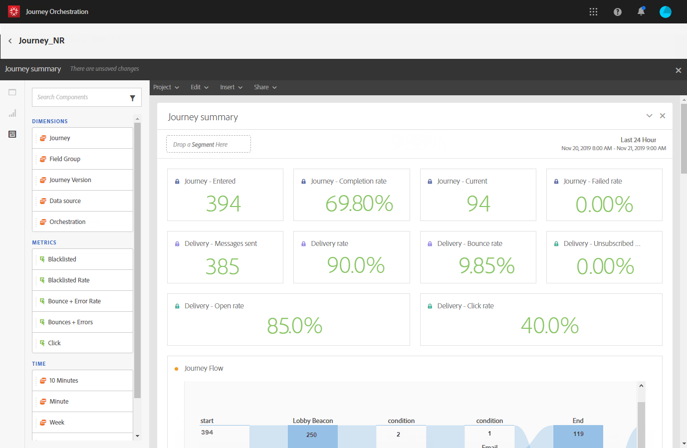

# 关于历程报告 {#concept_rfj_wpt_52b}

>[!NOTE]
>
>仅当您具有Adobe Campaign Standard时，才会填充投放数据和区段组件。

本节将介绍如何访问和使用报告来衡量历程的有效性。

## 报告界面 {#reporting-interface}

例如，顶部工具栏允许您修改、保存或打印报告。

使用 **[!UICONTROL Project]** 按Tab键以：

* **[!UICONTROL Open]**：打开之前创建的报表或模板。
* **[!UICONTROL Save As]**：复制模板以修改它们。
* **[!UICONTROL Refresh project]**：根据新数据和筛选器更改来更新报表。
* **[!UICONTROL Download CSV]**：将报表导出到CSV文件。
* **[!UICONTROL Print]**：打印报表。

此 **[!UICONTROL Edit]** 选项卡允许您：

* **[!UICONTROL Undo]**：取消您在功能板上的上一个操作。
* **[!UICONTROL Redo]**：取消您的上一个 **[!UICONTROL Undo]** 操作。
* **[!UICONTROL Clear all]**：删除功能板上的每个面板。

此 **[!UICONTROL Insert]** 表格允许您通过向功能板添加图形和表格来自定义报表：

* **[!UICONTROL New Blank Panel]**：向功能板中添加新的空白面板。
* **[!UICONTROL New Freeform]**：向功能板中添加新的自由格式表。
* **[!UICONTROL New Line]**：向功能板中添加新的折线图。
* **[!UICONTROL New Bar]**：向功能板中添加新的条形图。

通过左侧的选项卡，可构建报告并根据需要筛选数据。

通过这些选项卡，可访问以下项目：

* **[!UICONTROL Panels]**：在报表中添加空白面板或自由格式以开始筛选数据。 有关详情，请参阅 [添加面板](../reporting/creating-your-journey-reports.md#adding-panels) 部分
* **[!UICONTROL Visualizations]**：拖放所选的可视化图表项以为报表提供一个图形维度。 有关详情，请参阅 [添加可视化图表](../reporting/creating-your-journey-reports.md#adding-visualizations) 部分。
* **[!UICONTROL Components]**：使用不同的维度、量度、区段和时间段自定义您的报表。 有关详情，请参阅 [添加组件](../reporting/creating-your-journey-reports.md#adding-components) 部分。

## 历程摘要模板 {#ootb-template}

报告分为两类：现成的模板和自定义报告。
开箱即用的模板， **[!UICONTROL Journey summary]**，可让您清楚地查看最重要的跟踪数据。

每个表都由概要数字和图表表示。 您可以更改详细信息在其各自的可视化设置中的显示方式。

报告顶部提供了以下KPI：

* **[!UICONTROL Journey - Entered]**：到达历程的进入事件的个人总数。
* **[!UICONTROL Journey - Completion rate]**：与进入历程的个人总数相比，到达历程结束的个人总数（或者，如果个人不符合任何条件）。
* **[!UICONTROL Journey - Current]**：当前历程中的个人总数。
* **[!UICONTROL Journey - Failed rate]**：与运行历程数相比，未成功执行的历程总数。
* **[!UICONTROL Delivery - Messages sent]**：已发送的消息总数。
* **[!UICONTROL Delivery rate]**：与发送的消息相比，成功发送的消息总数。
* **[!UICONTROL Delivery - Bounce rate]**：与发送的消息相比退回的消息总数。
* **[!UICONTROL Delivery - Unsubscribed rate]**：与投放的邮件相比，收件人退订的总数。
* **[!UICONTROL Delivery - Open rate]**：打开的邮件总数，与已送达的邮件数相比。
* **[!UICONTROL Delivery - Click rate]**：与已投放消息数相比，投放中的点击总数。

历程流可视化图表允许您查看目标用户档案的路径，以分步方式浏览历程。 仅当定位一个历程时，此项才可用。 它是自动生成的，无法修改。

此 **[!UICONTROL Journey summary]** 表包含可用于您的历程的数据，例如：

* **[!UICONTROL Entered]**：到达历程的进入事件的个人总数。
* **[!UICONTROL Completion rate]**：与进入旅程的个人总数相比，达到旅程的结束流量控制的个人总数。
* **[!UICONTROL Current]**：当前历程中的个人总数。
* **[!UICONTROL Failed]**：未成功执行的历程总数。
* **[!UICONTROL Failed rate]**：与运行历程数相比，未成功执行的历程总数。

此 **[!UICONTROL Top events]** 此表显示了最成功的事件，以及 **[!UICONTROL Top action]**，是您的历程中最成功的操作。

此 **[!UICONTROL Delivery - Sending summary]** 该表包含可用于历程投放的数据，例如：

* **[!UICONTROL Processed/sent]**：已发送的消息总数。
* **[!UICONTROL Delivered rate]**：与发送的消息相比，成功发送的消息总数。
* **[!UICONTROL Delivered]**：成功发送的消息数，与已发送消息的总数相关。
* **[!UICONTROL Bounce + error rate]**：与发送的消息相比退回的消息总数。
* **[!UICONTROL Bounces + errors]**：投放和自动返回处理期间累计的错误总数与已发送消息的总数相关。

此 **[!UICONTROL Delivery - Tracking summary]** 该表包含可用于跟踪历程投放成功性的数据，例如：

* **[!UICONTROL Open Rate]**：已打开消息的百分比。
* **[!UICONTROL Open]**：消息在投放中打开的次数。
* **[!UICONTROL Click trough rate]**：与已投放消息数相比，投放中的点击总数。
* **[!UICONTROL Click]**：在投放中点击内容的次数。
* **[!UICONTROL Unsubscribe rate]**：收件人退订次数与已投放消息相比的百分比。
* **[!UICONTROL Unsubscribed]**：与投放的邮件相比，收件人退订的总数。
