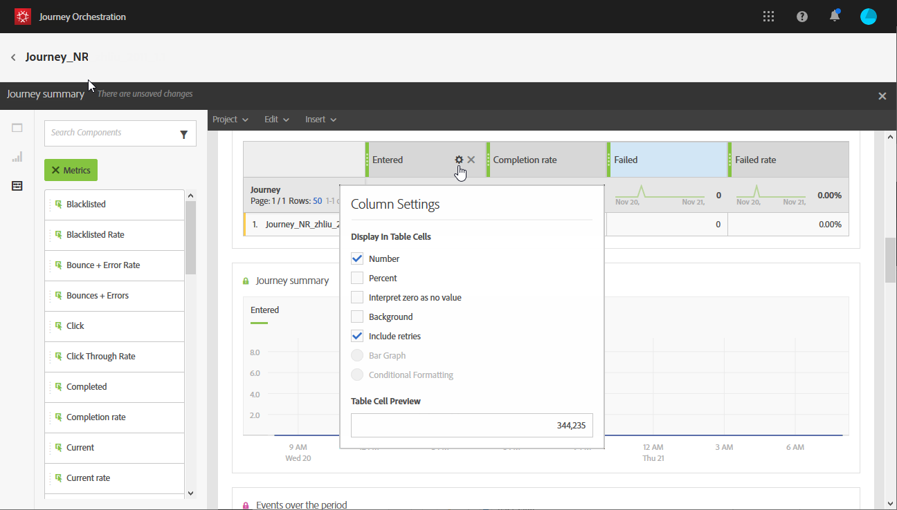

# 创建旅程报告 {#concept_rfj_wpt_52b}

## 访问和创建报告 {#accessing-reports}

>[!NOTE]
>
>删除旅程后，所有关联的报告将不再可用。

本节将介绍如何创建或使用现成报告。 将面板、组件和可视化结合在一起，以更好地跟踪您旅程的成功。

要访问旅程报告和开始，跟踪投放的成功：

1. 在顶部菜单中，单击 **[!UICONTROL Home]**&#x200B;选项卡。

1. 选择要报告的旅程。

   请注意，您还可以在将指针悬停在旅程列表 **的旅程上** ，同时单击“报告”来访问您的报告。

   

1. 单击 **[!UICONTROL Report]** 屏幕右上方的图标。

   

1. 现 **[!UICONTROL Journey summary]** 成的报告会显示在屏幕上。 要访问自定义报告，请单击 **[!UICONTROL Close]** 按钮。

   

1. 单击该 **[!UICONTROL Create new project]** 页面从头开始创建报表。

   

1. 在选项卡 **[!UICONTROL Panels]** 中，根据需要拖放任意数量的面板或自由形式表。 For more information, refer to this [section](#adding-panels).

   

1. 然后，您可以通过将维度和量度从选项卡拖放到自由格式表 **[!UICONTROL Components]** 来开始筛选数据。 For more information, refer to this [section](#adding-components).

   

1. 要更清晰地视图数据，您可以从选项卡中添加可视 **[!UICONTROL Visualizations]** 化。 For more information, refer to this [section](#adding-visualizations).

## 添加面板{#adding-panels}

### 添加空白面板 {#adding-a-blank-panel}

要开始报表，可向现成或自定义报表添加一组面板。 每个面板包含不同的数据集，并由自由形式表和可视化组成。

此面板允许您根据需要构建报表。 您可以在报告中添加任意所需数量的面板，以便按不同的时间段过滤数据。

1. 单击该 **[!UICONTROL Panels]** 图标。 您还可以通过单击并选择来添加 **[!UICONTROL Insert tab]** 面板 **[!UICONTROL New Blank Panel]**。

   

1. 将其拖放 **[!UICONTROL Blank Panel]** 到仪表板中。

   

您现在可以向面板中添加自由形式表以开始定位数据。

### 添加自由形式表 {#adding-a-freeform-table}

自由形式表允许您创建一个表，以使用表中提供的不同度量和维度分析 **[!UICONTROL Component]** 数据。

每个表和可视化都可调整大小，并可以移动以更好地自定义您的报表。

1. 单击该 **[!UICONTROL Panels]** 图标。

   

1. 将项目拖放 **[!UICONTROL Freeform]** 到仪表板中。

   您还可以通过单击选项卡并选 **[!UICONTROL Insert]** 择或在 **[!UICONTROL New Freeform]** 空面板中 **[!UICONTROL Add a freeform table]** 单击来添加表。

   

1. 将选项卡中的项 **[!UICONTROL Components]** 拖放到列和行中以构建表。

   

1. 单击图 **[!UICONTROL Settings]** 标以更改数据在列中的显示方式。

   

   其 **[!UICONTROL Column settings]** 组成有：

   * **[!UICONTROL Number]**:允许您在列中显示或隐藏摘要编号。
   * **[!UICONTROL Percent]**:允许您在列中显示或隐藏百分比。
   * **[!UICONTROL Interpret zero as no value]**:允许您在值等于零时显示或隐藏。
   * **[!UICONTROL Background]**:允许您在单元格中显示或隐藏水平进度栏。
   * **[!UICONTROL Include retries]**:允许您在结果中包含重试。 仅可用于 **[!UICONTROL Sent]** 和 **[!UICONTROL Bounces + Errors]**。

1. 选择一行或多行，然后单击 **[!UICONTROL Visualize]** 图标。 将添加一个可视化，以反映您选择的行。

   

您现在可以根据需要添加任意数量的组件，还可以添加可视化功能，为数据提供图形表示。

## 添加组件{#adding-components}

组件可帮助您使用不同的维度、指标和时段自定义报表。

1. 单击选 **[!UICONTROL Components]** 项卡以访问组件列表。

   

1. 选项卡中显示的 **[!UICONTROL Components]** 每个类别均显示五个最常用的项目，单击类别的名称即可访问其完整的组件列表。

   组件表分为三个类别:

   * **[!UICONTROL Dimensions]**:从投放日志获取详细信息，如收件人的浏览器或域，或投放成功。
   * **[!UICONTROL Metrics]**:获取有关消息状态的详细信息。 例如，如果已传递消息，且用户已打开该消息。
   * **[!UICONTROL Time]**:为表设置时间段。

1. 将组件拖放到面板中以开始筛选数据。

您可以根据需要拖放任意数量的组件，并将它们相互比较。

## 添加可视化{#adding-visualizations}

通过 **[!UICONTROL Visualizations]** 该选项卡可拖放可视化项目，如区域、圆环和图形。 可视化功能为您提供数据的图形表示。

1. 在选项卡 **[!UICONTROL Visualizations]** 中，在面板中拖放一个可视化项目。

   

1. 在向面板中添加可视化后，您的报表将自动检测自由格式表中的数据。 选择可视化设置。
1. 如果您有多个自由形式表，请在窗口中选择要添加到图形中的可用数据 **[!UICONTROL Data Source Settings]** 源。 单击可视化标题旁边的彩色点也可以使用此窗口。

   

1. 单击设 **[!UICONTROL Visualization]** 置按钮可直接更改图形类型或图形上显示的内容，如：

   * **[!UICONTROL Percentages]**:以百分比显示值。
   * **[!UICONTROL Anchor Y Axis at Zero]**:即使值范围超过零，也强制y轴为零。
   * **[!UICONTROL Legend visible]**:让您隐藏图例。
   * **[!UICONTROL Normalization]**:强制值匹配。
   * **[!UICONTROL Display Dual Axis]**:向图形添加另一个轴。
   * **[!UICONTROL Limit Max Items]**:限制显示的图形数。
   * **[!UICONTROL Threshold]**:允许您为图形设置阈值。 它显示为黑色虚线。

   

此可视化功能可让您在报告中更清晰地视图数据。