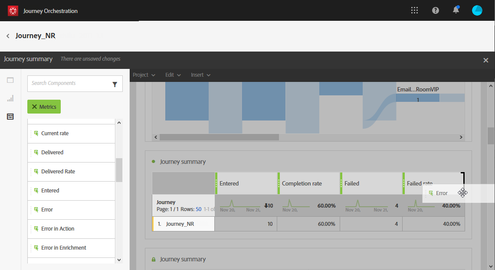

# 创建历程报告 {#concept_rfj_wpt_52b}

## 访问和创建报告 {#accessing-reports}

>[!NOTE]
>
>删除历程后，所有关联的报表将不再可用。

本节将介绍如何创建或使用现成报表。 将面板、组件和可视化图表结合在一起，以更好地跟踪您的历程是否成功。

要访问历程报告并开始跟踪投放成功与否，请执行以下操作：

1. 在顶部菜单中，单击 **[!UICONTROL Home]**&#x200B;选项卡。

1. 选择要报告的历程。

   请注意，您还可以通过单击 **报表** 在历程列表中悬停历程时。

   

1. 单击 **[!UICONTROL Report]** 图标。

   

1. 的 **[!UICONTROL Journey summary]** 屏幕上会显示现成报表。 要访问自定义报表，请单击 **[!UICONTROL Close]** 按钮。

   

1. 单击 **[!UICONTROL Create new project]** 从头开始创建报表。

   

1. 从 **[!UICONTROL Panels]** 选项卡，根据需要拖放任意数量的面板或自由格式表。 有关更多信息，请参阅 [部分](#adding-panels).

   

1. 然后，您可以通过从 **[!UICONTROL Components]** 选项卡。 有关更多信息，请参阅 [部分](#adding-components).

   

1. 为了更清晰地查看数据，您可以从 **[!UICONTROL Visualizations]** 选项卡。 有关更多信息，请参阅 [部分](#adding-visualizations).

## 添加面板{#adding-panels}

### 添加空白面板 {#adding-a-blank-panel}

要启动报表，您可以向现成或自定义报表添加一组面板。 每个面板都包含不同的数据集，并且由自由格式表和可视化组成。

利用此面板，可根据需要构建报表。 您可以在报表中添加所需数量的面板，以便按不同的时间段过滤数据。

1. 单击 **[!UICONTROL Panels]** 图标。您还可以通过单击 **[!UICONTROL Insert tab]** 选择 **[!UICONTROL New Blank Panel]**.

   

1. 拖放 **[!UICONTROL Blank Panel]** 进入功能板。

   

您现在可以向面板中添加一个自由格式表，以开始定位数据。

### 添加自由格式表 {#adding-a-freeform-table}

自由格式表允许您创建一个表格，以使用 **[!UICONTROL Component]** 表。

每个表和可视化图表都可以调整大小，并且可以进行移动以更好地自定义您的报表。

1. 单击 **[!UICONTROL Panels]** 图标。

   

1. 拖放 **[!UICONTROL Freeform]** 项目放入功能板。

   您还可以通过单击 **[!UICONTROL Insert]** 选项卡，选择 **[!UICONTROL New Freeform]** 或 **[!UICONTROL Add a freeform table]** 中。

   

1. 从 **[!UICONTROL Components]** 选项卡来构建表。

   

1. 单击 **[!UICONTROL Settings]** 图标以更改数据在列中的显示方式。

   

   的 **[!UICONTROL Column settings]** 由以下组成：

   * **[!UICONTROL Number]**:允许您在列中显示或隐藏概要数字。
   * **[!UICONTROL Percent]**:可显示或隐藏列中的百分比。
   * **[!UICONTROL Interpret zero as no value]**:允许您在值等于零时显示或隐藏。
   * **[!UICONTROL Background]**:用于在单元格中显示或隐藏水平进度栏。
   * **[!UICONTROL Include retries]**:允许您在结果中包含重试。 此选项仅适用于 **[!UICONTROL Sent]** 和 **[!UICONTROL Bounces + Errors]**.

1. 选择一行或多行，然后单击 **[!UICONTROL Visualize]** 图标。 将添加一个可视化，以反映您选择的行。

   

您现在可以根据需要添加任意数量的组件，还可以添加可视化图表，以提供数据的图形表示形式。

## 添加组件{#adding-components}

组件可帮助您使用不同的维度、量度和时间段来自定义报表。

1. 单击 **[!UICONTROL Components]** 选项卡来访问组件列表。

   

1. 在 **[!UICONTROL Components]** 选项卡会显示五个最常用的项目，单击类别名称可访问其完整组件列表。

   组件表分为三类：

   * **[!UICONTROL Dimensions]**:从投放日志获取详细信息，如收件人的浏览器或域，或投放成功与否。
   * **[!UICONTROL Metrics]**:获取有关消息状态的详细信息。 例如，如果已投放消息且用户将其打开。
   * **[!UICONTROL Time]**:为表设置时间段。

1. 在面板中拖放组件以开始过滤数据。

您可以根据需要拖放任意数量的组件，并将它们彼此进行比较。

## 添加可视化{#adding-visualizations}

的 **[!UICONTROL Visualizations]** 选项卡，可拖放可视化项目，如区域、圆环图和图表。 可视化图表为您提供了数据的图形表示形式。

1. 在 **[!UICONTROL Visualizations]** 选项卡，将可视化项目拖放到面板中。

   

1. 在向面板中添加可视化后，您的报表将自动检测自由格式表中的数据。 选择可视化的设置。
1. 如果您有多个自由格式表，请选择要在 **[!UICONTROL Data Source Settings]** 窗口。 单击可视化标题旁边的彩色圆点，也可以使用此窗口。

   

1. 单击 **[!UICONTROL Visualization]** 设置按钮直接更改图表类型或其上显示的内容，例如：

   * **[!UICONTROL Percentages]**:以百分比表示值。
   * **[!UICONTROL Anchor Y Axis at Zero]**:即使值范围高于零，也强制y轴为零。
   * **[!UICONTROL Legend visible]**:允许您隐藏图例。
   * **[!UICONTROL Normalization]**:强制值匹配。
   * **[!UICONTROL Display Dual Axis]**:向图表中添加另一个轴。
   * **[!UICONTROL Limit Max Items]**:限制显示的图表数量。
   * **[!UICONTROL Threshold]**:允许您为图表设置阈值。 它显示为黑色虚线。

   

通过此可视化图表，您可以更清楚地查看报表中的数据。
