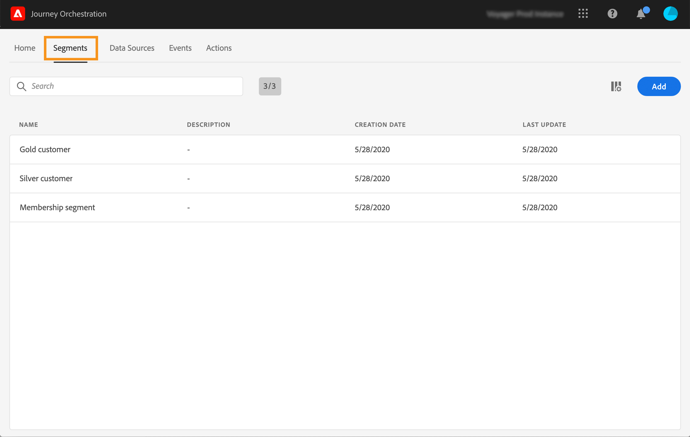

# 创建区段 {#creating-a-segment}

>[!CAUTION]
>
>**希望了解 Adobe Journey Optimizer**？ 请单击[此处](https://experienceleague.adobe.com/zh-hans/docs/journey-optimizer/using/ajo-home){target="_blank"}获取 Journey Optimizer 文档。
>
>
>_本文档参考已被 Journey Optimizer 取代的旧版 Journey Orchestration 资料。 如果您对访问 Journey Orchestration 或 Journey Optimizer 有任何疑问，请联系帐户团队。_

您可以使用[Adobe Experience Platform分段服务](https://experienceleague.adobe.com/docs/experience-platform/segmentation/home.html?lang=zh-Hans)创建区段，也可以直接在[!DNL Journey Orchestration]中访问和创建区段。

1. 在顶部菜单中，单击&#x200B;**[!UICONTROL Segments]**&#x200B;选项卡。 此时将显示Adobe Experience Platform区段的列表。 您可以在列表中搜索特定区段。

   

1. 单击&#x200B;**[!UICONTROL Add]**&#x200B;以创建新区段。 利用区段定义屏幕，可配置定义区段所需的所有字段。 该配置与分段服务中的配置相同。 请参阅[区段生成器用户指南](https://experienceleague.adobe.com/docs/experience-platform/segmentation/ui/overview.html?lang=zh-Hans)。

   

您的区段现在可用于您的历程以构建条件或添加&#x200B;**[!UICONTROL Segment qualification]**&#x200B;事件。 请参阅[在条件](../segment/using-a-segment.md)和[事件活动](../building-journeys/segment-qualification-events.md)中使用区段。
