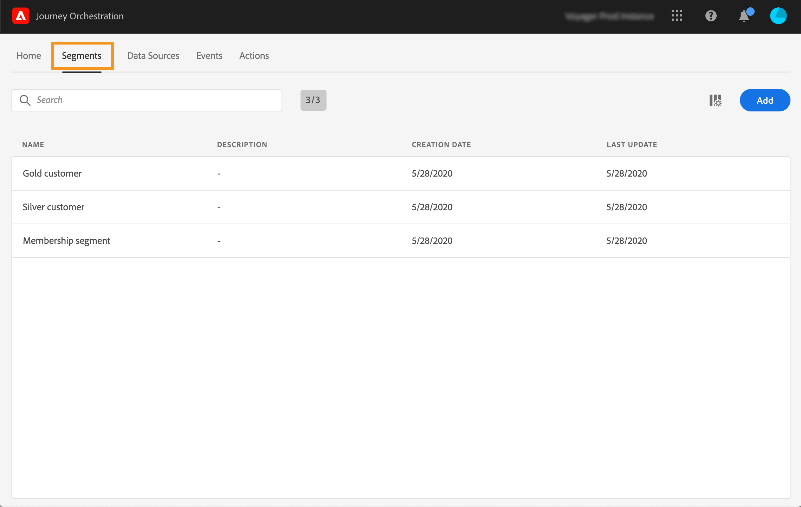

# 创建区段 {#creating-a-segment}

您可以使用[Adobe Experience Platform Segmentation Service](https://experienceleague.adobe.com/docs/experience-platform/segmentation/home.html)创建区段，也可以直接在[!DNL Journey Orchestration]中访问和创建区段。

1. 在顶部菜单中，单击&#x200B;**[!UICONTROL Segments]**&#x200B;选项卡。此时会显示Adobe Experience Platform区段列表。 您可以在列表中搜索特定区段。

   

1. 单击&#x200B;**[!UICONTROL Add]**&#x200B;以创建新区段。 区段定义屏幕允许您配置所有必填字段以定义区段。 配置与分段服务中的配置相同。 请参阅[区段生成器用户指南](https://experienceleague.adobe.com/docs/experience-platform/segmentation/ui/overview.html)。

   

现在，您的区段可用于历程中以构建条件或添加&#x200B;**[!UICONTROL Segment qualification]**&#x200B;事件。 请参阅[在条件](../segment/using-a-segment.md)和[事件活动](../building-journeys/segment-qualification-events.md)中使用区段。
