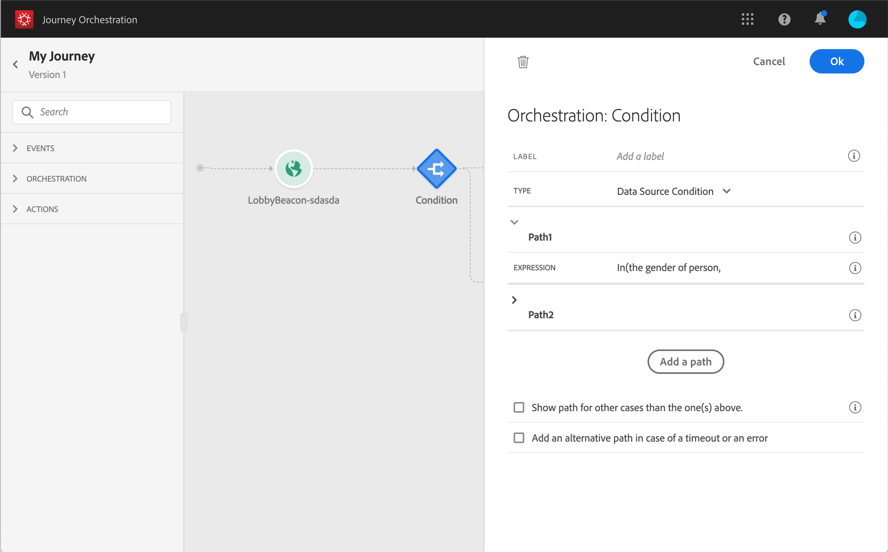

# 在条件中使用区段 {#using-a-segment}

>[!CAUTION]
>
>**正在查找Adobe Journey Optimizer**？ 单击[此处](https://experienceleague.adobe.com/zh-hans/docs/journey-optimizer/using/ajo-home){target="_blank"}获取Journey Optimizer文档。
>
>
>_本文档参考已被Journey Optimizer替换的旧版Journey Orchestration资料。 如果您对访问Journey Orchestration或Journey Optimizer有任何疑问，请联系您的帐户团队。_

本节介绍如何在历程条件中使用区段。 要了解如何在历程中使用&#x200B;**[!UICONTROL Segment qualification]**&#x200B;事件，请参阅此[部分](../building-journeys/segment-qualification-events.md)。

要在历程条件中使用区段，请执行以下步骤：

1. 打开历程，删除&#x200B;**[!UICONTROL Condition]**&#x200B;活动并选择&#x200B;**数据Source条件**。
   

1. 单击每个所需额外路径的&#x200B;**[!UICONTROL Add a path]**。 对于每个路径，单击&#x200B;**[!UICONTROL Expression]**&#x200B;字段。

   

1. 在左侧，展开&#x200B;**[!UICONTROL Segments]**&#x200B;节点。 拖放要用于条件的区段。 默认情况下，区段的条件为true。

   

   >[!NOTE]
   >
   >只有具有&#x200B;**已实现**&#x200B;和&#x200B;**现有**&#x200B;区段参与状态的个人才会被视为该区段的成员。 有关如何评估区段的更多信息，请参阅[分段服务文档](https://experienceleague.adobe.com/docs/experience-platform/segmentation/tutorials/evaluate-a-segment.html?lang=en#interpret-segment-results)。

有关历程条件以及如何使用简单表达式编辑器的详细信息，请参阅[条件活动](../building-journeys/condition-activity.md#about_condition)。
