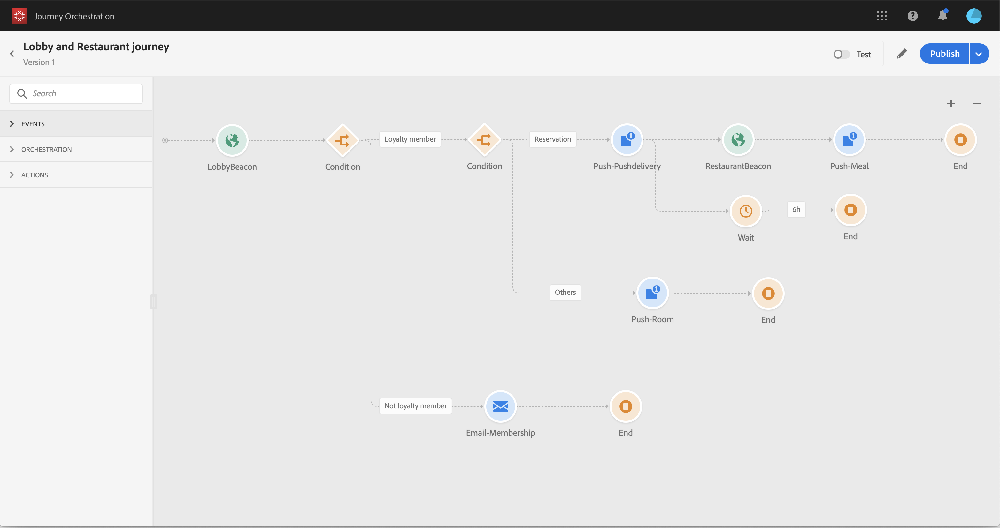

# 关于高级用例{#concept_vzy_ncy_w2b}

## 用途 {#purpose}

以一个叫马尔顿的酒店品牌为例。 在酒店里，他们在所有战略区域附近都放置了信标设备：大厅、地板、餐厅、健身房、游泳池等。

>[!NOTE]
>
>在此用例中，我们使用Adobe Campaign Standard发送消息。

在此使用案例中，我们将了解如何在客户靠近特定信标时实时向客户发送个性化消息。

首先，我们希望当某人进入马尔顿酒店时，立即发送消息。 仅当此人过去24小时内未收到我们的任何通信时，我们才希望发送消息。

然后，我们检查两个条件：

* 如果此人员不是忠诚会员，我们向他们发送电子邮件，让他们加入忠诚会员资格优惠。
* 如果此人已经是忠诚会员，我们会检查他是否有订房：
   * 如果他没有，我们会向他们发送包含房费的推送通知。
   * 如果是，我们会向他们发送欢迎推送通知。 如果他在接下来的6小时内进餐厅，我们会给他们发一则推送通知，并附上一顿饭的折扣。

对于此用例，我们需要创建两个事件(请参阅 [此页面](../usecase/configuring-the-events.md))：

* 大厅信标事件，当客户进入酒店时将推送到系统。
* 当客户进入餐厅时将推送的餐厅信标事件。

我们需要配置与两个数据源的连接(请参阅 [此页面](../usecase/configuring-the-data-sources.md))：

* 内置的Adobe Experience Platform数据源，用于检索有关我们的两个条件（忠诚度会员资格和上次联系日期）的信息以及消息个性化信息。
* 酒店预订系统，用于检索预订状态信息。

## 先决条件 {#prerequisites}

在我们的用例中，我们设计了三个Adobe Campaign Standard事务性消息传递模板。 我们正在使用事件事务性消息模板。 请参阅此 [页面](https://experienceleague.adobe.com/docs/campaign-standard/using/communication-channels/transactional-messaging/getting-started-with-transactional-msg.html?lang=zh-Hans).

Adobe Campaign Standard配置为发送电子邮件和推送通知。

Experience CloudID用作酒店预订系统中识别客户的键。

当客户在信标附近检测到事件时，会从客户的手机发送事件。 您需要设计一个移动应用程序，以将事件从客户的手机发送到Mobile SDK。

忠诚度成员字段是一个自定义字段，并且已添加到特定组织ID的XDM中。
